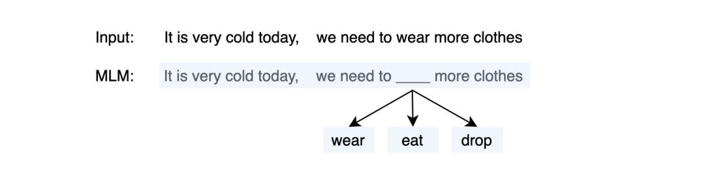
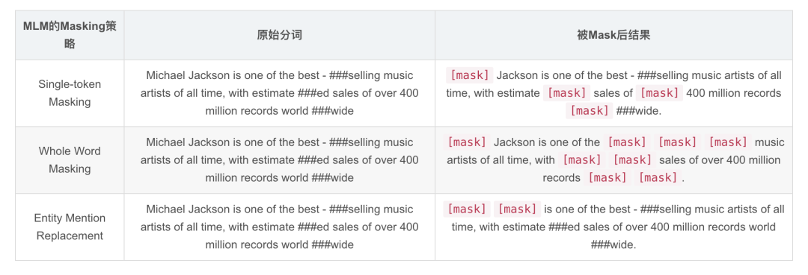

# 1.1 经典的 Pre-trained 任务

本文的目标是介绍 Prompt-Tuning 的方法，而 Prompt-Tuning 的动机则是进一步拉近微调与预训练阶段的任务目标，因此本部分则以常用的 BERT 为主，简单介绍 Pre-training 的经典方法，更加详细的解读，可参考：【预训练语言模型】BERT: Pre-training of Deep Bidirectional Transformers for Language Understanding（BERT）。

## 一、Masked Language Modeling（MLM）

传统的语言模型是以 word2vec、GloVe 为代表的词向量模型，他们主要是以词袋（N-Gram）为基础。例如在 word2vec 的 CBOW 方法中，随机选取一个固定长度的词袋区间，然后挖掉中心部分的词后，让模型（一个简单的深度神经网络）预测该位置的词，如下图所示：

图1. N-Gram

Masked Language Modeling（MLM）则采用了 N-Gram 的方法，不同的是，N-Gram 喂入的是被截断的短文本，而 MLM 则是完整的文本，因此 MLM 更能够保留原始的语义：

图2. MLM

MLM 是一种自监督的训练方法，其先从大规模的无监督语料上通过固定的替换策略获得自监督语料，设计预训练的目标来训练模型，具体的可以描述为：

*   替换策略：在所有语料中，随机抽取 15% 的文本。被选中的文本中，则有 80% 的文本中，随机挑选一个 token 并替换为 `[mask]`，10% 的文本中则随机挑选一个 token 替换为其他 token，10% 的文本中保持不变。
    
*   训练目标：当模型遇见 `[mask]` token 时，则根据学习得到的上下文语义去预测该位置可能的词，因此，训练的目标是对整个词表上的分类任务，可以使用交叉信息熵作为目标函数。

因此以 BERT 为例，首先喂入一个文本`It is very cold today, we need to wear more clothes.` ，然后随机 mask 掉一个 token，并结合一些特殊标记得到：`[cls] It is very cold today, we need to [mask] more clothes. [sep]` ，喂入到多层的 Transformer 结构中，则可以得到最后一层每个 token 的隐状态向量。MLM 则通过在`[mask]`头部添加一个 MLP 映射到词表上，得到所有词预测的概率分布。

现如今有诸多针对 MLM 的改进版本，我们挑选两个经典的改进进行介绍：

*   **Whole Word Masking（WWM）** ：来源于 RoBERTa 等，其认为 BERT 经过分词后得到的是 word piece，而 BERT 的 MLM 则是基于 word piece 进行随机替换操作的，即 Single-token Masking，因此被 mask 的 token 语义并不完整。而 WWM 则表示被 mask 的必须是一个完整的单词。
    
*   **Entity Mention Replacement（EMR）** ：来源于 ERNIE-BAIDU 等，其通常是在知识增强的预训练场景中，即给定已知的知识库（实体），对文本中的整个实体进行 mask，而不是单一的 token 或字符。

下面给出对比样例。以文本 "**Michael Jackson is one of the best-selling music artists of all time, with estimated sales of over 400 million records worldwide**" 为例：

图3. Mask

## 二、Next Sentence Prediction（NSP）

在 BERT 原文中，还添加了 NSP 任务，其主要目标是给定两个句子，来判断他们之间的关系，属于一种自然语言推理（NLI）任务。在 NSP 中则存在三种关系，分别是：

*   entailment（isNext）：存在蕴含关系，NSP 中则认为紧相邻的两个句子属于 entailment，即 isNext 关系；
    
*   contradiction（isNotNext）：矛盾关系，NSP 中则认为这两个句子不存在前后关系，例如两个句子来自于不同的文章；
    
*   Neutral：中性关系，NSP 中认为当前的两个句子可能来自于同一篇文章，但是不属于 isNext 关系的
    

而显然，构建 NSP 语料也可以通过自监督的方法获得，首先给定一个大规模无监督语料，按照文章进行分类。在同一篇文章里，随机挑选一个句子作为 premise，因此 entailment 类对应的则是其下一个句子，另外再随机挑选同一篇文章中的其他句子作为 Neutral 类，其他文章中的句子作为 contradiction 类。

在 BERT 中，NSP 任务则视为 sentence-pair 任务，例如输入两个句子`S1：It is very cold today.` 和 `S2：We need to wear more clothes.`，通过拼接特殊字符后，得到：`[cls] It is very cold today. [sep] We need to wear more clothes. [sep]`，然后喂入到多层 Transformer 中，可以得到`[cls]`token 的隐状态向量，同样通过 MLP 映射到一个 3 分类上获得各个类的概率分布：

图4. BERT

在以 ALBETR、RoBERTa 等系列的模型，由于发现 NSP 对实验的效果并没有太多正向影响，因此均删除了 NSP 的任务，在后续的预训练语言模型中，也纷纷提出其他的预训练目标，本文不再过多赘述。在后续的 Prompt-Tuning 技术中，大多数则以 MLM 作为切入点。
