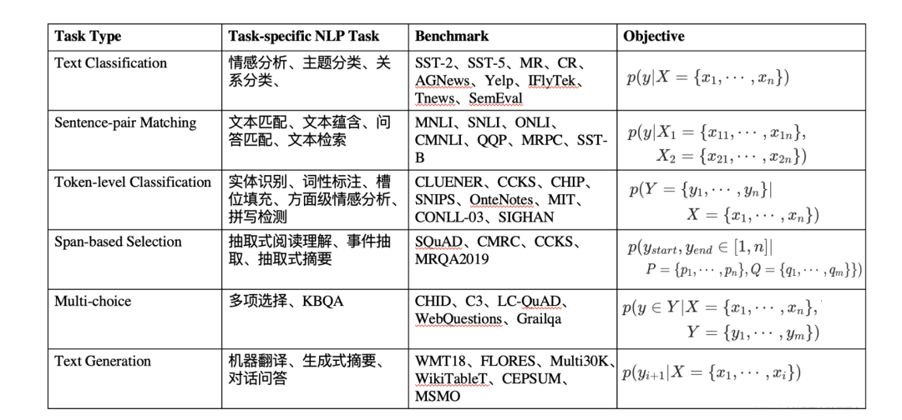

# 1.2 Task-specific Fine-tuning

获得了预训练的语言模型后，在面对具体的下游任务时，则需要进行微调。通常微调的任务目标取决于下游任务的性质。我们简单列举了几种 NLP 有关的下游任务：

*   **Single-text Classification（单句分类）** ：常见的单句分类任务有短文本分类、长文本分类、意图识别、情感分析、关系抽取等。给定一个文本，喂入多层 Transformer 模型中，获得最后一层的隐状态向量后，再输入到新添加的分类器 MLP 中进行分类。在 Fine-tuning 阶段，则通过交叉信息熵损失函数训练分类器；

> *   短 / 长文本分类：直接对句子进行归类，例如新闻归类、主题分类、场景识别等；
>     
> *   意图识别：根据给定的问句判断其意图，常用于检索式问答、多轮对话、知识图谱问答等；
>     
> *   情感分析：对评论类型的文本进行情感取向分类或打分；
>     
> *   关系抽取：给定两个实体及对应的一个描述类句子，判断这两个实体的关系类型；
>     

*   **Sentence-pair Classification（句子匹配 / 成对分类）** ：常见的匹配类型任务有语义推理、语义蕴含、文本匹配与检索等。给定两个文本，用于判断其是否存在匹配关系。此时将两个文本拼接后喂入模型中，训练策略则与 Single-text Classification 一样；

> *   语义推理 / 蕴含：判断两个句子是否存在推理关系，例如 entailment、contradiction，neutral 三种推理关系；
>     
> *   文本匹配与检索：输入一个文本，并从数据库中检索与之高相似度匹配的其他句子
>     

*   **Span Text Prediction（区间预测）** ：常见的任务类型有抽取式阅读理解、实体抽取、抽取式摘要等。给定一个 passage 和 query，根据 query 寻找 passage 中可靠的字序列作为预测答案。通常该类任务需要模型预测区间的起始位置，因此在 Transformer 头部添加两个分类器以预测两个位置。

> *   抽取式阅读理解：给定 query 和 passage，寻找 passage 中的一个文本区间作为答案；
>     
> *   实体抽取：对一段文本中寻找所有可能的实体；
>     
> *   抽取式摘要：给定一个长文本段落，寻找一个或多个区间作为该段落的摘要；
>     

*   **Single-token Classification（字符分类）** ：此类涵盖序列标注、完形填空、拼写检测等任务。获得给定文本的隐状态向量后，喂入 MLP 中，获得每个 token 对应的预测结果，并采用交叉熵进行训练。

> *   序列标注：对给定的文本每个 token 进行标注，通常有词性标注、槽位填充、句法分析、实体识别等；
>     
> *   完形填空：与 MLM 一致，预测给定文本中空位处可能的词
>     
> *   拼写检测：对给定的文本中寻找在语法或语义上的错误拼写，并进行纠正；
>     

*   **Text Generation（文本生成）** ：文本生成任务常用于生成式摘要、机器翻译、问答等。通常选择单向的预训练语言模型实现文本的自回归生成，当然也有部分研究探索非自回归的双向 Transformer 进行文本生成任务。BART 等模型则结合单向和双向实现生成任务。

> *   生成式摘要：在文本摘要中，通过生成方法获得摘要；
>     
> *   机器翻译：给定原始语言的文本，来生成目标语言的翻译句子；
>     
> *   问答：给定 query，直接生成答案；
>     

相关的任务类型、常见的 Benchmark 以及形式化定义如下图所示：

图1. Benchmark

这几类任务基本可以涵盖现有的自然语言处理场景中，而这五类任务在 Fine-tuning 阶段几乎都涉及 **在模型头部引入新参数** 的情况，且都存在 **小样本场景过拟合** 的问题，因此 Prompt-Tuning 的引入非常关键。
