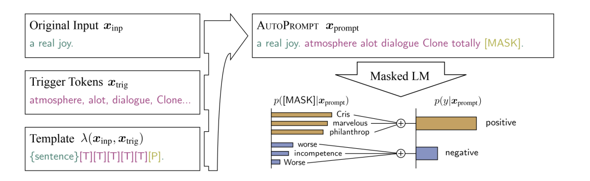
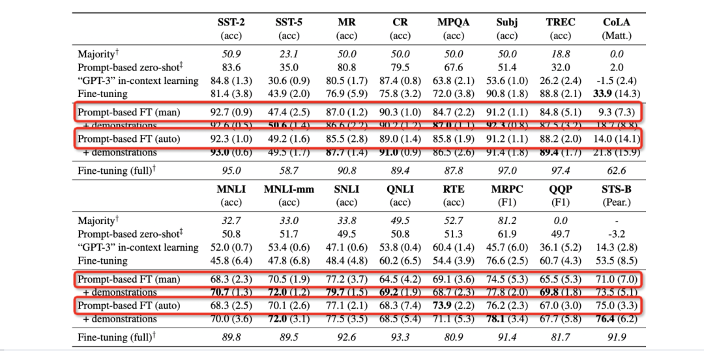
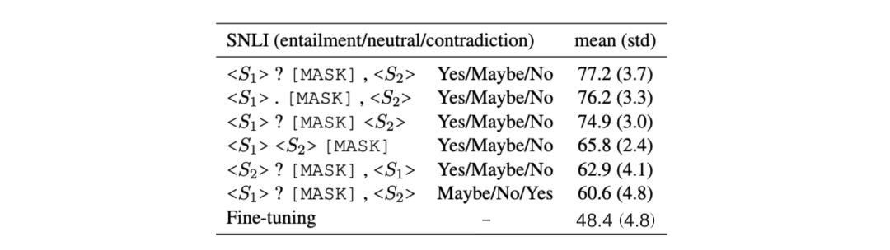
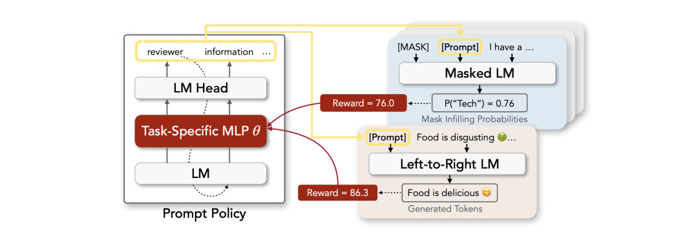

# 3.2 如何挑选合适的 Pattern？

自 2020 年底至今，学术界已经涌现出一批基于 Prompt-Tuning 的方案试图探索如何自动构建 PVP。本节主要总结几种成熟的 Pattern（Template）构建方法。可以罗列为如下几点：

*   **人工构建（Manual Template）** ：在前文已经描述过，不再详细说明；
    
*   **启发式法（Heuristic-based Template）** ：通过规则、启发式搜索等方法构建合适的模板；
    
*   **生成（Generation）** ：根据给定的任务训练数据（通常是小样本场景），生成出合适的模板；
    
*   **词向量微调（Word Embedding）** ：显式地定义离散字符的模板，但在训练时这些模板字符的词向量参与梯度下降，初始定义的离散字符用于作为向量的初始化；
    
*   **伪标记（Pseudo Token）** ：不显式地定义离散的模板，而是将模板作为可训练的参数；

前面 3 种也被称为 **离散的模板构建** 法（记作 **Hard Template** 、 **Hard Prompt** 、 **Discrete Template** 、 **Discrete Prompt** ），其旨在直接与原始文本拼接显式离散的字符，且在训练中 **始终保持不变** 。这里的保持不变是指 **这些离散字符的词向量（Word Embedding）在训练过程中保持固定** 。通常情况下， **离散法不需要引入任何参数** 。

后面 2 种则被称为 **连续的模板构建** 法（记作 **Soft Template** 、 **Soft Prompt** 、 **Continuous Template** 、 **Continuous Prompt** ），其旨在让模型在训练过程中根据具体的上下文语义和任务目标对模板参数进行连续可调。这套方案的动机则是认为离散不变的模板无法参与模型的训练环节，容易陷入局部最优，而如果将模板变为可训练的参数，那么不同的样本都可以在连续的向量空间中寻找合适的伪标记，同时也增加模型的泛化能力。因此， **连续法需要引入少量的参数并让模型在训练时进行参数更新** 。

下面简单介绍几个经典的方法：

## （1）启发式法构建模板

启发式法一般是采用规则、正则化模板的方法自动构建出相应的 Pattern，或者直接通过启发式搜索的方法获得 Pattern。这一类方法在程序设计时只需要编写规则和少量的模板即可快速的获得 Pattern。

给定一个具体的任务（例如分类任务），可以实现定义若干个模板（例如正则化工具），然后根据具体的句子内容，向模板中填充相关实体，以贴合句子实际的描述。例如清华大学刘知远团队提出的 **PTR** （PTR: Prompt Tuning with Rules for Text Classification）利用启发式的规则定义若干子模板（sub-prompt），并通过若干子模板的组合来形成最终的 Pattern。

> 例如在关系抽取任务中，通常给定一个短文本，两个实体（记作 subject 和 object），假如给定句子 “**Mark Twain was the father of Langdon.** ” 以及两个实体 “**Mark Twain**” 和 “**Landon**”。那么可以定义 3 个子模板：
> 
> *   头实体 (subject entity) : the [mask] , 对应于: “the [mask] Mark Twain", 可用于预测头实体的类型;
>     
> *   尾实体 (object entity) : the [mask] , 对应于: "the [mask] Landon", 可用于尾实体的类型;
>     
> *   实体关系 (relation): , 对应于: “Mark Twain [mask] Landon", 可用于头尾实体关系;
>     
> 
> 基于上述定义的 3 个规则, 则可以结合起来形成最终模板, 即 , 即 “the [mask] Mark Twain [mask] the [mask] Landon”。如图所示:
> 
> 

> 
> 

> 
图1. 

> 
> PTR 的详细解读请参考博主的论文解读：论文解读：PTR: Prompt Tuning with Rules fo Text Classification：https://wjn1996.blog.csdn.net/article/details/120256178

因此不论给定哪个句子，模板不会完全固定不变，而是根据不同的实体而相应改变模板的字符序列。

相比之下， **AutoPrompt** 则是另一种典型的方法，其由加州大学提出《AutoPrompt: Eliciting Knowledge from Language Models with Automatically Generated Prompts（EMNLP2021），如下图所示，给定原始的输入，额外定义若干离散的字符作为 trigger，并组成 Template，喂入 MLM 中预测对应 label word 的概率。而这些 trigger 最终通过梯度搜索的方法进行挑选。

图2. 

## （2）生成法构建模板

基于规则的方法构建的模板虽然简单，但是这些模板都是 “ **一个模子刻出来的** ”，在语义上其实挺难做到与句子贴合。因此一种策略就是 **直接让模型来生成合适的模板** ，因为文本生成本质上就是去理解原始文本的语义，并获得在语义上较为相关的文本。这样不论给定什么句子，我们可以得到在语义层面上更加贴合的模板。

陈丹琦团队提出 **LM-BFF** 则作为该类方法的典范，其出自于《Making Pre-trained Language Models Better Few-shot Learners》（ACL2021）。LM-BFF 提出了基于生成的方法来构建 Pattern，而给定相应的 Pattern 之后，再通过搜索的方法得到相应的 Verbalizer。如下图所示：

图3. 

首先定义一个 Template 的母版（有点类似于 PTR 中的含有占位符的子模板），将这些母版与原始文本拼接后喂入 T5 模型（T5 模型属于自回归式的生成模型）后在 <X> 和 < Y > 占位符部分生成相应的字符，最终形成对应的 Template。然后再基于生成的 Template 和 label word 进行训练。

通过多个任务的小样本场景测试（分类任务，每个类只有 16 个样本），整体观察可发现这种基于生成的方法明显比人工构建的效果更好，如图所示：

图4. 

> LM-BFF 的详细内容请参考博主的论文解读：论文解读：Making Pre-trained Language Models Better Few-shot Learners（LM-BFF）:https://wjn1996.blog.csdn.net/article/details/115640052

## （3）连续提示模板

不论是启发式方法，还是通过生成的方法，都需要为每一个任务单独设计对应的模板，因为这些模板都是可读的离散的 token（这类模板我们称作 Discrete Prompt 或 Hard Prompt。），这导致很难寻找到最佳的模板。

另外，即便是同一个任务，不同的句子也会有其所谓最佳的模板，而且有时候，即便是人类理解的相似的模板，也会对模型预测结果产生很大差异。例如下图，以 SNLI 推断任务为例，仅仅只是修改了模板，测试结果差异很明显，因此离散的模板存在方差大、不稳定等问题。

图5. 

如何避免这种问题呢，一种新的 **“连续提示”** 被提出，称作 Continuous Prompt 或 Soft Prompt，其将模板转换为可以进行优化的连续向量，换句话说，我们不需要显式地指定这些模板中各个 token 具体是什么，而只需要在语义空间中表示一个向量即可。

这样，不同的任务、数据可以自适应地在语义空间中寻找若干合适的向量，来代表模板中的每一个词，相较于显式的 token，这类 token 称为 **伪标记（Pseudo Token）** 。下面给出基于连续提示的模板定义：

> 假设针对分类任务, 给定一个输入句子 , 连续提示的模板可以定义为: 其中 则是伪标记, 其仅代表一个抽象的 token, 并没有实际的含义, 本质上是一个向量。

基于连续提示的 Prompt-Tuning 的实现方法，以下列三篇论文为代表，分别作简要介绍：

*   《The Power of Scale for Parameter-Efficient Prompt Tuning》：代表方法为 Prompt Tuning
    
*   《GPT Understands, Too》：代表方法为 P-tuning
    
*   《PPT: Pre-trained Prompt Tuning for Few-shot Learning》：代表方法 PPT

### Prompt Tuning

该方法率先提出了伪标记和连续提示的概念，以让模型在能过动态地对模板在语义空间内进行调整，使得模板是可约的（differentiate）。形式化的描述如下：

> 给定 个 tokens, 记作 , 一个预训练模型对应的 embedding table, 通过这个 table, 可以将每个 token 表示为一个 embedding , 其中 是向量的维度 (其与预训练模型的配置有关, 例如 BERT-base 是 768)。连续模板中的每个伪标记 可以视为参数, 也可以视为一个 token, 因此, 可以通过一个 embedding table 获得每个伪标记的向量 , 然后喂入一个 MLP 获得新的表征。最后, 对于预训练模型的输入则是同时包含 和 。

每个伪标记的初始化可以有下列几种情况：

*   最简单的是随机初始化：即随机初始化一个面向所有伪标记的 embedding table，可采用正态分布或者均匀分布等；
    
*   每个 token 使用预训练模型已有的 embedding table 进行初始化，此时，每一个伪标记先随机指定词表中的一个词，并取对应词的 embedding 作为这个伪标记的初始化；
    
*   在分类任务上，使用 label word（verbalizer）对应的 embedding 作为初始化，可以有效限制模型输出的是预设的输出类对应的 word。

因此，在训练过程中，每个伪标记以及对应的 MLP 参数都可以得到训练，对于不同的输入句子 x，这些伪标记对应的 embedding 也各不相同，达到了预期的目的。

### P-tuning

> P-tuning 的详细内容请参考博主的论文解读：论文解读：GPT Understands, Too:https://wjn1996.blog.csdn.net/article/details/120802305 

P-tuning 是另一个具有代表性的连续提示方法, 方法图如下所示 (图中的 等价于上文的 , 表示伪标记)。

图6. 

其在 Prompt Tuning 方法上主要做出三个改进：

*   **考虑到这些仂标记的相互依赖关系**：认为 与 是有先后关系的, 而 transformer 无法显式地刻画这层关系, 因此引入 Prompt Encoder, 实际过程中采用一层 RN；
    
*   **指定上下文词**：如果模板全部是伪标记, 在训练时无法很好地控制这些模板朝着与对应句子相似的语义上优化, 因此选定部分具有与当前句子语义代表性的一些词作为一些伪标记的初始化 (例如上图中 “capital”、“Britain” 等)；
    
*   **重参数 (Reparameterization)**: 具体到代码实现上, P-tuning 先通过一个 Prompt Encoder 表征这些伪标记后, 直接将这些新的表征覆盖到对应的 embedding table 上, 换句话说, Prompt Encoder 只在训练时候会使用到, 而在推理阶段则不再使用。
    
*   **混合提示 (Hydride Prompt)**: 将连续提示与离散 token 进行混合, 例如 mask .
    

### PPT（Pre-trained Prompt Tuning）

Prompt-Tuning 通常适用于低资源场景, 但是由于连续的模板是随机初始化的, 即其存在新的参数, 少量样本可能依然很难确保这些模板被很好地优化。因此简单的方法就是对这些连续的模板进行预训练。PPT 旨在通过先让这些连续提示在大量无标注的预训练语料进行预训练, 然后将其加载到对应下游任务的 PLM 上进行训练, 如下图所示 (图中的 即连续的提示模板, $ 并表示为 mask token)：

图7. 

*   首先在大量无标注语料上进行预训练，获得训练好的连续提示；
    
*   对下游任务（是非问答、NLI、文本匹配等），加载这些训练好的提示之后，进行微调，或者直接进行 zero-shot 预测。

下图对几种 template 优化进行的对比。

图8. 

## （4）Template 优化进阶

我们为任务设计的模板都是建立在一个假设上：即模板都是尽可能是可读的，即满足人类语言的语法形态。然而最近也有工作认为，最优的模板可能是不符合语法的乱语 (Ungrammatical Gibberish Text)，即人类可读的模板，模型也许不可读。虽然这很反直觉，但是我们不能否认这种情况的存在。论文《RLPROMPT: Optimizing Discrete Text Prompts with Reinforcement Learning》给出了相应的发现，并提出了一种基于强化学习的方法 RLPROMPT 来寻找最优的模板。

图9. 

上图为 RLPROMPT 框架，左侧为策略网络，右侧分别为双向预训练模型（Masked LM）和生成式预训练模型（Left-to-Right LM），分别对应于分类任务和生成任务。RLPROMPT 的原理如下：

> *   **Step1** ：给定一个句子（例如 “I have ...”），一个 [mask] token，以及一个用于待生成的模板占位符 [Prompt]。
>     
> *   **Step2** ：如果是分类任务，则将输入句子喂入一个双向语言模型中获得 [mask] 位置的预测 token，并通过 verbalizer 映射到对应类别的概率分布，如果是在训练阶段，真实标签是已知的，其概率可以作为当前模板的反馈（reward）。如果是生成任务，则喂入生成模型中，获得生成 token 的预测概率（或者其他文本生成的指标）并作为反馈。
>     
> *   **Step3** ：根据当前的反馈，使用强化学习的 policy gradient 方法训练一个决策函数。基于这个决策函数可以对 [Prompt] 生成一个离散的模板词。决策函数本质上是一个预训练语言模型，通过 LM head 来生成一个 token。
>     
> *   **Step4** ：生成一个模板词之后，重复 Step2～Step3，直到生成足够的模板词。
>     

基于 RLPROMPT，最终可以得到一些离散的模板，相比连续的提示更加有解释性。取几个常用的评测任务，对比不同方法生成的模板的区别：

图10. 
