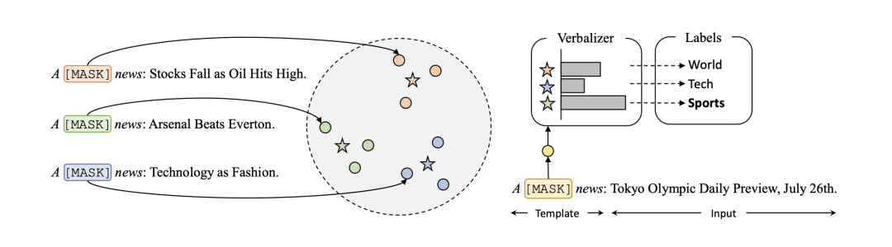

# 3.3 如何挑选合适的 Verbalizer？

除了 Template 以外，Verbalizer 是直接关系到预测的结果是什么，不同的 Verbalizer 会对最终预测效果产生较大的影响，不同的任务会有不同的合适的 label word。例如在电影评论任务中，positive 类别的 label word 比较合适的是 wonderful，而在美食点评任务中，positive 比较合适的是 testy。因此 label word 的选择也是 Prompt-Tuning 中关键的部分。如下图所示，以 SST-2 为例，相同的模板条件下，不同的 label word 对应的指标差异很大。

图1. 

传统的方法是人工设计（Manual Design），即可以根据对每个任务的经验来人工指定这些 label word。但是人工设计需要依赖大量的人力，且对于一些具有专业性的任务还需要依赖于专家，使得 Prompt-Tuning 的效率很低。

为了缓解这个问题，一些工作开始研究如何根据不同的任务自动地选择合适的 label word。受到 Template 的离散和连续两种类型优化的启示，Verbalizer 也可以分为离散和连续两种类型。本文分别介绍两个具有代表性的工作：

*   领域知识指导搜索离散的 label word：《Knowledgeable Prompt-tuning: Incorporating Knowledge into Prompt Verbalizer for Text Classification》，代表方法为 KPT；
    
*   原型网络动态生成 label representations：《Prototypical Verbalizer for Prompt-based Few-shot Tuning》，代表方法为 ProtoVerb。

### KPT（Knowledgeable Prompt Tuning）

> KPT 的详细内容请参考博主的论文解读：论文解读：Knowledgeable Prompt-tuning: Incorporation Knowledge into Prompt Verbalizer for Text Classification:https://wjn1996.blog.csdn.net/article/details/120790512

针对不同的任务，都有其相应的领域知识，为了避免人工选择 label word，该方法提出基于知识图谱增强的方法，如下图所示：

图2. 

具体思路如下：

*   首先通过一些已有的字典工具，从词表中获得与给定 label 相关的词。如何建模这种相关性呢，该方法引入知识库，依赖于知识库中的三元组来衡量。例如 SCIENCE 在知识库中是一个实体，与该实体存在多挑关系的词可能有 science、mathematics 等等；
    
*   第一步可以获得大量的词，但是也容易引入噪声，因此需要进行提炼（Refine），可以设计一系列的启发式方法来度量每个词与 label 的相关度，最后获得指定数量的若干个合适的 label word；
    
*   对于选定的 label word，采用 Verbalizaer 集成的方法获得最终的预测结果。
    

### ProtoVerb

回顾在 Template 的构建中，离散的模板是无法在训练过程中被优化的，从而引入了连续的模板。同理，离散 label word 也是只能在训练之前被指定，而在后续训练中无法被改变。因此，为了让 label word 也可以自适应的变化，提出连续的 label word。

ProtoVerb 巧妙的运用了原型网络（Prototypical Network）的思路，将每个类别的所有样本的表征的期望作为该类的原型向量，并使用该原型向量代替连续的 label word。

图3. 

如上图，以新闻分类为例，首先定义固定的模板 “A [mask] news.”，并拼接到原始的输入句子上。喂入 BERT 模型中，获得 [mask] 位置的表征向量代表句子向量。在训练过程中的 label 是已知的，所以可以求得同一 label 对应所有句子向量的均值来表示这个 label 的表征（图中的五角星）。

在测试阶段，则只需要计算测试句子的表征与各个类别的原型向量的相似度，并取最大相似度对应的 label 作为预测结果。

通过这种连续的 label word，基本避免了显式获取 label word 的过程，使得模型的训练一气呵成。相似的做法也在《PromptBERT: Improving BERT Sentence Embeddings with Prompts》中被提及。