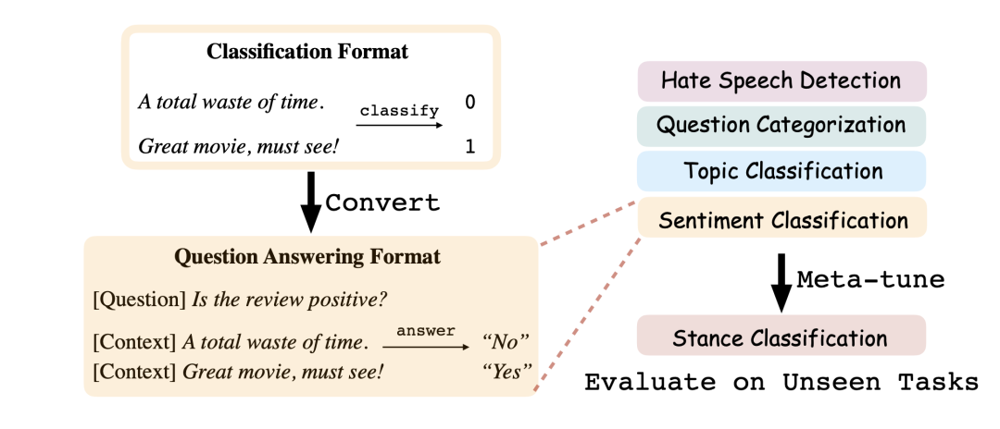

# 4.1 Prompt 是一种针对任务的指令

**Prompt 本质上是对下游任务的指令，可以作为一种信息增强** 。

简单的来说，就是告诉模型需要做什么任务，输出什么内容。上文我们提及到的离散或连续的模板，本质上就是一种对任务的提示。当数据集不同（乃至样本不同）的时候，我们期望模型能够自适应的选择不同的模板，这也相当于说不同的任务会有其对应的提示信息。

例如在对电影评论进行二分类的时候，最简单的提示模板是 “. It was [mask].”，但是其并没有突出该任务的具体特性，我们可以为其设计一个能够突出该任务特性的模板，例如 “The movie review is . It was [mask].”，然后根据 mask 位置的输出结果通过 Verbalizer 映射到具体的标签上。这一类具备任务特性的模板可以称之为 **指令（Instruction）** 。

下面展示几个任务设计的指令模板：

图1. 

看似设计指令是一件容易的事情，但是在真实使用过程中，预训练模型很难 “理解” 这些指令，根据最近研究工作发现，主要总结如下几个原因：

* **预训练模型不够大** ：我们常使用的 BERT-base、BERT-large、RoBERTa-base 和 RoBERTa-large 只有不到 10 亿参数，相比于现如今 GPT-3、OPT 等只能算作小模型，有工作发现，小模型在进行 Prompt Tuning 的时候会比 Fine-tuning 效果差，是因为小模型很容易受到模板的影响
    

> 对比一下传统的 Fine-tuning，每个样本的输入几乎都是不同的，然而基于 Prompt 的方法中，所有的样本输入都会包含相同的指令，这就导致小模型很容易受到这些指令带来的干扰。

* **缺乏指令相关的训练** ：这些小模型在预训练阶段没有专门学习过如何理解一些特殊的指令。
    

> 我们回顾一下上面章节，不论是生成离散的模板还是连续的模板，都是在向现有的预训练语言模型进行 “妥协”，即找到能够让当前预训练语言模型在小样本上效果最好的模板，或者说是站在已有预训练模型的基础上寻找模板。然而这种寻找到的模板不可读也不可解释，或者过于通用，不具备任务特性，无法很好地在真实场景下使用。因此，我们需要的是先设计好任务相关的指令，使得这些指令是可读的，可在真实场景下使用的。不过由于预训练模型没见过这些指令，所以很难在小样本上快速理解它们。

也许读者想到了前面所讲到的 Pre-trained Prompt Tuning（PPT），即再次对预训练语言模型进行一次 Continual Pre-training。然而我们忽略了一点，即 **我们期望预训练模型不止是在我们已经设计好的指令上进行学习，还应该在未知的指令上具备一定的泛化性能** ，也就是说在一个完全新的任务上，只需要少量样本（甚至是零样本），也能过很好地理解这个指令。

为了达到这个目的，最常用的方法是 **元学习（Meta Learning）** ，我们介绍几个代表性的工作：

*   《TransPrompt: Towards an Automatic Transferable Prompting Framework for Few-shot Text Classification》：代表方法 TransPrompt，利用迁移学习提升预训练语言模型在不同类型任务上的泛化性能；
    
*   《Adapting Language Models for Zero-shot Learning by Meta-tuning on Dataset and Prompt Collections》：代表方法：MPT，统一分类任务范式，并采用元学习进行训练；
    

### TransPrompt

该方法是面向连续提示模板的，其对 P-tuning 做了如下几个改进：

*   **引入 Cross-task Learning** ：原来 P-tuning 只对单一任务进行 Prompt Tuning，而 TransPrompt 则对同一类别多个任务进行 Cross-task Learning。例如情感分析有 SST-2、MR 和 CR 三个任务，则为每一个任务设计一个 Task-specific Prompt Encoder。为了捕捉任务之间的共同知识，也额外设计以恶搞 Universal Prompt Encoder。

> 在训练过程中，所有任务的数据集样本直接混合起来，每一个样本都会对应一个任务的标记。在喂入模型时，一个 batch 内会有来自多个任务的样本，根据任务类型的标记，分别使用对应的 Task-specific Prompt Encoder 来表征连续的模板，所有的样本都喂入 Universal Prompt Encoder 以获得通用的连续模板。

*   **引入去偏（De-basing）技术** ：不论是小样本还是全量数据，即便是统计分布上完全一致，不同的任务的难易程度是不一样的，因此模型在训练的时候可能极易偏向于一些简单任务。为了确保任务之间训练的平衡性，引入两个去偏技术，分别是 Prototypical-based Debiasing 和 Entropy-based Debiasing，具体的做法详见原文。
    
### Meta Prompt Tuning（MPT）

该方法是面向离散的提示，其主要关注于文本分类任务，但是不同的是，其对分类的范式进行了一些转换，将所有分类任务定义为 “Yes/No” 问题，下面对比一下两种不同的范式：

> **传统的多类分类范式**：假设一个分类任务有 个类别, 一般情况下, 一个句子 将会对应一个样本 , 其中 是 类中的一个; Yes/No 分类范式：假设一个分类任务有 个类别, 将每一个句子和类别作为一个整体, 来判断它们之间是否匹配, 即, 得到一个新的样本 。这样的话, 一个句子 将会对应 个样本。基于 Yes/No 范式, 不论类别有多少, 都可以转换为统一的 Yes/No 分类, 从而不同类别的分类任务也可以混合起来进行训练。

在转换范式的时候, 会发现输入的句子需要融合标签, 因此需要涉及到为不同标签设计对应的指令。如下图所示, 对于情感分析任务, 输入的句子是 “ total waste of time”, 给定一个标签 “Positive”, 对应的指令则是 “Is the review positive?”。整体的输入是 “ . Is the review positive? Answer: [mask].”。此时我们只需要约束 mask 位置的输出是 Yes 和 No 即可, 例如概例子中 No 的概率最大

图2. 

由于进行了范式转换，不论是情感分析，还是问题分类、主题分类，所有分类任务都可以 “一视同仁”。因此可以采用元学习的方法，如上图，让模型在四个任务上进行 Multi-task Training，然后利用元学习技术（例如 MAML）将知识迁移到新的任务上，最后在这个新的任务上进行验证。

MPT 的优点是可以实现范式统一，这对后续基于 Prompt 的超大规模多任务训练奠定基础，但是其缺点也很突出，即需要为不同任务不同类别设计对应的指令。
