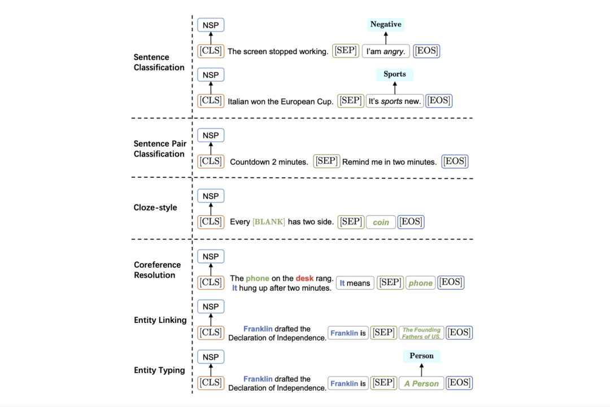

# 4.2 复用预训练目标——实现基于 Prompt 的统一范式

我们需要思考，上述所讲的内容为什么要设计 Template（和 Verbalizer）？为什么都要包含 mask token？

回顾第一节我们介绍的几个预训练语言模型，我们发现目前绝大多数的双向预训练语言模型都包含 Masked Language Modeling（MLM），单向预训练语言模型都包含 Autoregressive Language Modeling（ALM），这些任务是预训练目标，本质上是预测被 mask 的位置的词，在训练时让模型理解语言的上下文信息。之所以设计 Template 和指令，就是希望在下游任务时能够复用这些预训练的目标，避免引入新的参数而导致过拟合。因此，我们可以将 Prompt 升华到一个新的高度，即 **Prompt Tuning 的本质是复用预训练语言模型在预训练阶段所使用的目标和参数** 。

> 基于 Huggingface 的预训练模型仓库中，我们一般称之为 LMhead，本质上就是一个 MLP，输入为一个大小为 [batch_size, sequence_length, hidden_size] 的张量，输出为 [batch_size, sequence_length, vocab_size] 的概率分布。

由于绝大多数的语言模型都采用 MLM 或 ALM 进行训练，所以我们现如今所看到的大多数基于 Prompt 的分类都要设计 Template 和 Verbalizer。那么我们是否可以极大化地利用 MLM 和 ALM 的先验知识在不同的下游任务上获得更好的表现？是否可以设计一个全新的预训练任务来满足一些下游任务的需求呢？

我们介绍两个充分利用这个思想的方法：

*   **万物皆可生成** ：将所有任务统一为文本生成，极大化利用单向语言模型目标；
    
*   **万物皆可抽取** ：将所有任务统一为抽取式阅读理解，并设计抽取式预训练目标；
    
*   **万物皆可推理** ：将所有任务建模为自然语言推断（Natural Language Inference）或相似度匹配任务。
    

## （1）万物皆可生成——基于生成的 Prompt 范式统一

在含有单向 Transformer 的语言模型中（例如 GPT、BART），都包含自回归训练目标，即基于上一个 token 来预测当前的 token，而双向语言模型中的 MLM 可以视为只生成一个 token 的自回归模型。

为此，我们则可以将分类任务视为一种特殊的文本生成，并配上 Verbalizer，这样，所有的 NLP 任务都可以统一为生成任务。针对不同的任务，只需要提供对应的指令和模板即可（由于是使用单向语言模型，因此没有 mask token，需要生成的部分置于文本末尾）。下面给出几个示例：

图1. 

利用此思想，有很多工作致力于通过 Prompt 与生成的思想将各类任务进行统一。以问答领域为例，问答包括生成式问答、抽取式问答、多项选择等，我们可以将各种类型的问答建模为生成任务。

典型的方法例如：《UNIFIEDQA: Crossing format boundaries with a single QA system》、《ProQA- Structural Prompt-based Pre-training for Unified Question Answering》，其采用端到端的预训练语言模型（例如 BART、T5），并复用预训练阶段的训练目标。

图2. 

最近大火的 ChatGPT 则是基于 “万物皆可生成” 的思想，将单向语言模型的 ALM 发挥到极致，实现对所有任务的大一统，与之为代表的还有 In-Context Learning、Instruction-Tuning 和 Chain-of-Thought，将在第 5 章节介绍。

## （2）万物皆可抽取——基于抽取式阅读理解的 Prompt 范式统一

基于生成的方法存在两个缺点：

*   必须让待生成的部分置于文本末尾，此时会约束指令和模板的设计，不利于灵活运用；
    
*   由于是开放式生成，生成的内容无法控制，且依赖于文本的长度等；
    
*   对于一些具有条件限制的任务，例如多项选择、信息抽取等，生成的内容或许不符合这些条件。例如在做实体抽取的时候，需要确保生成的实体是在文本中出现的。
    

为此，“万物皆可抽取” 的思想可以解决此类问题，其思想指将所有自然语言理解任务转换为抽取式阅读理解的形式，下面给出形式化的定义：

> **抽取式阅读理解 (Extractive MRC)** : 给定一个问题 (Question) ，一篇文章或文本（Passage） ，其中 分别表示 Question 和 Passage 的 token, 分别表示 Question 和 Passage 的长度。任务的目标是根据 Question，在 Passage 中寻找一个区间 start: end] 作为答案 start end

除了抽取式阅读理解任务外，其他 NLP 任务如何转换为这个形式呢？本质上还是在如何设计模板和指令。下面给出几个事例：

图3. 

可以发现，如果是分类型的任务，只需要通过指令和模板的形式将所有类别罗列起来即可。在训练时，可以采用两种方法：

* 设计抽取式预训练目标，在无标注语料上进行自监督训练；
    
* 按照阅读理解的形式统一所有任务范式，并混合所有任务进行 Cross-task Learning，再在新的任务上进行测试。
    

经典的方法比如《Unifying Question Answering, Text Classification, and Regression via Span Extraction》，苏剑林提出的 Global Pointer。博主也运用该思想在 2022 年 AIWIN 春季赛 “中文保险小样本” 中获得第二名成绩。

基于 MRC 的范式统一方法则是提出新的预训练目标——区间抽取，并巧妙的集成了一些比较复杂的任务，例如实体识别，同时抽取式方法也可以很好地运用在多标签分类问题上，同理，实体识别和多区间抽取 QA 也属于类似多标签问题，即需要抽取出数量不等的区间。但是缺点是无法运用到生成问题上，且依赖于候选项。

## （3）万物皆可推理——基于 NLI 的 Prompt 范式统一

另外一个方法则是将所有任务建模为 NLI 形式，其与上文介绍的 MPT 比较类似，除了 MPT 以外，《Entailment as Few-Shot Learner》（EFL）和 NSP-BERT 也是类似的方法，其思想是复用 BERT 中的 Next Sentence Prediction（NSP）的预训练目标。下面给出几个事例：

图4. 

通常可以直接使用 NSP 对应的 LMhead 进行微调，在训练过程中还需要考虑如何进行负采样，一般方法是直接选择其他类别作为负样本。

> 例如一个分类问题中有 个类别。给定一个句子有对应 个正确的类别 (ground truth) , 当 时就是单标签的分类, 则是多标签分类。那么每个句子就可以得到 个正样本 (即输入句子与对应标签是蕴含关系的) 和 个负样本。在训练的时候, 则可以构建一个句子 - 类别矩阵 , 其中 表示第 个句子与第 个类别是否存在蕴含关系。

下图给出传统 Fine-tuning（图（a））、基于 MLM 的 Prompt-Tuning（图（b））和基于 NLI 的 Prompt-Tuning（图（c））的对比：

图5. 

可以发现，两种 Prompt-Tuning 方法的共同点是都是复用了预训练阶段所使用的目标和参数，不同点是对任务建模的方式和指令模板的设计有所不同。在复用 NSP 时，则需要罗列所有的类别并与输入样本做拼接，从而将多类分类问题转换为判断输入与标签是否存在蕴含关系（Entailment）。

另外，该思想也在最近大火的多模态模型 CLIP 模型中应用，通过设计 Prompt 的形式对文本和图像进行匹配，并设计对比学习目标进行预训练。