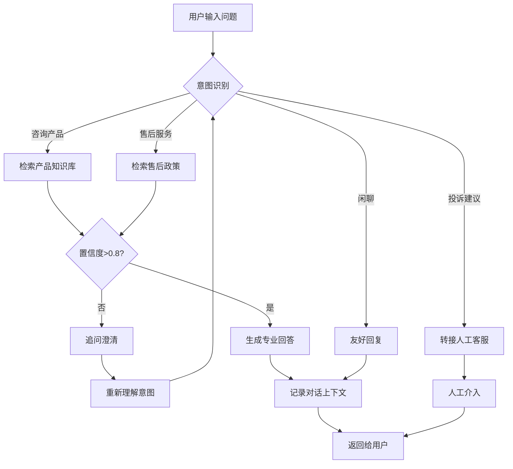

# 大模型实战案例

本章节通过实际案例，帮助初学者将大模型技术应用到真实场景中。由浅入深，涵盖从简单的 API 调用到复杂的应用开发。

---

## 目录

1. [案例一：智能客服聊天机器人](#案例一智能客服聊天机器人)
2. [案例二：文档问答系统](#案例二文档问答系统)
3. [案例三：代码辅助工具](#案例三代码辅助工具)
4. [案例四：智能数据分析助手](#案例四智能数据分析助手)
5. [案例五：多智能体协作系统](#案例五多智能体协作系统)

---

## 案例一：智能客服聊天机器人

### 📋 项目概述

构建一个基于大模型的智能客服系统，能够回答用户关于产品的常见问题，并在需要时转接人工客服。

### 🏗️ 系统架构

```
┌─────────────────────────────────────────────────────────────┐
│                         用户界面                             │
│                   (Web / APP / 小程序)                        │
└───────────────────────┬─────────────────────────────────────┘
                        │
                        ▼
┌─────────────────────────────────────────────────────────────┐
│                      API 网关层                              │
│              (鉴权、限流、请求转发)                           │
└───────────────────────┬─────────────────────────────────────┘
                        │
                        ▼
┌─────────────────────────────────────────────────────────────┐
│                    核心业务逻辑层                             │
│  ┌─────────────┐  ┌─────────────┐  ┌─────────────────────┐  │
│  │ 意图识别    │  │ 上下文管理  │  │ 知识库检索          │  │
│  │ (Intent)    │  │ (Context)   │  │ (RAG)               │  │
│  └──────┬──────┘  └──────┬──────┘  └──────────┬──────────┘  │
│         └─────────────────┼───────────────────┘             │
│                           ▼                                 │
│                    ┌─────────────┐                         │
│                    │  提示词工程  │                         │
│                    │  (Prompt)   │                         │
│                    └──────┬──────┘                         │
│                           ▼                                 │
│  ┌─────────────────────────────────────────────────────┐   │
│  │              大模型服务 (LLM API)                    │   │
│  │         GPT-4 / Claude / 文心一言 等                │   │
│  └─────────────────────────────────────────────────────┘   │
└───────────────────────────┬─────────────────────────────────┘
                            │
                            ▼
┌─────────────────────────────────────────────────────────────┐
│                    数据持久化层                              │
│     ┌──────────┐  ┌──────────┐  ┌──────────────────┐       │
│     │对话记录  │  │用户画像  │  │知识库向量数据库  │       │
│     │(MySQL)   │  │(Redis)   │  │(Milvus/Pinecone) │       │
│     └──────────┘  └──────────┘  └──────────────────┘       │
└─────────────────────────────────────────────────────────────┘
```

### 🔄 对话流程图



### 💻 核心代码实现

```python
"""
智能客服聊天机器人实现
作者: GPT-Notes
版本: 1.0.0
"""

import os
import json
import time
from typing import List, Dict, Optional, Tuple
from dataclasses import dataclass
from enum import Enum
import openai
import numpy as np
from sklearn.metrics.pairwise import cosine_similarity

# ==================== 配置部分 ====================

class Config:
    """系统配置类"""
    # OpenAI API 配置
    OPENAI_API_KEY = os.getenv("OPENAI_API_KEY", "your-api-key")
    MODEL_NAME = "gpt-3.5-turbo"  # 可根据需要切换模型
    MAX_TOKENS = 1000
    TEMPERATURE = 0.7
    
    # 意图识别阈值
    CONFIDENCE_THRESHOLD = 0.8
    
    # 上下文管理
    MAX_CONTEXT_LENGTH = 10  # 保存最近10轮对话


# ==================== 数据模型 ====================

class IntentType(Enum):
    """意图类型枚举"""
    PRODUCT_INQUIRY = "product_inquiry"      # 产品咨询
    AFTER_SALES = "after_sales"              # 售后服务
    COMPLAINT = "complaint"                  # 投诉建议
    SMALL_TALK = "small_talk"                # 闲聊
    UNKNOWN = "unknown"                      # 未知意图


@dataclass
class Message:
    """消息数据类"""
    role: str  # 'user' 或 'assistant'
    content: str
    timestamp: float = None
    
    def __post_init__(self):
        if self.timestamp is None:
            self.timestamp = time.time()
    
    def to_dict(self) -> Dict:
        """转换为字典格式，用于 API 调用"""
        return {
            "role": self.role,
            "content": self.content
        }


@dataclass
class ConversationContext:
    """对话上下文管理"""
    session_id: str
    messages: List[Message]
    user_profile: Dict
    
    def add_message(self, role: str, content: str):
        """添加新消息，保持上下文长度限制"""
        self.messages.append(Message(role=role, content=content))
        # 只保留最近的对话
        if len(self.messages) > Config.MAX_CONTEXT_LENGTH * 2:
            self.messages = self.messages[-Config.MAX_CONTEXT_LENGTH * 2:]
    
    def get_messages_for_api(self) -> List[Dict]:
        """获取 API 调用的消息格式"""
        return [msg.to_dict() for msg in self.messages]


# ==================== 知识库实现 ====================

class KnowledgeBase:
    """
    简易知识库实现（基于向量检索）
    实际生产环境可使用 Pinecone、Milvus 等向量数据库
    """
    
    def __init__(self):
        # 模拟产品知识库数据
        self.documents = [
            {
                "id": "prod_001",
                "category": "product",
                "question": "产品的价格是多少？",
                "answer": "我们的标准版售价 ¥299/月，专业版 ¥599/月，企业版请联系我们获取报价。",
                "keywords": ["价格", "费用", "多少钱", "收费"]
            },
            {
                "id": "prod_002",
                "category": "product",
                "question": "支持哪些支付方式？",
                "answer": "我们支持支付宝、微信支付、银行卡转账，企业用户还支持对公转账。",
                "keywords": ["支付", "付款", "支付宝", "微信"]
            },
            {
                "id": "serv_001",
                "category": "after_sales",
                "question": "如何申请退款？",
                "answer": "购买后7天内可申请无理由退款，请登录账户在「订单管理」中提交退款申请。",
                "keywords": ["退款", "退货", "退钱"]
            },
            {
                "id": "serv_002",
                "category": "after_sales",
                "question": "技术支持工作时间？",
                "answer": "在线客服：工作日 9:00-21:00；电话支持：工作日 9:00-18:00；紧急问题24小时响应。",
                "keywords": ["工作时间", "客服时间", "支持时间"]
            }
        ]
        # 预计算关键词的嵌入向量（实际应使用 Embedding API）
        self.keyword_embeddings = self._precompute_embeddings()
    
    def _precompute_embeddings(self) -> Dict:
        """预计算关键词嵌入（简化版，实际应调用 Embedding API）"""
        # 这里使用简化的词袋模型作为示例
        embeddings = {}
        for doc in self.documents:
            # 将关键词转换为简单向量表示
            vec = self._simple_embedding(" ".join(doc["keywords"]))
            embeddings[doc["id"]] = vec
        return embeddings
    
    def _simple_embedding(self, text: str) -> np.ndarray:
        """简化的文本向量化（实际应使用 text-embedding-ada-002）"""
        # 基于字符频率的简单编码
        vec = np.zeros(128)
        for i, char in enumerate(text[:128]):
            vec[i] = ord(char) % 100 / 100.0
        return vec
    
    def search(self, query: str, top_k: int = 3) -> List[Dict]:
        """
        检索相关知识
        
        Args:
            query: 用户查询
            top_k: 返回最相关的 k 条结果
        
        Returns:
            相关文档列表，包含相似度分数
        """
        query_vec = self._simple_embedding(query)
        
        results = []
        for doc in self.documents:
            doc_vec = self.keyword_embeddings[doc["id"]]
            similarity = cosine_similarity(
                query_vec.reshape(1, -1),
                doc_vec.reshape(1, -1)
            )[0][0]
            
            # 关键词匹配增强
            keyword_match = sum(1 for kw in doc["keywords"] if kw in query)
            final_score = similarity + keyword_match * 0.1
            
            results.append({
                **doc,
                "score": min(final_score, 1.0)  # 归一化到 0-1
            })
        
        # 按相似度排序
        results.sort(key=lambda x: x["score"], reverse=True)
        return results[:top_k]


# ==================== 意图识别模块 ====================

class IntentClassifier:
    """基于规则和 LLM 的混合意图识别"""
    
    # 规则模式定义
    RULE_PATTERNS = {
        IntentType.PRODUCT_INQUIRY: [
            "价格", "多少钱", "费用", "怎么买", "有什么功能",
            "支持什么", "怎么用", "是什么"
        ],
        IntentType.AFTER_SALES: [
            "退款", "退货", "售后", "维修", "保修", "技术支持",
            "客服", "联系", "帮助", "问题"
        ],
        IntentType.COMPLAINT: [
            "投诉", "举报", "不满", "太差", "垃圾", "骗子",
            "坑人", "欺骗", "虚假宣传"
        ],
        IntentType.SMALL_TALK: [
            "你好", "在吗", "谢谢", "再见", "拜拜", "哈哈",
            "早安", "晚安", "吃了吗", "天气"
        ]
    }
    
    def classify(self, text: str) -> Tuple[IntentType, float]:
        """
        识别用户意图
        
        Args:
            text: 用户输入文本
        
        Returns:
            (意图类型, 置信度)
        """
        text_lower = text.lower()
        scores = {}
        
        # 基于规则的匹配
        for intent, patterns in self.RULE_PATTERNS.items():
            match_count = sum(1 for p in patterns if p in text_lower)
            scores[intent] = match_count / len(patterns) if patterns else 0
        
        # 找出最高分的意图
        best_intent = max(scores, key=scores.get)
        confidence = scores[best_intent]
        
        # 如果规则匹配度低，标记为未知（可进一步使用 LLM 判断）
        if confidence < 0.1:
            return IntentType.UNKNOWN, 0.5
        
        return best_intent, min(confidence * 2, 1.0)  # 放大置信度


# ==================== 提示词工程 ====================

class PromptManager:
    """提示词模板管理"""
    
    # 系统提示词模板
    SYSTEM_PROMPT = """你是一位专业的智能客服助手，具备以下特点：

【角色设定】
- 友好、耐心、专业
- 使用礼貌用语
- 回答简洁明了

【回答原则】
1. 优先使用知识库中的信息回答
2. 如果知识库没有相关信息，坦诚告知
3. 复杂问题建议转人工客服
4. 保持上下文连贯性

【注意事项】
- 不涉及政治、宗教等敏感话题
- 不提供医疗、法律等专业建议
- 保护用户隐私信息

当前时间：{current_time}
用户身份：{user_type}
"""
    
    # 上下文提示词
    CONTEXT_PROMPT = """
【对话历史】
{conversation_history}

【相关知识】
{relevant_knowledge}

用户问题：{user_question}

请基于以上信息，给出专业、友好的回答。如果信息不足，请礼貌地告知需要更多信息或建议转人工客服。
"""
    
    @classmethod
    def build_system_prompt(cls, user_type: str = "普通用户") -> str:
        """构建系统提示词"""
        return cls.SYSTEM_PROMPT.format(
            current_time=time.strftime("%Y-%m-%d %H:%M"),
            user_type=user_type
        )
    
    @classmethod
    def build_context_prompt(
        cls,
        conversation_history: str,
        relevant_knowledge: str,
        user_question: str
    ) -> str:
        """构建上下文提示词"""
        return cls.CONTEXT_PROMPT.format(
            conversation_history=conversation_history,
            relevant_knowledge=relevant_knowledge,
            user_question=user_question
        )


# ==================== 核心服务类 ====================

class CustomerServiceBot:
    """智能客服机器人主类"""
    
    def __init__(self):
        # 初始化组件
        self.knowledge_base = KnowledgeBase()
        self.intent_classifier = IntentClassifier()
        self.contexts: Dict[str, ConversationContext] = {}  # 会话上下文缓存
        
        # 初始化 OpenAI 客户端
        openai.api_key = Config.OPENAI_API_KEY
    
    def get_or_create_context(self, session_id: str) -> ConversationContext:
        """获取或创建会话上下文"""
        if session_id not in self.contexts:
            self.contexts[session_id] = ConversationContext(
                session_id=session_id,
                messages=[],
                user_profile={}
            )
        return self.contexts[session_id]
    
    def process_message(
        self,
        session_id: str,
        user_message: str
    ) -> Dict:
        """
        处理用户消息的主入口
        
        Args:
            session_id: 会话唯一标识
            user_message: 用户输入的消息
        
        Returns:
            包含回复内容和元信息的字典
        """
        # 1. 获取会话上下文
        context = self.get_or_create_context(session_id)
        
        # 2. 意图识别
        intent, confidence = self.intent_classifier.classify(user_message)
        print(f"[意图识别] 类型: {intent.value}, 置信度: {confidence:.2f}")
        
        # 3. 根据意图类型处理
        if intent == IntentType.COMPLAINT:
            # 投诉直接转人工
            return self._handle_complaint(context, user_message)
        
        elif intent == IntentType.SMALL_TALK:
            # 闲聊简单回复
            return self._handle_small_talk(context, user_message)
        
        else:
            # 其他意图使用 RAG + LLM 处理
            return self._handle_standard_query(
                context, user_message, intent, confidence
            )
    
    def _handle_standard_query(
        self,
        context: ConversationContext,
        user_message: str,
        intent: IntentType,
        confidence: float
    ) -> Dict:
        """处理标准查询（产品咨询、售后等）"""
        
        # 1. 检索知识库
        relevant_docs = self.knowledge_base.search(user_message, top_k=3)
        
        # 2. 判断是否找到相关知识
        if not relevant_docs or relevant_docs[0]["score"] < 0.3:
            # 知识库无匹配，需要追问或转人工
            return {
                "reply": "抱歉，我可能没有理解您的问题。您能更详细地描述一下吗？或者您可以直接联系人工客服获取帮助。",
                "need_clarification": True,
                "transfer_to_human": False,
                "intent": intent.value,
                "confidence": confidence
            }
        
        # 3. 构建提示词
        knowledge_text = "\n".join([
            f"- {doc['question']}: {doc['answer']}"
            for doc in relevant_docs
        ])
        
        history_text = self._format_history(context.messages[-6:])  # 最近3轮
        
        # 4. 调用 LLM 生成回复
        messages = [
            {
                "role": "system",
                "content": PromptManager.build_system_prompt()
            },
            {
                "role": "user",
                "content": PromptManager.build_context_prompt(
                    conversation_history=history_text,
                    relevant_knowledge=knowledge_text,
                    user_question=user_message
                )
            }
        ]
        
        try:
            response = openai.ChatCompletion.create(
                model=Config.MODEL_NAME,
                messages=messages,
                max_tokens=Config.MAX_TOKENS,
                temperature=Config.TEMPERATURE
            )
            
            reply = response.choices[0].message.content
            
            # 5. 更新上下文
            context.add_message("user", user_message)
            context.add_message("assistant", reply)
            
            return {
                "reply": reply,
                "need_clarification": False,
                "transfer_to_human": confidence < 0.5,
                "intent": intent.value,
                "confidence": confidence,
                "sources": [doc["id"] for doc in relevant_docs[:2]]
            }
            
        except Exception as e:
            print(f"[错误] LLM 调用失败: {e}")
            return {
                "reply": "系统暂时繁忙，请稍后再试。",
                "error": str(e),
                "transfer_to_human": True
            }
    
    def _handle_complaint(
        self,
        context: ConversationContext,
        user_message: str
    ) -> Dict:
        """处理投诉类消息"""
        reply = """非常抱歉给您带来了不好的体验！您的反馈对我们很重要。

为了更好地解决您的问题，我建议：
1. 直接联系人工客服：400-XXX-XXXX
2. 或留下您的联系方式，我们会尽快与您联系

请问您方便提供联系电话吗？"""
        
        context.add_message("user", user_message)
        context.add_message("assistant", reply)
        
        return {
            "reply": reply,
            "transfer_to_human": True,
            "intent": IntentType.COMPLAINT.value,
            "priority": "high"
        }
    
    def _handle_small_talk(
        self,
        context: ConversationContext,
        user_message: str
    ) -> Dict:
        """处理闲聊类消息"""
        casual_responses = {
            "你好": "您好！很高兴为您服务，有什么可以帮您的吗？😊",
            "在吗": "在的！有什么可以帮助您的？",
            "谢谢": "不客气！很高兴能帮到您。还有其他问题吗？",
            "再见": "再见！祝您有美好的一天！👋",
            "拜拜": "拜拜！期待再次为您服务~"
        }
        
        # 尝试匹配关键词
        reply = None
        for keyword, response in casual_responses.items():
            if keyword in user_message:
                reply = response
                break
        
        if not reply:
            reply = "您好！我是智能客服助手，有什么可以帮您的吗？"
        
        context.add_message("user", user_message)
        context.add_message("assistant", reply)
        
        return {
            "reply": reply,
            "intent": IntentType.SMALL_TALK.value,
            "casual": True
        }
    
    def _format_history(self, messages: List[Message]) -> str:
        """格式化对话历史为文本"""
        lines = []
        for msg in messages:
            role_label = "用户" if msg.role == "user" else "助手"
            lines.append(f"{role_label}: {msg.content}")
        return "\n".join(lines)


# ==================== 使用示例 ====================

def demo():
    """演示智能客服的使用"""
    
    print("=" * 60)
    print("🤖 智能客服机器人演示")
    print("=" * 60)
    
    # 初始化机器人
    bot = CustomerServiceBot()
    session_id = "demo_session_001"
    
    # 测试对话
    test_messages = [
        "你好",
        "你们的产品价格是多少？",
        "支持支付宝付款吗？",
        "如果不满意可以退款吗？",
        "你们的服务太差了，我要投诉！"
    ]
    
    for msg in test_messages:
        print(f"\n👤 用户: {msg}")
        print("-" * 40)
        
        result = bot.process_message(session_id, msg)
        
        print(f"🤖 助手: {result['reply']}")
        print(f"📊 意图: {result.get('intent', 'unknown')}")
        print(f"🔢 置信度: {result.get('confidence', 'N/A')}")
        
        if result.get('transfer_to_human'):
            print("⚠️  建议转人工客服")
        print()


if __name__ == "__main__":
    demo()
```

### 🎯 关键概念解释

| 概念 | 说明 | 作用 |
|------|------|------|
| **意图识别 (Intent)** | 判断用户想要做什么 | 决定后续处理流程 |
| **RAG** | 检索增强生成 | 让大模型基于知识库回答 |
| **上下文管理** | 保存多轮对话历史 | 保持对话连贯性 |
| **置信度** | 模型对识别结果的确定程度 | 决定是否转人工 |

### 📚 扩展阅读

- [什么是 RAG (检索增强生成)](https://arxiv.org/abs/2005.11401)
- [Prompt Engineering 最佳实践](https://platform.openai.com/docs/guides/prompt-engineering)
- [向量数据库选型指南](https://www.pinecone.io/learn/vector-database/)

---

## 案例二：文档问答系统

> 持续更新中...

---

*最后更新: 2025年2月14日*
