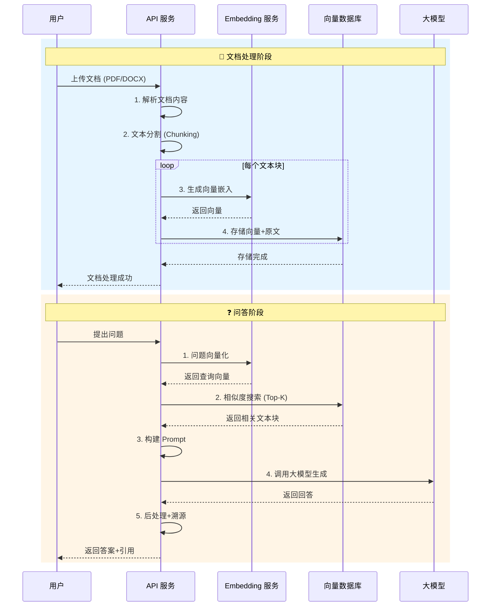

# 案例二：文档问答系统（RAG 实战）

## 📋 项目概述

构建一个基于 **RAG (Retrieval-Augmented Generation，检索增强生成)** 技术的文档问答系统。该系统能够让用户上传文档，然后基于文档内容进行智能问答。

```
┌─────────────────────────────────────────────────────────────────┐
│                     文档问答系统架构图                            │
├─────────────────────────────────────────────────────────────────┤
│                                                                 │
│   ┌──────────┐      ┌─────────────┐      ┌─────────────────┐   │
│   │ 文档上传 │ ───▶ │ 文本分割    │ ───▶ │ Embedding 编码  │   │
│   │ (PDF/TXT)│      │ (Chunking)  │      │ (向量化)        │   │
│   └──────────┘      └─────────────┘      └────────┬────────┘   │
│                                                    │            │
│                                                    ▼            │
│   ┌──────────────────────────────────────────────────────┐    │
│   │              向量数据库 (Vector DB)                   │    │
│   │   ┌──────────────────────────────────────────────┐   │    │
│   │   │  Doc1_Chunk1  ──▶  [0.23, -0.45, 0.89, ...] │   │    │
│   │   │  Doc1_Chunk2  ──▶  [-0.12, 0.67, -0.34, ...]│   │    │
│   │   │  Doc2_Chunk1  ──▶  [0.56, -0.23, 0.78, ...] │   │    │
│   │   │  ...                                         │   │    │
│   │   └──────────────────────────────────────────────┘   │    │
│   └────────────────────────┬─────────────────────────────┘    │
│                            │                                   │
│                            │ 相似度检索                         │
│                            ▼                                   │
│   ┌──────────┐      ┌─────────────┐      ┌─────────────────┐   │
│   │ 用户提问 │ ───▶ │ 查询向量化  │ ───▶ │ Top-K 相似检索  │   │
│   └──────────┘      └─────────────┘      └────────┬────────┘   │
│                                                    │            │
│                                                    ▼            │
│   ┌──────────────────────────────────────────────────────┐    │
│   │                    大模型 (LLM)                       │    │
│   │  输入: 检索到的相关文本 + 用户问题                     │    │
│   │  输出: 基于文档内容的准确回答                          │    │
│   └──────────────────────────────────────────────────────┘    │
│                                                                 │
└─────────────────────────────────────────────────────────────────┘
```

## 🔄 RAG 工作流程



## 💻 核心代码实现

```python
"""
RAG 文档问答系统
基于 LangChain 框架实现

依赖安装:
pip install langchain langchain-openai chromadb pypdf unstructured
"""

import os
import tempfile
from typing import List, Dict, Optional, Tuple
from dataclasses import dataclass
from pathlib import Path

from langchain.document_loaders import (
    PyPDFLoader,
    TextLoader,
    UnstructuredWordDocumentLoader
)
from langchain.text_splitter import RecursiveCharacterTextSplitter
from langchain.embeddings.openai import OpenAIEmbeddings
from langchain.vectorstores import Chroma
from langchain.chat_models import ChatOpenAI
from langchain.chains import RetrievalQA
from langchain.prompts import PromptTemplate
from langchain.schema import Document


# ==================== 配置 ====================

class RAGConfig:
    """RAG 系统配置"""
    # API 配置
    OPENAI_API_KEY = os.getenv("OPENAI_API_KEY")
    
    # 文本分割参数
    CHUNK_SIZE = 500        # 每个文本块的大小
    CHUNK_OVERLAP = 50      # 重叠大小，保持上下文连贯
    
    # 检索参数
    TOP_K = 5               # 检索最相关的 K 个文本块
    SIMILARITY_THRESHOLD = 0.7  # 相似度阈值
    
    # 模型配置
    LLM_MODEL = "gpt-3.5-turbo"
    TEMPERATURE = 0.0       # 0 表示更确定的回答


# ==================== 文档处理器 ====================

class DocumentProcessor:
    """
    文档处理类
    负责加载、解析和分割文档
    """
    
    # 支持的文件类型
    SUPPORTED_EXTENSIONS = {
        '.pdf': PyPDFLoader,
        '.txt': TextLoader,
        '.docx': UnstructuredWordDocumentLoader,
        '.doc': UnstructuredWordDocumentLoader
    }
    
    def __init__(self):
        self.text_splitter = RecursiveCharacterTextSplitter(
            chunk_size=RAGConfig.CHUNK_SIZE,
            chunk_overlap=RAGConfig.CHUNK_OVERLAP,
            length_function=len,
            separators=["\n\n", "\n", "。", "；", " ", ""]
        )
    
    def load_document(self, file_path: str) -> List[Document]:
        """
        加载文档
        
        Args:
            file_path: 文档路径
        
        Returns:
            Document 对象列表
        """
        path = Path(file_path)
        extension = path.suffix.lower()
        
        if extension not in self.SUPPORTED_EXTENSIONS:
            raise ValueError(f"不支持的文件类型: {extension}")
        
        loader_class = self.SUPPORTED_EXTENSIONS[extension]
        loader = loader_class(file_path)
        
        print(f"📄 正在加载文档: {path.name}")
        documents = loader.load()
        print(f"   ✓ 加载完成，共 {len(documents)} 页/段")
        
        return documents
    
    def split_documents(self, documents: List[Document]) -> List[Document]:
        """
        分割文档为文本块
        
        Args:
            documents: 原始文档列表
        
        Returns:
            分割后的文本块列表
        """
        print(f"✂️  正在分割文档...")
        chunks = self.text_splitter.split_documents(documents)
        print(f"   ✓ 分割完成，共 {len(chunks)} 个文本块")
        print(f"   ✓ 平均块大小: {sum(len(c.page_content) for c in chunks) / len(chunks):.0f} 字符")
        
        return chunks
    
    def process(self, file_path: str) -> List[Document]:
        """
        完整的文档处理流程
        
        Args:
            file_path: 文档路径
        
        Returns:
            处理后的文本块
        """
        documents = self.load_document(file_path)
        chunks = self.split_documents(documents)
        
        # 添加元数据
        for i, chunk in enumerate(chunks):
            chunk.metadata.update({
                "chunk_index": i,
                "source_file": Path(file_path).name,
                "total_chunks": len(chunks)
            })
        
        return chunks


# ==================== 向量存储管理器 ====================

class VectorStoreManager:
    """
    向量存储管理类
    负责向量的存储、检索和管理
    """
    
    def __init__(self, persist_directory: str = "./chroma_db"):
        """
        初始化向量存储
        
        Args:
            persist_directory: 持久化目录
        """
        self.persist_directory = persist_directory
        self.embeddings = OpenAIEmbeddings(
            openai_api_key=RAGConfig.OPENAI_API_KEY
        )
        self.vectorstore = None
        
        # 如果存在已有数据库，加载它
        if os.path.exists(persist_directory):
            print(f"📦 加载已有向量数据库: {persist_directory}")
            self.vectorstore = Chroma(
                persist_directory=persist_directory,
                embedding_function=self.embeddings
            )
    
    def add_documents(self, documents: List[Document], collection_name: str = "default"):
        """
        添加文档到向量数据库
        
        Args:
            documents: 要添加的文本块
            collection_name: 集合名称
        """
        print(f"🔢 正在生成向量嵌入...")
        
        if self.vectorstore is None:
            # 创建新的向量存储
            self.vectorstore = Chroma.from_documents(
                documents=documents,
                embedding=self.embeddings,
                persist_directory=self.persist_directory,
                collection_name=collection_name
            )
        else:
            # 添加到现有存储
            self.vectorstore.add_documents(documents)
        
        # 持久化
        self.vectorstore.persist()
        print(f"   ✓ 向量存储完成，已持久化到: {self.persist_directory}")
    
    def similarity_search(
        self,
        query: str,
        k: int = None,
        filter_dict: Dict = None
    ) -> List[Tuple[Document, float]]:
        """
        相似度搜索
        
        Args:
            query: 查询文本
            k: 返回结果数量
            filter_dict: 过滤条件
        
        Returns:
            (文档, 相似度分数) 列表
        """
        if self.vectorstore is None:
            raise ValueError("向量数据库为空，请先添加文档")
        
        k = k or RAGConfig.TOP_K
        
        # 使用 similarity_search_with_score 获取相似度分数
        results = self.vectorstore.similarity_search_with_score(
            query=query,
            k=k,
            filter=filter_dict
        )
        
        return results
    
    def get_retriever(self, search_kwargs: Dict = None):
        """
        获取检索器，用于 QA Chain
        """
        if self.vectorstore is None:
            raise ValueError("向量数据库为空")
        
        search_kwargs = search_kwargs or {"k": RAGConfig.TOP_K}
        return self.vectorstore.as_retriever(search_kwargs=search_kwargs)


# ==================== 问答引擎 ====================

class QAEngine:
    """
    问答引擎
    核心功能：基于检索的问答
    """
    
    # 自定义提示词模板
    QA_PROMPT_TEMPLATE = """你是一个专业的文档问答助手。请基于以下提供的文档内容，回答用户的问题。

【回答规则】
1. 只基于提供的文档内容回答，不要添加外部知识
2. 如果文档中没有相关信息，请明确告知"根据提供的文档，我无法找到相关信息"
3. 保持回答简洁准确，避免冗长
4. 如有多个相关信息，请综合整理

【相关文档内容】
{context}

【用户问题】
{question}

请基于以上文档内容回答问题："""
    
    def __init__(self, vector_store_manager: VectorStoreManager):
        """
        初始化问答引擎
        
        Args:
            vector_store_manager: 向量存储管理器
        """
        self.vector_store = vector_store_manager
        
        # 初始化大模型
        self.llm = ChatOpenAI(
            model_name=RAGConfig.LLM_MODEL,
            temperature=RAGConfig.TEMPERATURE,
            openai_api_key=RAGConfig.OPENAI_API_KEY
        )
        
        # 创建提示词
        self.qa_prompt = PromptTemplate(
            template=self.QA_PROMPT_TEMPLATE,
            input_variables=["context", "question"]
        )
        
        # 构建 QA Chain
        self.qa_chain = RetrievalQA.from_chain_type(
            llm=self.llm,
            chain_type="stuff",  # 简单地将所有文档拼接
            retriever=self.vector_store.get_retriever(),
            return_source_documents=True,
            chain_type_kwargs={"prompt": self.qa_prompt}
        )
    
    def ask(self, question: str) -> Dict:
        """
        提出问题并获取答案
        
        Args:
            question: 用户问题
        
        Returns:
            包含答案和源文档的字典
        """
        print(f"\n❓ 用户问题: {question}")
        print("-" * 50)
        
        # 首先执行相似度搜索，查看检索结果
        search_results = self.vector_store.similarity_search(question)
        print(f"🔍 检索到 {len(search_results)} 个相关文本块")
        
        for i, (doc, score) in enumerate(search_results, 1):
            print(f"   [{i}] 相似度: {1-score:.3f} | 来源: {doc.metadata.get('source_file', 'N/A')}")
        
        # 执行问答
        result = self.qa_chain({"query": question})
        
        return {
            "question": question,
            "answer": result["result"],
            "source_documents": result["source_documents"]
        }
    
    def ask_with_sources(self, question: str) -> str:
        """
        提问并返回格式化的答案（包含引用）
        """
        result = self.ask(question)
        
        # 构建带引用的回答
        answer = result["answer"]
        sources = result["source_documents"]
        
        # 添加引用信息
        source_info = "\n\n📚 参考来源:\n"
        seen_files = set()
        for i, doc in enumerate(sources, 1):
            file_name = doc.metadata.get('source_file', 'Unknown')
            if file_name not in seen_files:
                source_info += f"   [{i}] {file_name}\n"
                seen_files.add(file_name)
        
        return answer + source_info


# ==================== 完整系统封装 ====================

class DocumentQASystem:
    """
    文档问答系统主类
    整合所有组件，提供简洁的接口
    """
    
    def __init__(self, db_path: str = "./qa_vector_db"):
        """
        初始化系统
        
        Args:
            db_path: 向量数据库路径
        """
        self.doc_processor = DocumentProcessor()
        self.vector_store = VectorStoreManager(db_path)
        self.qa_engine = None
        
        # 如果已有数据，初始化 QA 引擎
        if self.vector_store.vectorstore is not None:
            self.qa_engine = QAEngine(self.vector_store)
    
    def upload_document(self, file_path: str) -> bool:
        """
        上传并处理文档
        
        Args:
            file_path: 文档路径
        
        Returns:
            是否成功
        """
        try:
            # 1. 处理文档
            chunks = self.doc_processor.process(file_path)
            
            # 2. 添加到向量数据库
            self.vector_store.add_documents(chunks)
            
            # 3. 重新初始化 QA 引擎
            self.qa_engine = QAEngine(self.vector_store)
            
            print(f"✅ 文档 '{Path(file_path).name}' 处理完成！")
            return True
            
        except Exception as e:
            print(f"❌ 处理失败: {e}")
            return False
    
    def query(self, question: str) -> str:
        """
        查询问题
        
        Args:
            question: 问题
        
        Returns:
            回答
        """
        if self.qa_engine is None:
            return "系统尚未加载任何文档，请先上传文档。"
        
        return self.qa_engine.ask_with_sources(question)
    
    def get_stats(self) -> Dict:
        """获取系统统计信息"""
        stats = {
            "has_documents": self.vector_store.vectorstore is not None,
            "db_path": self.vector_store.persist_directory
        }
        
        if self.vector_store.vectorstore:
            # 获取集合信息
            try:
                stats["document_count"] = self.vector_store.vectorstore._collection.count()
            except:
                stats["document_count"] = "Unknown"
        
        return stats


# ==================== 演示 ====================

def create_sample_document():
    """创建示例文档用于测试"""
    sample_text = """
# 公司年度财报 2024

## 一、公司概况

科技创新有限公司成立于2018年，专注于人工智能和企业软件解决方案。
公司总部位于北京，在上海、深圳设有分公司。

## 二、财务数据

2024年度主要财务指标：
- 营业收入：12.5亿元，同比增长35%
- 净利润：2.8亿元，同比增长42%
- 研发投入：3.2亿元，占营收25.6%
- 员工人数：1,250人

## 三、核心业务

### 3.1 人工智能平台
我们的AI平台服务于超过500家企业客户，提供：
- 自然语言处理服务
- 计算机视觉解决方案
- 智能数据分析

### 3.2 企业软件
企业软件业务线收入占比40%，主要产品包括：
- 企业资源计划系统 (ERP)
- 客户关系管理系统 (CRM)
- 人力资源管理系统 (HRM)

## 四、未来展望

2025年战略目标：
1. 营收突破20亿元
2. 拓展海外市场
3. 推出新一代大模型产品
4. 员工规模扩大到2,000人

## 五、联系方式

- 投资者关系：ir@tech-innovation.com
- 客服热线：400-888-9999
- 公司官网：www.tech-innovation.com
"""
    
    # 写入临时文件
    with tempfile.NamedTemporaryFile(mode='w', suffix='.txt', delete=False) as f:
        f.write(sample_text)
        return f.name


def demo():
    """演示文档问答系统"""
    
    print("=" * 60)
    print("📚 RAG 文档问答系统演示")
    print("=" * 60)
    
    # 初始化系统
    qa_system = DocumentQASystem(db_path="./demo_vector_db")
    
    # 创建并上传示例文档
    print("\n📄 创建示例文档...")
    sample_file = create_sample_document()
    qa_system.upload_document(sample_file)
    
    # 查询问题
    questions = [
        "这家公司的营业收入是多少？",
        "公司总部在哪里？",
        "主要业务有哪些？",
        "2025年的战略目标是什么？",
        "这家公司的创始人是谁？"  # 文档中没有的信息
    ]
    
    print("\n" + "=" * 60)
    print("🤖 开始问答")
    print("=" * 60)
    
    for q in questions:
        print("\n" + "-" * 60)
        answer = qa_system.query(q)
        print(f"\n💡 回答:\n{answer}")
    
    # 清理
    os.unlink(sample_file)
    print(f"\n\n✅ 演示完成！向量数据库保存在: ./demo_vector_db")


if __name__ == "__main__":
    demo()
```

## 📊 RAG vs 微调对比

```
┌─────────────────────────────────────────────────────────────────┐
│                 RAG vs Fine-tuning 选择指南                      │
├─────────────────────────────────────────────────────────────────┤
│                                                                 │
│   【使用 RAG 的情况】              【使用微调的情况】             │
│                                                                 │
│   ✅ 需要引用信息来源              ✅ 需要改变模型行为/语气        │
│   ✅ 数据经常更新                  ✅ 执行特定格式的任务          │
│   ✅ 数据量很大                    ✅ 数据量相对较小              │
│   ✅ 需要降低成本                  ✅ 需要减少延迟               │
│   ✅ 保护数据隐私（不发送给LLM）    ✅ 数据对公众敏感             │
│                                                                 │
├─────────────────────────────────────────────────────────────────┤
│   【RAG 的优势】                                                │
│   • 动态更新知识 - 无需重新训练                                  │
│   • 可追溯 - 能显示信息来源                                      │
│   • 成本较低 - 无需训练费用                                      │
│   • 更安全 - 数据存储在本地                                      │
│                                                                 │
│   【微调的优势】                                                │
│   • 更自然的交互体验                                            │
│   • 推理速度更快                                                │
│   • 可在离线环境运行                                            │
│   • 针对特定任务的优化                                          │
│                                                                 │
└─────────────────────────────────────────────────────────────────┘
```

## 🔧 关键技术点

### 1. 文本分割策略

```python
# 不同分割策略对比
def chunking_strategies():
    """
    ┌──────────────────────────────────────────────────────────┐
    │  策略类型        适用场景            优缺点               │
    ├──────────────────────────────────────────────────────────┤
    │  固定长度        通用场景            简单但可能切断语义   │
    │  递归分割        结构化文档          保留段落结构         │
    │  语义分割        长文档              按主题切分，精度高   │
    │  Agentic         复杂文档            智能决策，成本高     │
    └──────────────────────────────────────────────────────────┘
    """
    pass
```

### 2. 检索优化技巧

| 技巧 | 说明 | 效果 |
|------|------|------|
| **Query 扩展** | 用 LLM 扩展用户问题，生成多个变体 | 提高召回率 |
| **重排序 (Rerank)** | 使用更精确的模型对初步结果重排序 | 提高精度 |
| **混合检索** | 向量检索 + 关键词检索结合 | 平衡精度和召回 |
| **HyDE** | 用 LLM 生成假设文档再检索 | 处理复杂查询 |

### 3. 常见向量数据库对比

```
┌────────────────────────────────────────────────────────────────┐
│                   向量数据库对比                                 │
├──────────────┬──────────┬──────────┬──────────┬───────────────┤
│    数据库    │ 开源     │ 托管     │ 性能     │ 适合场景      │
├──────────────┼──────────┼──────────┼──────────┼───────────────┤
│  Chroma      │    ✓     │    ✗     │  中      │ 开发/原型     │
│  Milvus      │    ✓     │    ✓     │  高      │ 生产环境      │
│  Pinecone    │    ✗     │    ✓     │  高      │ 快速上手      │
│  Weaviate    │    ✓     │    ✓     │  高      │ 企业应用      │
│  Qdrant      │    ✓     │    ✓     │  中高    │ 云服务        │
└──────────────┴──────────┴──────────┴──────────┴───────────────┘
```

## 🎯 进阶：多文档问答

```python
class MultiDocumentQA:
    """支持多个文档集合的问答系统"""
    
    def __init__(self):
        self.collections = {}  # 不同类别的文档集合
    
    def add_collection(self, name: str, documents: List[str]):
        """添加文档集合"""
        self.collections[name] = {
            'documents': documents,
            'vectorstore': self._create_vectorstore(documents)
        }
    
    def query(self, question: str, collection: str = None) -> Dict:
        """
        查询，可指定特定集合或跨集合查询
        
        流程:
        1. 先识别问题涉及哪个文档集合
        2. 在对应集合中检索
        3. 如果没有指定集合，跨所有集合检索
        """
        if collection and collection in self.collections:
            # 特定集合查询
            return self._query_collection(question, collection)
        else:
            # 路由到最合适的集合
            target = self._route_question(question)
            return self._query_collection(question, target)
```

## 📚 参考资料

- [LangChain 官方文档](https://python.langchain.com/)
- [Retrieval-Augmented Generation for Knowledge-Intensive NLP Tasks](https://arxiv.org/abs/2005.11401)
- [Vector Databases: A Technical Overview](https://www.pinecone.io/learn/vector-database/)

---

*最后更新: 2025年2月14日*
