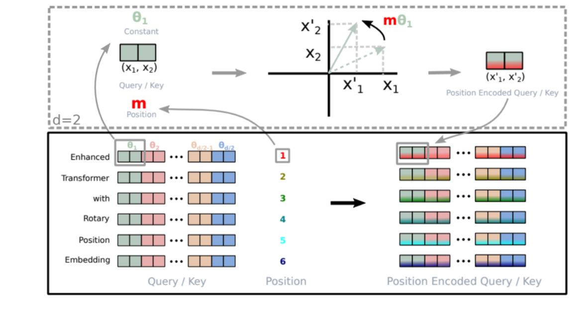
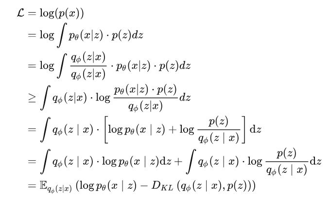
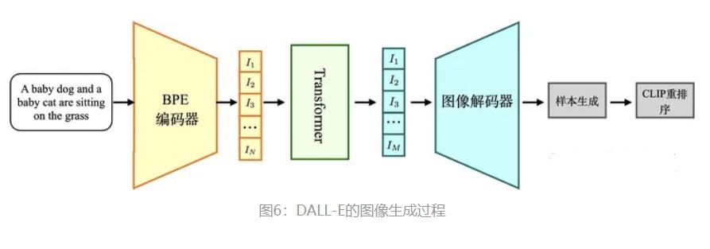

# 1.5 大模型

随着2023年chatgpt的爆火，大模型的研究热度也在与日俱增，在自动驾驶领域里也出现了自动驾驶和大模型结合的工作。在介绍这方面的工作之前，有必要先讲解一下大模型发展的来龙去脉。

## 1.5.1 gpt系列模型

### 1.5.1.1 gpt1

gpt1起源于《Improving Language Understanding by Generative Pre-Training》，是2018年由OpenAI的研究团队发布的一篇论文。它介绍了一种名为“生成式预训练”（Generative Pre-Training，简称gpt）的新型语言模型，该模型通过在大规模语料库上进行训练，能够学习自然语言的模式和规律，从而实现更好的语言理解。

gpt1模型是一种基于神经网络的自回归语言模型。该模型使用了前述1.3NLP自然语言处理一节已经介绍过的Transformer的架构，这是一种新型的序列到序列模型，能够在处理长序列数据时避免传统的循环神经网络中存在的梯度消失问题。Transformer架构中的关键组件包括多头注意力机制和残差连接等，gpt1使用了Transformer的解码器部分。为了预训练GPT模型，研究团队使用了两个大规模的语料库：BooksCorpus和英文维基百科。

以下是GPT1的主要技术特点：

基于Transformer架构：GPT1采用了Transformer架构，其中包括多头自注意力机制和前向神经网络。这使得GPT1可以在处理自然语言时捕捉长距离依赖性，并且具有高效的并行性。

图1. gpt1 

预训练技术：GPT-1使用了一种称为“生成式预训练”的技术。预训练分为两个阶段：预训练和微调（fine-tuning）。在预训练阶段，GPT-1使用了大量的无标注文本数据集，例如维基百科和网页文本等。通过最大化预训练数据集上的对数似然函数来训练模型参数。在微调阶段，GPT-1将预训练模型的参数用于特定的自然语言处理任务，如文本分类和问答系统等。

多层模型：GPT-1模型由多个堆叠的Transformer编码器组成，每个编码器包含多个注意力头和前向神经网络。这使得模型可以从多个抽象层次对文本进行建模，从而更好地捕捉文本的语义信息。

### 1.5.1.2 gpt2

《Language Models are Unsupervised Multitask Learners》是一篇介绍GPT-2模型的论文，它是2019年由OpenAI发表的。GPT-2主要解决的问题是如何利用大规模未标注的自然语言文本来预训练一个通用的语言模型，从而提高自然语言处理的能力。与GPT-1模型不同之处在于，GPT-2模型使用了更大的模型规模和更多的数据进行预训练，同时增加了许多新的预训练任务。

以下是GPT-2的主要技术特点：

- 大规模预训练：GPT-2使用了一种无监督学习的方法，在大规模文本语料库上进行预训练。在这个阶段，模型从语料库中学习文本序列的统计规律和语义信息。
- 非监督多任务学习：GPT-2具有多任务学习的能力，通过训练模型来执行多个不同的自然语言处理任务，从而提高模型的鲁棒性和泛化能力。
- Transformer架构：GPT-2使用Transformer架构作为模型的基础，使得模型可以自适应地处理长距离依赖关系，从而更好地理解文本的语义。
- 无需人工标注数据：GPT-2在训练过程中不需要人工标注数据，可以自动从大规模文本语料库中学习自然语言的规律。
- 零样本学习：GPT-2具有小样本学习的能力，能够在只看到少量样本的情况下学习和执行新任务。

### 1.5.1.3 gpt3

《Language Models are Few-Shot Learners》是一篇介绍GPT-3模型的论文，是2020年由OpenAI发表的。GPT-3主要解决的问题是如何使一个预训练的语言模型具有迁移学习的能力，即在只有少量标注数据的情况下，能够快速适应到新的任务中。

GPT-3模型采用了基于Transformer的架构，与前一代GPT-2类似，但是在模型规模、预训练数据量和使用的预训练任务上都有所增加。GPT-3的模型规模为1750亿个参数，是前一代GPT-2的100倍以上。GPT-3还具有零样本学习的能力，即能够在没有任何样本数据的情况下进行学习和预测。例如，当给定一个新的任务和一些文字描述时，GPT-3能够基于文字描述自动推理出该任务的执行过程。

### 1.5.1.4 instructGPT

由于gpt3.5、chatgpt和gpt4均没有公开的论文技术细节和开源代码，这里就介绍一下instructGPT的内容。《InstructGPT: Training language models to follow instructions with human feedback》是一篇由OpenAI团队发表的论文，于2021年在ICML上发布。

InstructGPT模型在GPT-3基础上进一步强化。InstructGPT使用来自人类反馈的强化学习方案RLHF(reinforcement learning from human feedback)，通过对大语言模型进行微调，从而能够在参数减少的情况下，实现优于GPT-3的功能。

图2. RLHF 

OpenAI在GPT-3基础上根据人类反馈的强化学习方案RHLF，训练出奖励模型去训练学习模型。

具体来说，该方法包括以下步骤：

定义指令：首先，定义指令集合，即人类需要模型生成的语言指令。这些指令通常是任务相关的，例如完成一项任务或回答某个问题。

生成指令：通过 InstructGPT 生成一个或多个备选指令，每个指令都对应一个相应的生成概率。这些备选指令会显示在屏幕上供人类评估。

人类反馈：人类对生成的备选指令进行评估，并提供一个奖励信号，表示该指令与预期指令的匹配程度。奖励信号可以表示为基于 BLEU、ROUGE 等指标的分数。

强化学习训练：根据人类反馈，训练模型以优化生成指令的质量。具体来说，使用强化学习算法，将生成的指令和人类反馈作为训练数据，迭代训练模型，以最大化生成指令的奖励信号。

该方法的优点是可以让语言模型更加有针对性地生成文本，以适应特定任务或场景，并且可以根据人类反馈进行动态调整，提高生成文本的质量和多样性。

### 1.5.2 Llama系列模型

除了gpt系列，Llama模型也是著名的大模型之一，由于其开源情况和效果都不错，它也是自动驾驶和大模型结合的工作中所用的基础大模型之一，所以有必要在此介绍一下。Llama (Large Language Model Meta AI)是Meta公司发布的大型语言模型系列，Llama1于2023年2月25日推出，Llama2于2023年7月19日推出。Llama 是一系列从 7 B到 65B 参数的基础语言模型。Meta 训练这些模型使用了数万亿个 token，并且证明了完全可以只使用公开可得的数据集来训练最先进的模型，而无需使用专有和不可获取的数据集。特别是，Llama-13B 在大多数基准测试中表现优于GPT-3（175B）。

#### 1.5.2.1 Llama1

##### 1.5.2.1.1 RMSNorm

Llama 的网络基于 Transformer 架构。为了提高训练稳定性，LLaMa 对每个 Transformer 子层的输入进行归一化，而不是对输出进行归一化。LLaMa 使用了 RMSNorm 归一化函数。在之前的Vision Transformer等论文中，Transformer中的Normalization层一般都是采用LayerNorm来对Tensor进行归一化，LayerNorm的公式如下：
$y= (x-E(x)) /\sqrt{Var(x)+ε}*γ+β$
$E(x)=Σ_{i=1}^N x_i/N$
$Var(x)=Σ_{i=1}^N (x_i-E(x))^2$
而RMSNorm就是LayerNorm的变体，RMSNorm省去了求均值的过程,也没有了偏置 $β$ ,即
$y=x/\sqrt{Mean(x^2)+ε}*γ$
$Mean(x^2)=Σ_{i=1}^N {x_i}^2/N$
其中 $γ$ 和 $β$ 为可学习的参数。

##### 1.5.2.1.2 SWiGLU

LLaMa 使用 SwiGLU 激活函数替换 ReLU 以提高性能，SwiGLU 是2019年提出的新的激活函数，它结合了 SWISH 和 GLU 两种者的特点。SwiGLU 主要是为了提升Transformer 中的 FFN(feed-forward network) 层的实现。
$SwiGLU(x,W,V,b,c,β)=Swish_β(xW+b)\circ(xV+c)$,其中\circ是阿达玛积符号。

##### 1.5.2.1.3 旋转位置编码

LLaMa 没有使用之前的绝对位置编码，而是使用了旋转位置编码（RoPE），可以提升模型的外推性。在RoPE中，可以通过绝对位置编码的方式实现相对位置编码，如下图所示, 序列两两一对利用复数坐标嵌入位置信息，最后编码矩阵则与旋转矩阵形式等价，这也是旋转位置编码的得名由来。有关旋转位置编码的数学推导过程比较复杂，可以参考论文《ROFORMER: ENHANCED TRANSFORMER WITH ROTARY POSITION EMBEDDING》。

图3. 旋转位置编码 

#### 1.5.2.2 Llama2

Llama2在Llama1的基础上对内存优化做了一些改进：

##### 1.5.2.2.1 KV Cache & GQA

大模型推理性能优化的一个常用技术是KV Cache，首先这里的K和V值得分别是Attention计算时的KV，这里的K V Cache就是将Attention 中的KV缓存下来，通过空间换时间的方式来加速计算Attention。通过将每次计算的K和V缓存下来，之后新的序列进来时只需要从KV Cache中读取之前的KV值即可，就不需要再去重复计算之前的KV了。此外，对于Q也不用将序列对应的所有 $Q_i$ 都计算出来，只需要计算最新的 $Q_newtoken$ , (即此时句子长度为1), K V同理。

GQA就如下图所示，多头注意力机制(MHA)就是多个头各自拥有自己的Q、K、V来算各自的Self-Attention，而MQA(Multi Query Attention)就是Q依然保持多头，但是K、V只有一个，所有多头的Q共享一个K、V ,这样做虽然能最大程度减少KV Cache所需的缓存空间，但是可想而知参数的减少意味着精度的下降，所以为了在精度和计算之间做一个trade-off，GQA (Group Query Attention)孕育而生，即Q依然是多头，但是分组共享K、V，即减少了K、V缓存所需的缓存空间。

图4. GQA 

##### 1.5.2.2.2 SiLU激活函数

与标准的Transformer一样，经过Attention层之后就进行FeedForward层的处理，但LLama2的FeedForward与LLama1的SWiGLU激活函数不一样，采用了SiLU激活函数：
$SiLU(x)=x*sigmoid(x)=x/(1+e^{-x})$

### 1.5.3 Dall-e系列

#### 1.5.3.1 Dall-e1

OpenAI创造的Dall-e图像生成器，能够直接通过文本描述生成图像。Dall-e主要包括dVAE、稀疏Transformer和CLIP三个模型架构，三个模型都是不同阶段独立训练的。下面讲一下dVAE、稀疏transformer和CLIP三个部分。

##### 1.5.3.1.1 阶段1：dVAE(离散变分自编码器,Discrete Variance Auto-Encoder)

在深度学习中，变分自编码器（VAE）是比较常见的生成模型。提到VAE，则又不得不提自编码器（Auto-Encoder，AE），AE是一个常见的降维算法，它由编码器和解码器组成，编码器用于将输入x压缩成信号y，表示为y=f(x)。解码器用于将信号y重构成内容r ，表示为r=h(y)。自编码器的误差定义为输入x和重构内容r的差值，它可以表示为式e=x-r=x-h(f(x))。

AE的一种特殊情况，它通过引入正则化来避免模型过拟合，并且保证隐层空间有较好的进行数据生成的能力。不同于AE的是，VAE的预测不再是一个值，而是一个分布，通过在分布上的随机采样便可以解码成不同的生成内容。给定一个输入 x ，VAE的编码器的输出应该是特征 z 的后验分布 p(z|x) 。但是这个分布是非常难计算的，一个替代方案是使用另外一个可伸缩的概率分布函数 q(z|x) 来替代 p(z|x) 。然后通过网络学习 q(z|x) 的参数，让其分布逼近 p(z|x) 。在计算分布的相似度时，一个常见的指标是KL散度（KL-Divergence），所以VAE的目标可以表示为最小化 p(z|x)和 q(z|x) 的KL散度。因为 q(z|x) 是一个概率分布函数，因此我们有$Σ_xq(z|x)=1$。

根据上面的介绍，可以给出VAE的证据下界（Evidence Lower Bound，ELB）的推导过程。下面证明不等式是利用了琴生不等式。这里的证据指数据或可观测变量的概率密度。

图5.证据下界 

上式是普通的变分自编码器的证明过程。在DALL-E1的阶段1中，这个证据下界可以写为下式。我们可以通过最大化下式来进行阶段1的优化。
$L=E_{q_{Φ}(z|x)}(log p_{θ}(x|z)-βD_{kL}(q_{Φ}(z|x),p_{ψ}(z))$

在DALL-E中， x是输入图像， z是图像编码的特征向量。$q_{Φ}$ 是输入图像编码后得到的大小为 32×32，通道数为 8,192的token的分布，$p_{θ}$ 是解码器根据token生成的RGB图像的分布。$p_{ψ}$ 是位于codebook(在NLP里，codebook就可以理解为一个小词典，里面装了最常用的单词，我们每一个长句子都能用这些词表示，这样就能达到一个压缩的效果)向量之上初始化的一个均匀分布，并不参与stage1的训练。

因为我们得到的 $q_{Φ}$ 是一个one-hot编码，计算one-hot编码时一般使用argmax取特征向量的最大值，但是这个argmax是不可导的，因此无法用来更新模型。DALL-E解决这个问题的策略是引入了Gumbel-Softmax的操作。

Gumbel-Softmax在DALL-E中可以理解为通过向softmax中引入超参数 $τ$ 来使argmax可导。超参数 $τ$ 在深度学习中有一个专业术语叫做温度，它可以通过调整softmax曲线的平滑程度来实现不同的功能。加入超参 $τ$ 的softmax可以表示为下式：
$σ_{τ}(p_{j})=exp(p_{j}/τ)/Σ_{i=1}^N (p_{i}/τ)$

当 $τ$ 的值大于1时，我们可以得到的更加平滑的softmax曲线，这种方式可以得到更加平滑的置信度分布。当 $τ$ 的值小于1时，得到的softmax曲线更加陡峭，当 $τ$ 的值趋近0时，可以得到近似argmax的效果，但是这时softmax还是可导的。在DALL-E中，$τ$ 的值被设置为了1/16以解决 $q_{Φ}$ 的不可导的问题。

在构建生成图像时，图像的像素是有值域范围的，而VAE中通过拉普拉斯分布或者高斯分布得到的值域是整个实数集，这就造成了模型目标和实际生成内容的不匹配问题。为了解决这个问题，DALL-E提出了拉普拉斯分布的变体：log-拉普拉斯分布。它的核心思想是将sigmoid作用到拉普拉斯分布的随机变量上，从而得到一个值域是(0,1)的随机变量，如下式：
$f(x|μ,b)=exp(-|logit(x)-μ|/b)/2bx(1-x)$

DALL-E的离散VAE的编码器和解码器都是基于残差网络构建的，DALL-E1保持了残差网络的基础结构，但也有其针对性的调整，它的核心修改如下：

- 编码器的输入层的卷积核的大小是7*7；
- 编码器的最后一个卷积的卷积核的大小是1*1，用于产生大小是 32 *32 *8192的Feature Map；
- 使用最大池化而非原来的平均池化进行降采样；
- 解码器的的第一个卷积核最后一个卷积的卷积核的大小均为 1*1；
- 解码器使用了最近邻的方式进行上采样;
- 为了提升训练速度，VAE使用了混合精度训练。

图像像素的范围是0到255，在DALL-E1中，输入像素的范围首先被映射到了(ε，1-ε)的范围，计算方式如下式：
$φ：x \rightarrow (1-2ε)*x/255+ε$
其中x为图像的像素值，ε是一个超参，原文设为0.1。
在解码器中，通过log-拉普拉斯分布得到的预测结果的范围是(0,1)，这里可以通过φ的逆运算便可以得到解码器的生成内容，表示为下式：
$\hat{x}=φ^{-1}(sigmoid(x))$

##### 1.5.3.1.2 阶段2：稀疏transformer先验分布学习

图6.先验分布学习 

在阶段2中，固定上式的 $ϕ$ 和 $θ$ ，只通过最大化证据下界来优化参数 $ψ$ ，这里 $p_{ψ}$ 是一个由120亿参数的稀疏Transformer构成的模型。如上图所示，首先使用BPE(Byte Pair Encoding，字节对编码)方法将文本编码成长度为 256，特征数为 16,384 的特征向量。然后将其与阶段1得到的图像特征进行拼接，最后使用稀疏Transformer自回归的训练这个图像和文本的拼接结果。

稀疏Transformer的特点是只关注Top-k个贡献最大的特征的状态，因此比普通的Transformer更能关注重要的特征。DALL-E1的Transformer有64个自注意力层，每个层的头数是62，每个注意力头的维度是64。

DALL-E共使用了3个不同形式的稀疏自注意力编码，如下图所示。给定注意力层的索引 $i$ ，(i∈[1,63])，如果(i-2)mod4=0，我们使用下图第三部分的列注意力。否则我们使用下图第一部分的行注意力。另外对于最后一层稀疏Transformer，我们使用下图第四部分的卷积稀疏自注意力。

图7.三种稀疏自注意力机制 

##### 1.5.3.1.3 图像生成CLIP

CLIP（Contrastive Language–Image Pre-training）是OpenAI的第一篇多模态预训练的算法，它延续了GPT系列“大力出奇迹”的传统。模型是一个基于图像和文本并行的多模态模型，然后通过两个分支的特征向量的相似度计算来构建训练目标。CLIP的核心思想是将图像和文本映射到同一个特征空间。这个特征空间是一个抽象的概念，例如当看到一条狗的图片的时候，我们心中想的是狗，当我们读到狗的时候我们想的也是狗，那么我们心中想象的狗，便是“特征空间”。

所以CLIP也是由两个编码器组成，如下图所示：

- 图像编码器：用于将图像映射到特征空间；
- 文本编码器：用于将文本映射到相同的特征空间。
  

图8.clip 

在模型训练过程中，我们取到的每个batch由 $N$ 个图像-文本对组成。这 $N$ 个图像送入到图像编码器中会得到N个图像特征向量$(I_{1},……,I_{N})$，同理将这 $N$ 个文本送入到文本编码器中我们可以得到 $N$ 个文本特征向量$(T_{1},……,T_{N})$。因为只有在对角线上的图像和文本是一对，所以CLIP的训练目标是让是一个图像-文本对的特征向量相似度尽可能高，而不是一对的相似度尽可能低，这里相似度的计算使用的是向量内积。通过这个方式，CLIP构建了一个由 $N$ 个正样本和 $N^2-N$ 个负样本组成的损失函数。另外，因为不同编码器的输出的特征向量长度不一样，CLIP使用了一个线性映射将两个编码器生成的特征向量映射到统一长度。

Dall-e1图像生成过程如下图所示，它首先将输入文本编码成特征向量，然将特征向量送入到自回归的Transformer中生成图像的token，再后将图像的token送入到dVAE的解码器中得到生成图像，最后通过CLIP对生成样本进行评估，得到最终的生成结果。

图9.图像生成过程 

#### 1.5.3.2 Dall-e2

Dall-e2主要包括三个部分：CLIP，先验模块prior和img decoder。Dall-e2将其三个部分分开训练，最后将这些训练好的子模块拼接在一起，最后实现由文本生成图像的功能。首先训练CLIP，使其能够编码文本和对应图像，这一步和上面介绍的CLIP流程一样。下面详细介绍训练先验模块prior和img decoder的流程。

##### 1.5.3.2.1 训练prior，使文本编码可以转换为图像编码

将CLIP中训练好的text encoder拿出来，输入文本 $y$ ，得到文本编码 $z_{t}$。同样的，将CLIP中训练好的img encoder拿出来，输入图像 $x$ 得到图像编码 $z_i$。我们希望prior能从 $z_t$ 获取相对应的 $z_i$。假设 $z_t$ 经过prior输出的特征为 $z^{'}_{i}$，那么我们自然希望 $z_i$ 与 $z^{'}_{i}$ 越接近越好，这样来更新我们的prior模块。最终训练好的prior，将与CLIP的text encoder串联起来，它们可以根据我们的输入文本 $y$ 生成对应的图像编码特征 $z_i$了。使用了主成分分析法PCA来提升训练prior的稳定性。

图10.prior训练过程 

在DALL·E2模型中，作者团队尝试了两种先验模型：自回归式Autoregressive (AR) prior 和扩散模型Diffusion prior。实验效果上发现两种模型的性能相似，而因为扩散模型效率较高，因此最终选择了扩散模型作为prior模块。

原文所用的扩散模型为DDPM(Denoising Diffusion Probabilistic Models，去噪扩散概率模型)。给定一个图像 $x_0$ ，每一次加一点点高斯噪声，变成 $x_t$ 直到加到 $x_T$ 变成一个完全是高斯噪声的图像，然后训练一个模型让模型根据 $x_t$ 图像，预测 $x_{t-1}$ 图像的情况(实际上，是预测残差图 $ϵ$ ，也就是预测在哪些位置加了噪声)，模型因为输入输出是一样的尺寸，所以一般使用 U-Net 进行生成，原来用 $T$ 步生成图片，就用 $T$ 步循环 forward 这个 U-Net 网络来进行图片的还原，这样就可以做到从高斯模型还原回一副真实的图片，训练的时候，用$(x_{t-1},x_{t})$ 构建数据集 ground truth，进行训练，生成的时候，让模型从高斯噪声图片一步步还原（生成）图片。此外，还通过某种方式往这个 U-Net 中加入当前的时间信息（目前预测到 $t$ 步），来提醒模型当前是需要增加低频（轮廓，色彩）信息还是高频（细节）信息。

##### 1.5.3.2.2 训练decoder生成最终的图像

训练decoder模块，从图像特征 $z_i$ 还原出真实的图像 $x$ ，如下图左边所示。这个过程与自编码器类似，从中间特征层还原出输入图像，但又不完全一样。我们需要生成出的图像，只需要保持原始图像的显著特征就可以了，这样以便于多样化生成，例如下图右边的示例。

图11.prior训练过程 

#### 1.5.3.3 Dall-e3

Dall-e3在2023年10月发布，由于目前只给出了技术报告而并未披露更详尽的技术细节和开源代码，这里仅就其技术报告作一概略介绍。从DALL-E3的技术架构来看，主要分为图像描述生成和图像生成两大模块。图像描述生成模块使用了CLIP图像编码器和GPT语言模型(GPT-4)，可为每张图像生成细致的文字描述。图像生成模块先用VAE将高分辨率图像压缩为低维向量，降低学习难度。然后，使用T5Transformer将文本编码为向量，并通过GroupNorm层将其注入latent diffusion模型，指导图像生成方向。latent diffusion是图像生成的核心技术,将图像生成问题分解为多次对噪声向量的小规模扰动,逐步邻近目标图像。研究人员发现,在压缩image latent空间上再训练一个Diffusion模型,可以进一步提升细节生成质量。

