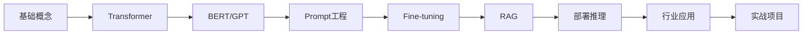

# 🚀 GPT-Notes 大模型学习笔记

<div align="center">


**简体中文** | [English](./README_EN.md)

---


*系统学习大模型，从入门到实战*

</div>

---

## 📖 简介

GPT-Notes 是一个全面的大模型学习笔记项目，旨在帮助开发者系统学习 LLMs（大型语言模型）相关知识。

> ⚡ **持续更新中** - 欢迎 Star & Fork ⭐

---

## 🗂️ 目录结构

```
GPT-Notes/
├── ch00_前沿/                      # 大模型最新动态
├── ch01_预训练语言模型/             # Transformer/BERT/GPT
├── ch02_Prompt-Tuning的定义/        # Prompt 基础
├── ch03_Prompt-Tuning的研究进展/    # P-tuning/Prefix-tuning
├── ch04_Prompt-Tuning的本质/        # 提示学习本质
├── ch05_llama2/                     # LLaMA 系列
├── ch06_langchain框架/              # LangChain 开发
├── ch07_Fine-tuning技术/            # LoRA/QLoRA/DeepSpeed
├── ch08_RAG技术/                    # RAG 检索增强
├── ch09_部署与推理/                 # vLLM/LMDeploy/量化
├── ch10_行业应用/                   # 智能客服/医疗/教育
└── 06_实战案例/                     # 实战项目
```

---

## 📚 学习路径



| 阶段 | 内容 | 建议时长 |
|------|------|----------|
| 1️⃣ 基础 | Transformer/BERT/GPT | 1周 |
| 2️⃣ 进阶 | Prompt/LangChain | 1周 |
| 3️⃣ 深入 | Fine-tuning/RAG | 2周 |
| 4️⃣ 实战 | 部署/行业应用 | 2周 |

---

## 🔥 核心内容

### 📌 预训练语言模型
- Transformer 架构详解
- BERT 模型原理与实战
- GPT 系列演进 (GPT-1 → GPT-4)

### 📌 Prompt 工程
- Prompt 设计原则
- Chain-of-Thought
- Few-shot Learning
- P-tuning / Prefix-tuning

### 📌 Fine-tuning
- LoRA 原理与实现
- QLoRA 高效微调
- DeepSpeed 分布式训练

### 📌 RAG 技术
- 向量数据库 (Chroma/FAISS/Milvus)
- 文档加载与分割
- 检索算法与重排序

### 📌 部署与推理
- vLLM 高效推理
- LMDeploy 部署
- 模型量化 (GPTQ/AWQ/GGUF)

### 📌 行业应用
- 智能客服机器人
- 医疗健康 AI
- 教育培训助手

---

## 🛠️ 实战案例

| 项目 | 描述 | 技术栈 |
|------|------|--------|
| 🤖 智能客服 | 基于 LLM 的客服系统 | LangChain + RAG |
| 📄 文档问答 | 企业知识库问答 | Embedding + Vector DB |
| 🧠 AI Agent | 自主智能体开发 | LangGraph + Tools |
| 💼 RAG 企业知识库 | 完整 RAG 实战 | Milvus + LlamaIndex |

---

## 📦 快速开始

```bash
# 克隆仓库
git clone https://github.com/gotonote/GPT-Notes.git

# 进入目录
cd GPT-Notes

# 查看目录结构
ls -la
```

---

## 🤝 贡献指南

欢迎提交 PR！请先阅读 [文章撰写规范](./文章撰写规范.md)。

```bash
# 1. Fork 仓库
# 2. 创建分支
git checkout -b feature/xxx

# 3. 提交更改
git commit -m "feat: 添加 xxx 内容"

# 4. 推送到远程
git push origin main
```

---

## 📋 更新日志

| 日期 | 内容 |
|------|------|
| 2026-02-15 | 添加 Fine-tuning/RAG/部署/行业应用 |
| 2026-02-14 | 添加实战案例 |
| 2026-02-14 | 初始化项目 |

---

## 📞 联系我们

- 📧 Email: 931531133@qq.com

---

<div align="center">

**⭐ Star us on GitHub to support our work! ⭐**

Made with ❤️ by [大白](https://github.com/gotonote)

</div>
