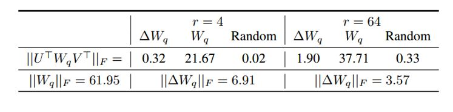
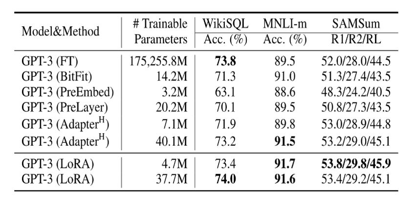

### 2.1 微调

微调大模型非常吃资源，以刚刚达到涌现能力边界的7B模型为例，微调7B模型需要3×28G的显存，至少需要2张A100的显卡才能满足要求。因此，如何降低微调大模型所需的机器资源，是初学者最为关心的问题。

目前主流对大模型进行微调方法有三种：
- Freeze
- P-Tuning
- Lora

以语言模型为例，在微调过程中模型加载预训练参数 $Φ_0$ 进行初始化,并通过最大化条件语言模型概率进行参数更新 $Φ_0+∆Φ$，即：
 $max_ΦΣ_{((x,y)∈Z)}Σ_{t=1}^{|y|}log(P_Φ(y_t|x,y<t))$
这种微调方式主要的缺点是我们学习到的参数增量 $∆Φ$ 的维度和预训练参数 $Φ_0$ 是一致的，这种微调方式所需的资源很多，一般被称为full fine-tuning。

研究者认为能用更少的参数表示上述要学习的参数增量 $∆Φ =∆Φ(Θ)$ ，其中 $|Θ|≪|Φ_0|$ ，原先寻找 $∆Φ$ 的优化目标变为寻找 $Θ$ ：
$max_{Φ}Σ_{((x,y)∈Z)}Σ_{t=1}^{|y|}log(P_{Φ_0}+∆Φ(Θ)(y_t|x,y<t))$
这种仅微调一部分参数的方法称为高效微调。针对高效微调，研究者有很多的实现方式(如Freeze、prefix-tuning和Lora等):

- Freeze方法：该方法的主要思想是在微调过程中"冻结"（即保持不变）预训练模型的一部分权重，只对特定层或参数进行更新，以便更好地适应新的任务或领域。

- P-Tuning方法： P-Tuning（Parameter Tuning）是一种用于语言模型微调的方法，旨在通过调整参数以适应特定任务或领域。相比于传统的微调方法，P-Tuning不仅微调模型的权重，还微调模型的超参数。
  
- Lora方法：旨在使用一个低秩矩阵来编码 $∆Φ$ ，相比于其他方法，LORA不会增加推理耗时且更便于优化。

下面详细介绍Lora方法。首先，在《intrinsic dimentionality explains the effectiveness of language model fine-tuning》一文中，作者表明了预训练模型拥有极小的内在维度(intrinsic dimension)，即存在一个极低维度的参数，微调它和在全参数空间中微调能起到相同的效果，同时在预训练后，越大的模型有越小的内在维度，这也解释了为何大模型都拥有很好的few-shot能力。

受intrinsic dimension工作的启发，Lora作者认为参数更新过程中也存在一个‘内在秩’。对于预训练权重矩阵 $W_0∈ℝ^{d×k}$ ，我们可以用一个低秩分解来表示参数更新 $△W$ ，即：
$W_0+△W= W_0+BA$
$B∈ℝ^{d×r},A∈ℝ^{r×k} and r≪min(d,k)$
训练过程中冻结参数 $W_0$ ，仅训练A和B中的参数。如上图所示，对于$ℎ= W_0x$ ，前向传播过程变为：
$ℎ= W_0x+△Wx=W_0x+BAx$

通过大量的对比实验，作者证明了LORA的有效性，但是作者希望进一步解释这种从下游任务中学到的低秩适应(low-rank adaptation)的特性。为此，作者提出了三个问题：
1. LORA应该作用于Transformer的哪个参数矩阵？
2. LORA最优的秩r是多少？
3. 参数增量 $△W$ 和 $W$ 的关系？

对于第一个问题从下图我们可以看到：
1. 将所有微调参数都放到attention的某一个参数矩阵的效果并不好，将可微调参数平均分配到W_q和W_k的效果最好
2. 秩仅取4也能获得足够的信息

图12.Lora微调结果1 

因此在实际操作中，应当将可微调参数分配到多种类型权重矩阵中，而不应该用更大的秩单独微调某种类型的权重矩阵。

对于第二个问题从下图我们可以看到：
在秩小到1或者2的时候，LORA的仍有不错的效果。这证明了更新参数矩阵 $△W$ 存在极小的‘内在秩’。

图13.Lora微调结果2 

从下图的对比结果，作者发现三个现象：
- 相比于随机矩阵，$△W$ 和 $W$ 有强关联。
- $△W$ 仅放大了 $W$ 中任务相关的特征，并未放大头部特征。
- $r$ 等于4时，$△W$ 的放大系数已经很大了。

因此我们可以得到结论：在训练过程中，低秩的适应矩阵 $△W$ 仅仅放大了对下游任务有用的特征，而不是预训练模型中的主要特征。

图14.Lora微调结果3 

如下图所示，LoRA在所有三个数据集上都匹配或超过微调基线。
并且经过实测，在Aquila-7B模型的Lora 微调中，设置r=8的情况下，训练参数从73亿降到了420万，仅为之前的0.057%。
在英伟达A100*80G4卡且batch_size=1的配置下，相比于全量SFT训练，LoRA所占用的显存降低了67.5%，训练速度增加了25.0%。而且可以独立保存，使得保存权重和转移权重更加方便。

图15.Lora微调结果4 

LoRA 的优势有以下三点：

- 可以针对不同的下游任务构建小型 LoRA 模块，从而在共享预训练模型参数基础上有效地切换下游任务。
- LoRA 使用自适应优化器（Adaptive Optimizer），不需要计算梯度或维护大多数参数的优化器状态，训练更有效、硬件门槛更低。
- LoRA 使用简单的线性设计，在部署时将可训练矩阵与冻结权重合并，不存在推理延迟。

但LoRA缺点也很明显，参与训练的模型参数量不多，也就百万到千万级别的参数量，所以效果比全量微调差很多。