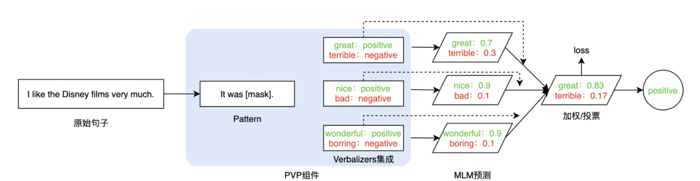
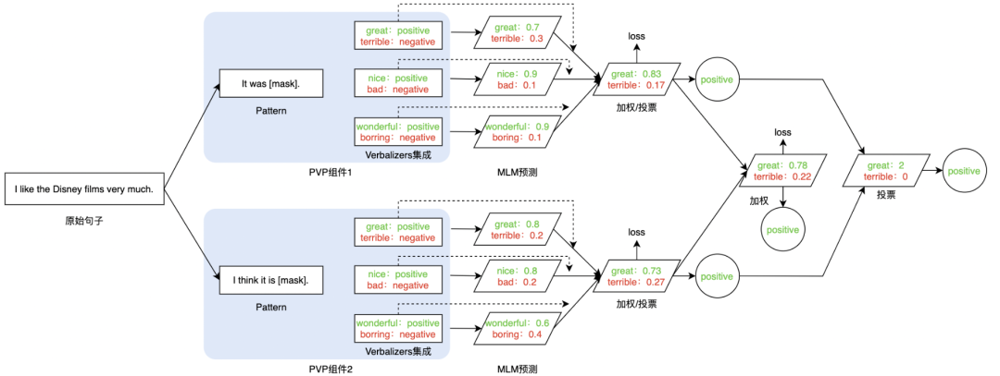

# 3.1 Prompt-Tuning 的鼻祖——GPT-3 与 PET

Prompt-Tuning 起源于 GPT-3 的提出《Language Models are Few-Shot Learners》（NIPS2020），其认为超大规模的模型只要配合好合适的模板就可以极大化地发挥其推理和理解能力。

其开创性提出 **in-context learning** 概念，即无须修改模型即可实现 few-shot/zero-shot learning。同时引入了 demonstrate learning，即让模型知道与标签相似的语义描述，提升推理能力。

*   **In-context Learning** ：是 Prompt 的前身。其通过从训练集中挑选一些样本作为任务的提示提示（Natural Language Prompt），来实现免参数更新的模型预测；
    
*   **Demonstration Learning** ：添加一些新的文本作为提示。例如在对 “I like the Disney film. It was [MASK]” 进行情感分析时，可以拼接一些相似场景的 ground-truth 文本 “I like the book, it was great.”、“The music is boring. It is terrible for me.” 等。此时模型在根据新添加的两个样例句子就可以 “照葫芦画瓢” 式地预测结果了。

不过以 GPT-3 为首的这类方法有一个明显的缺陷是—— **其建立在超大规模的预训练语言模型上** ，此时的模型参数数量通常超过 100 亿， **在真实场景中很难应用** ，因此众多研究者开始探索 GPT-3 的这套思路在小规模的语言模型（BERT）上还是否适用？事实上，这套方法在小规模的语言模型上是可行的，但是需要注意几点：

*   模型参数规模小了，Prompt 直接用在 Zero-shot 上效果会下降，因此需要考虑将 in-context learning 和 demonstrate learning 应用在 Fine-tuning 阶段；
    
*   GPT-3 中提供的提示（Natural Language Prompt）过于简单，并不难使用在一些具体的任务场景，因此需要单独设计一套组件实现。

因此，大名鼎鼎的 PET 模型问世，PET（Pattern-Exploiting Training）出自《Exploiting Cloze Questions for Few Shot Text Classification and Natural Language Inference》（EACL2021），根据论文题目则可以猜出，Prompt-Tuning 启发于文本分类任务，并且试图将所有的分类任务转换为与 MLM 一致的完形填空。

PET 详细地设计了 Prompt-Tuning 的重要组件——Pattern-Verbalizer-Pair（PVP），并描述了 Prompt-tuning 如何实现 Few-shot/Zero-shot Learning，如何应用在全监督和半监督场景（iPET）。PET 的详细讲解可参考 PET 的论文解读。

PET 设计了两个很重要的组件：

*   **Pattern（Template）** ：记作 ，即上文提到的 Template，其为额外添加的带有`[mask]`标记的短文本，通常一个样本只有一个 Pattern（因为我们希望只有 1 个让模型预测的`[mask]`标记）。上文也提到，不同的任务、不同的样本可能会有其更加合适的 pattern，因此 **如何构建合适的 pattern 是 Prompt-Tuning 的研究点之一** ；
    
*   **Verbalizer**: 记作 , 即标签词的映射, 对于具体的分类任务, 需要选择指定的标签词 (label word) 。例如情感分析中, 我们期望 Verbalizer 可能是 positive great, (negative terrible (positive 和 negative 是类标签) 。同样, 不同的任务有其相应的 label word, 但需要注意的是, Verbalizer 的构建需要取决于对应的 Pattern。因此如何构建 Verbalizer 是另一个研究挑战。上述两个组件被称为 Pattern-Verbalizer-Pair (PVP), 一般记作 , 在后续的大多数研究中均采用这种 PVP 组件。

因此基于 PVP 的训练目标可以形式化描述：

给定一个句子 ，以及对应的标签 ，给定定义的 PVP 组件 ，则有：

图1. 

那么会有读者一直会思考，一般情况下，一个句子只能有一个 PVP（因为我们只需要一个`[mask]`用来预测），这可能并不是最优的，是否可以为一个句子设计多个不同的 PVP 呢？这是可以的，这属于 Prompt-Tuning 的集成。PET 提供了简单的集成思路：

*   **Patterns Ensembling** ：同一个句子设计多个不同的 pattern，例如`It was [mask].`，`I think it is [mask].`，`This comment denotes as [mask].` 等，此时，原先只有一个句子，却可以生成多个不同的样本，也变相起到数据增强的作用。在训练时，可以当作单独的样本进行训练，推理时，则可以对所有 Pattern 的结果进行投票或加权。如下图所示：

图2. 

*   **Verbalizers Ensembling** ：同样，在给定的某个 Pattern 下，并非只有 1 个词可以作为 label word。例如 positive 类，则可以选择 “great”、“nice”、“wonderful”。当模型预测出这三个词时，均可以判定为 positive 类。在训练和推理时，可以对所有 label word 的预测概率进行加权或投票处理，并最后获得概率最大的类。如下图所示：
    

图3. 

*   **PVPs Ensembling（Prompt Ensembling）** ：Pattern 和 Verbalizer 均进行集成，此时同一个句子有多个 Pattern，每个 Pattern 又对应多个 label word。如下图所示（以 2 个 PVP 集成为例），在训练时可以采用加权，在推理时可以采用加权或投票法：
    

图4. 

PET 还提供了半监督的学习方法——iterative PET（iPET），如下图所示：

图5. 

iPET 旨在先从预训练模型开始，初始化多个不同的模型（图中 1 步骤），在有标注的少量样本上进行 Prompt-Tuning，然后通过多个不同的 PVP 训练得到多个不同的模型（图中 a 步骤），每个模型在无标注数据上进行推理打标，并根据置信度筛选（图中 b 步骤），根据新标注的数据与原始标注数据融合后，再重新进行 Prompt-Tuning（图中 c 步骤），重复 abc 三个步骤多次后，获得每个模型后，在测试时进行集成投票（图中 2、3 步骤）。

因此可以说，PET 提供 Prompt-Tuning 比较成熟的框架——PVP，基于这套框架，目前的研究开始关注 **如何选择或构建合适的 Pattern 和 Verbalizer** 。一种简单的方法是根据特定任务的性质和先验知识人工设计模板。例如上文例子中通常会选择`It was [mask].` 作为情感分析类的模板。人工构建方法虽然直观简单，但是致命问题也很突出。有相关工作在实验中发现，在同样的数据集和训练条件下， **选择不同的 Pattern 和 Verbalizer 会产生差异很大的结果** ，如下图所示（一般情况下，Template 等同于 Pattern，Verbalizer 等同于 Label word）：

图6. 

可发现，在相同 Pattern 时，选择不同的 label word 对结果影响很大，同理，不同的 Pattern 对结果影响也很明显，在真正应用中，调参者需要尝试多个不同的模板和标签词以穷举出最好的结果，并不能充分发挥 Prompt 简单快捷的优势。因此我们总结人工设计方法的缺陷：

*   采用人工构建的方法成本高，需要与领域任务相关的先验知识；
    
*   人工设计的 Pattern 和 Verbalizer 不能保证获得最优解，训练不稳定，不同的 PVP 对结果产生的差异明显，方差大；
    
*   在预训练阶段 MLM 任务并非完全按照 PVP 的模式进行训练的（比如 MLM 训练通常都是长文本，mask 的数量也并非只有 1 个，预测的概率分布也并非是有限的），因此人工构建的 Pattern 和 Verbalizer 使得 Prompt-Tuning 与 MLM 在语义和分布上依然存在差异。
    

因此如何能够自动地挑选合适的 PVP？