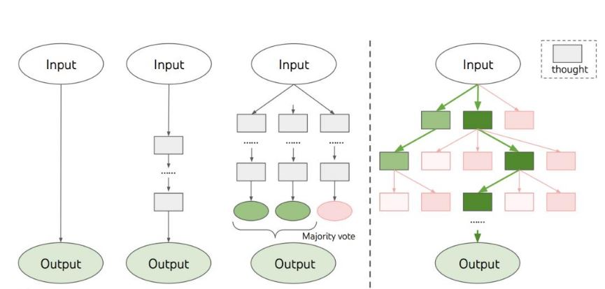
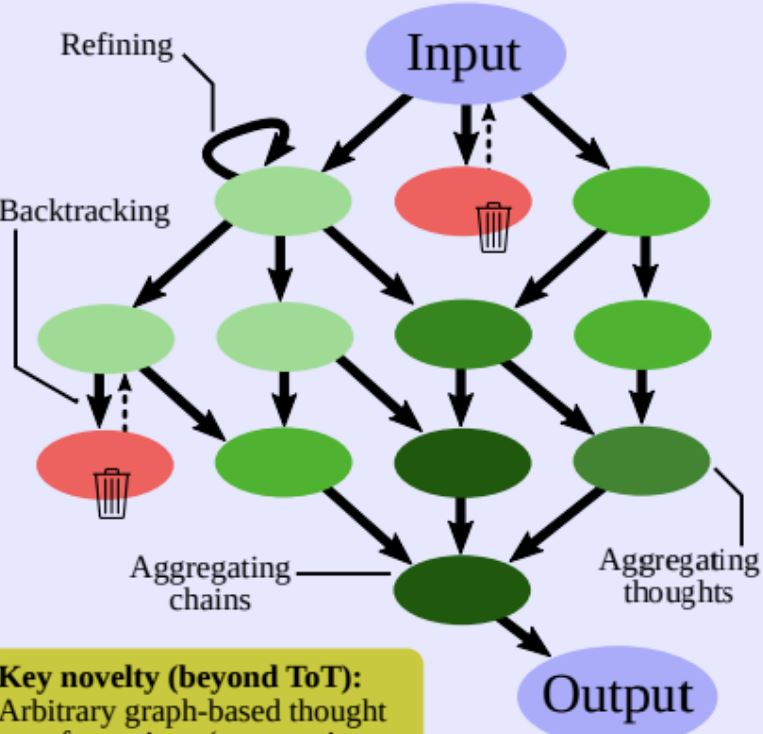
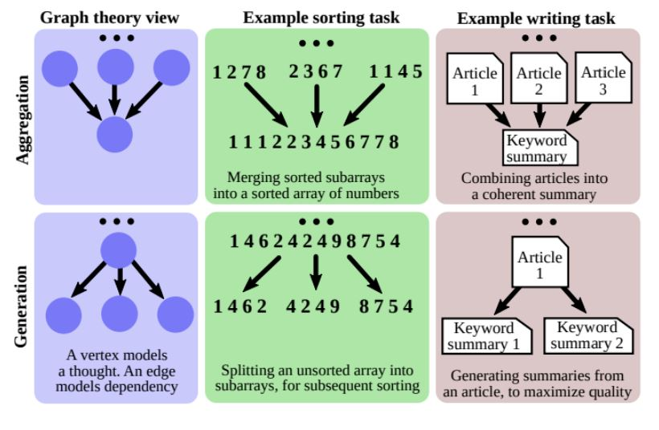
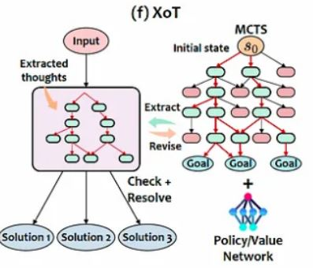
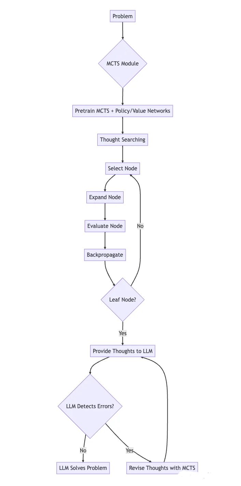

### 3.1 提示学习

在大语言模型时代，提示学习已经成为新的训练范式，通过缩短预训练模型与下游任务之间的差距，可以深度挖掘原有模型的能力，并在下游任务取得更大的优势。本节主要介绍提示学习的概念、如何在下游任务中使用提示学习，以及如何提升提示学习的效果。

#### 3.1.1 什么是提示学习

自bert等预训练语言模型出现以来，预训练+微调的范式在自然语言处理任务上取得了很大进展。但是，预训练+微调的范式主要是让预训练语言模型去适配下游任务，通过引入下游任务的损失，让模型在具体任务上继续训练，以便在下游任务中取得较好效果。但是，在微调过程中，语言模型会遗忘预训练过程中学到的知识，造成模型泛化性和鲁棒性的丢失，仅能保留某个任务或者某个数据的信息。随着语言模型逐渐变大，模型本身已经存储了大量的知识，因具体的下游任务微调导致原本模型能力丧失是大模型应用的一个障碍难点。

因此，预训练+提示+预测的范式成为大型语言模型的主流使用模板。该范式让下游任务去适配预训练语言模型，通过对下游任务的重构，让下游任务符合模型预训练过程，消除预训练任务与下游任务之间的差异，使得下游任务在小样本甚至零样本上取得更好结果，提高泛化性和鲁棒性。

提示学习是在原始文本输入上附加额外提示信息作为新的输入，将下游的预测任务转化为语言模型任务，并将语言模型的预测结果转化为原本下游任务的预测结果。提示学习在进行下游任务时的步骤如下：
第一步：根据不同下游任务选择合适预训练语言模型。
第二步：根据不同下游任务对输入文本选择合适的提示模板。
第三步：由于语言模型输出的是词表中的字词，与下游任务中的真实标签不匹配，需要根据不同下游任务指定不同关系映射，又称答案空间映射。
第四步：根据不同下游任务选择不同训练策略，例如增加额外参数训练、全量参数训练等。

#### 3.1.2 提示模板设计

提示模板包括完形填空型提示和前缀续写型提示两种格式。一般来说，选择哪一种格式的提示模板取决于要解决的下游任务。以情感分析为例，原始任务是根据给定的输入文本“原神，启动”判断该段文本的情感极性，采用完型填空型提示模板更为适合。提示学习在原始输入文本“原神，启动”上增加额外的提示模板，例如：“这句话的情感为{mask}。”然后利用语言模型的掩码语言模型任务针对{mask}标记进行预测，再将其预测出的token映射到情感极性标签上实现情感极性预测。

对于提示模板来说，最简单和最直接的方式就是人工编写，根据不同任务和模板格式编写不同的提示模板。但人工编写的方法依赖人的经验和背景知识，并且需要很多实验来验证提示模板的效果，由此自动构建提示模板便应运而生。目前自动构建提示模板的方法包括离散型提示模板的自动构建和连续型提示模板的自动构建。

离散型提示模板的自动构建是指自动搜索离散空间中描述的模板，一般由自然语言组成，主要方法如下：
- 提示挖掘：在给定训练数据的前提下，根据数据中的输入和输出从大型文本语料库中自动发现提示模板。具体来说，就是找到输入和输出中频繁出现的中间词或依赖路径，将这些中间词和依赖路径作为最终提示模板。
- 提示释义：首先将已有的提示模板(人工构建或挖掘的提示模板)释义成一组候选提示模板，然后选择在下游任务中精度最高的提示模板。释义的方法主要包括将提示翻译成其他语言再翻译回来、用同义词或同义短语替换、模型重写等。
- 梯度下降搜索：在词表中选择多个词语组成提示模板，对提示中的每个词进行替换，通过梯度下降的方式搜索并找到每个位置均对模型影响较大的词语组成提示模板。
- 提示生成：将提示模板的构建视作标准自然语言生成任务，通过模型生成提示模板内容。
- 提示打分：对于手工构造的一组提示模板，填充输入和输出内容，再通过单向语言模型对这些填充过的提示模板进行评分，选择语言模型概率最高的一个作为模板内容。将每个单独的输入生成自定义的提示模板的内容。

连续型提示模板的自动构建是让提示模板不再拘泥于人类可解释的自然语言，只要机器可以直接理解的对语言模型执行下游任务有益即可。因此连续型提示模板放宽了提示模板的词嵌入是自然语言词嵌入的约束，模板可以具有自己独立的参数，根据下游任务的训练数据来自动调整，主要方法如下：
- 前缀调优：在输入内容前增加一串连续的向量，也可以理解为在原始文本进行词嵌入之后，在前面拼接上一个前缀矩阵，或将前缀矩阵拼在模型每一层的输入前，在保持原有模型参数不变的情况下，仅对前缀矩阵的参数进行训练，以获得适合特定下游任务的前缀提示。
- 离散提示初始化调优：将离散型提示内容对连续型提示内容的虚拟化标记进行初始化，可以为连续型提示内容的训练提供一个较好的初始化起点，提高模型收敛效率以及连续型提示模板的效果。
- 软硬提示混合调优：将一些可调的词嵌入内容插入的人工提示模板中增强生成模板的能力。

#### 3.1.3 答案空间映射设计

在提示学习中，提示模板的内容进入模型后输出的答案格式可以是字词型、短语型和句子型。字词型的答案为语言模型词表中的一个标记，短语型的答案为一个连续的文本片段，句子型的答案为句子内容或者文档内容。由于生成的答案内容可能与原始标签内容不匹配，为了使模型可以预测出真实的标签内容，需要将模型输出的答案选择空间与真实输出空间进行映射，获取最终输出结果。答案空间映射最简单的方法是人工构建。对于文本生成任务来说，一般生成的答案空间与原始结果的空间是一致的，因此无需进行答案空间映射，或者说无约束空间。而对于标签有限的任务来说，就需要对模型输出结果进行空间约束了。

与人工编写提示模板一样，人工编写答案空间映射也会导致模型最终效果达不到最优且依赖于人的经验和背景知识，因此自动创建答案空间映射同样也应运而生。自动创建答案空间映射包含离散型和连续型，其中离散型答案空间映射自动构建方法如下：
- 答案释义：将原始答案空间映射中的答案词语进行释义，对原始答案空间映射进行扩充，扩大其覆盖范围。
- 裁剪后搜索：对一个随机构建的答案空间进行不断裁剪和模型搜索比较，获取最终答案空间。
- 标签分解：将标签词内容进行分解，拆解成多个字词，将其作为模型预测的答案空间。例如，将关系分类中的“玩-原神-玩的”标签分解成{“玩”、“原神”、“玩的”}答案空间。

连续型的答案空间映射自动构建方法主要是将类别标签初始化为可学习向量与模型输出拼接从而得到预测结果，例如WARP(词级别对抗重编程)方法。

以情感分析为例，可以将一些正向情感的词语映射为正向标签，一些负向情感的词语映射为负向标签。当对文本“{mask}满意，你也玩原神"进行情感分析时，假设模型预测{mask}位置的单词为“很”的概率为80%，“好”的概率为70%，“不”的概率为20%，则认为该输入的模型预测标签为“很”，通过答案空间映射获取该文本的情感极性为“正向”。

#### 3.1.4 多提示学习方法

在提示学习中，不同的提示模板内容会导致模型在预测阶段存在波动。在解决复杂任务时，无法很好构建单个提示模板。因此，可以通过多个提示进一步提高提示学习方法的效果，包括提示集成、提示增强、提示组合和提示分解，如下图所示：

图16.多提示学习 

- 提示集成是在模型推理时，使用多个不同的提示模板作为输入。这样可以利用不同提示内容达到互补作用。同时在提示集成过程中，无需选择最优模板，从而减轻人工构建最优提示模板的成本。此外，还提高了下游任务的稳定性。集成方法包括一致性平均法，对来自不同提示内容的答案概率求均值；加权平均法，对来自不同提示内容的答案概率加权平均；投票法，对答案标签投票，选择票数多的答案。
- 提示增强是在提示模板中增加演示示例，使得模型可以根据已有演示样例进行学习。
- 提示组合是将多个简单的提示模板融合成一个复杂的提示模板。主要应用在关系抽取任务中将实体识别和关系抽取两个子任务进行融合。
- 提示分解是将一个复杂的提示模板分解成多个简单的子提示模板。主要应用在实体关系抽取任务，将原始文本拆分，构建多个提示内容进行实体类别预测。

### 3.2 上下文学习

大模型参数量巨大导致微调困难，上下文学习则通过几个演示示例，在不进行微调的情况下提高模型效果。本节将介绍上下文学习的概念、如何在训练阶段提示上下文学习能力，以及如何在推理优化上下文学习的效果。

#### 3.2.1 什么是上下文学习

上下文学习可以看作提示学习的一种特殊情况，即演示示例看作提示学习中人工编写提示模板(离散型提示模板)的一部分，并且不进行参数更新。上下文学习的核心思想是通过类比来学习。如图所示，对于一个情感分类任务来说，首先从已存在的情感分析样本库中抽取部分演示示例，包含一些正向或负向的情感文本及对应标签；然后将其演示示例与待分析的情感文本进行拼接，送入大语言模型中；最后通过对演示示例的学习类比得出文本的情感极性。

图17.上下文学习 

大语言模型的上下文能力主要依赖两个阶段：模型在预训练阶段对上下文能力的培育和模型在推理阶段对指定任务演示的预测。下面将重点介绍这两个阶段。

#### 3.2.2 预训练阶段提升上下文能力

在模型预训练之后和模型推理之前，可以增加额外的训练过程，在训练过程中将上下文学习作为训练目标，以获取更好的上下文学习能力，又称模型预热。与微调不同，模型预热的目的不是通过训练大语言模型解决特定下游子任务，而是增强模型的整体上下文学习能力。模型预热分为有监督上下文训练和自监督上下文训练。

有监督上下文训练可以通过将有监督数据转化为上下文学习格式的数据进行模型训练。以MetaICL(Meta-training for In-Context Learning)方法为例，通过多任务的元学习来增加模型上下文学习的能力，消除模型预训练和后续上下文学习使用之间的差距。主要流程如下：
第一步：准备大量的多种元学习任务。
第二步：从已准备的元学习任务中随机抽取一个任务。
第三步：从被选任务中随机抽取 $k+1$ 个样本 $(x_1,y_1),...,(x_{k+1},y_{k+1})$。
第四步：将前 $k$ 个样本作为上下文内容，与第 $k+1$ 个样本的 $x_{k+1}$ 进行拼接，预测 $y_{k+1}$ 的内容，模拟模型上下文推理过程。

有监督上下文训练也可以通过有监督数据构建更加丰富的指令进行微调。以FLAN(Finetuned LAnguage Net)方法为例，在多种任务中的监督数据上增加明显的指令内容，再进行模型微调，提高语言模型零样本学习能力，激发模型理解能力，同时也提高了模型上下文学习的能力。

自监督上下文训练是通过将无监督数据自动转换为ICL格式数据后进行模型训练。无监督数据可以通过下一句生成(Next Sentence Generation,NSG)任务、掩码词预测(Masked Word Prediction,MWP)任务、最后短语预测(Last Phrase Prediction,LPP)任务和分类(CLassification,CL)任务来构建自监督学习数据。对于NSG任务，模型在给定前面的句子作为上下文内容的情况下，生成下一个句子内容。对于MWP任务，用特殊符号随机替换原始文本中的词语，模型预测输入中特殊符号位置被掩蔽的真实内容。对于LPP任务，可以将原始文本最后的短语作为模型待生成的内容，前面所有内容作为上下文；也可以在文本最后一句内容的开始前增加“问题”标记，最后的短语内容前增加“答案”标记，可以对原始短语内容进行替换或保持原状，然后判断最后短语的内容是否为真实内容。对于CL任务，将原始文本的最后一句话进行替换或保持不变，模型判断最后一句话的内容与原文保持一致。

自监督上下文的训练过程需要构建多个连续自监督数据样本，将内容进行拼接，并输入到模型中进行训练微调。对于输入偏后的样本，可以将其前面的样本视为上下文内容。这种方法可以在无标注数据的情况下提高模型的上下文学习能力。

#### 3.2.3 推理阶段优化上下文学习的效果

模型的上下文学习能力依赖于演示示例的设计和结果获取的打分函数，本节对其详细介绍。

演示的设计策略可以分为演示的组织方式和演示的格式。其中，演示的组织方式主要是从样本库中选取最优的演示样例，也就是选取模型进行上下文推理时的样例，以及对选取的演示样例进行排序，也就是选择演示样例的最优排序组合进而构成上下文内容。

最优演示样例的选择可以从无监督和有监督两个方面入手。无监督方法可以通过预先定义的指标来选择与所预测内容相似的演示样例，指标包括欧式距离、余弦相似度和困惑度等。考虑到演示样例的多样性以提高模型的泛化能力，还可以从不同的演示库中选择演示样例。当不存在样本库时，可以通过大语言模型生成一些与预测内容相似的演示样例。有监督方法可以通过训练监督模型来进行演示样例的筛选，先通过无监督检索器筛选出与训练集样本相似的样例，构建候选集合，再用每个候选演示样例与预测文本构建提示模板，通过模型获取输出概率，根据概率值标记候选集合中每个样例的正负标签，最后根据有标签数据训练一个密集检索器，用于推理阶段筛选演示样本。也可以利用强化学习的思想，将演示样例的选择看作序列决策任务，行为是选择一个演示样例，奖励是验证集准确率，训练一个强化学习模型选择最优演示样例。

最优演示样例的排序一般采用无监督训练的方法来进行排序，例如根据与预测文本的相对距离来进行演示样例来进行排序，越相似的演示样例距离预测文本越近。根据演示样例与预测文本组合后的信息熵来决定演示样例的排序，选择熵值最大的排序。

演示的格式主要是将演示样例与预测文本更好地串联起来，常见的演示格式包括简单拼接，指令格式和推理步骤格式。简单拼接仅适用于不复杂的情况。指令格式主要通过准确描述任务的自然语言指令将演示样例与预测文本进行组合，使模型可以精准获取用户意图信息，提高上下文推理能力。推理步骤格式主要解决更复杂的推理任务，在输入输出间增加显示的推理步骤(例如思维链)构造演示示例，从而激发模型推理能力，在输出结果返回推理答案和推理依据及步骤。推理步骤内容可以利用大语言模型本身的能力，增加“一步步考虑”等指令自动生成，也可以将复杂问题拆分成多个子问题进行逐个解答。

评分函数用于估计将大语言模型的预测转换为特定答案的可能性，分为直接评估法、困惑度评估法和通道评估法。直接评估法是直接根据候选答案的条件概率值从语言模型的词表获取答案。困惑度评估法是通过计算输入文本与候选答案之间的困惑度指标来选择答案内容。通道评估法是利用通道模型逆向计算条件概率值选择答案内容。

### 3.3 思维链(CoT)

用户与LLM对话的过程主要包括用户消息(提示，prompts)和模型回复(思维、想法，thoughts)，其中回复可以是一段文本(摘要任务)、一个文档(生成任务)或是一个代码块等。为了充分激活语言模型的能力，通常会采用各种提示方法。

随着模型参数增加，例如情感分析、主题分类等系统-1任务(人类可以快速直观地完成任务)，即使在小样本和零样本的条件也可以达到较好效果。但对于系统-2任务(人类需要缓慢且深思熟虑的思考才能完成的任务)，例如数学推理等任务，即使模型参数增加到数千亿效果也不理想，简单增加模型参数量不能给性能带来实质性提升。

Google在2022年提出了思维链的概念，用于提高大语言模型执行各种推理任务的能力。思维链本质上是一种离散式的提示模板，旨在通过提示模板使大语言模型可以模仿人类思考的过程，给出逐步推理依据，并推导出最终答案，而每一步推理依据组成的句子集合就是思维链的内容。思维链是帮助大语言模型将一个多步问题分解为多个可以被单独解答的中间步骤，而不是在一次向前传递中解决整个多跳问题。

如图所示，思维链提示模板与标准提示模板的区别就是在上下文学习时，给出的演示样例不仅包括问题和答案，还包括推理依据，并且在大语言模型预测过程中，并非直接给出答案结果，而是先给出问题对应的解题步骤，再推导出答案内容。思维链类似于一个解决方案，捕捉模型推理的一步步思考逻辑以找到答案。

图18.标准提示模板与思维链提示模板 

由于在模型推理过程中，会将部分演示示例作为模型推理的参考依据，因此这种方法也称为小样本思维链方法。一个复杂推理问题可以有多种不同推理思路，如果问题需要更深入地思考分析，得到的答案推理路径会更多。但在小样本思维链方法中，语言模型解码生成思维链时仅采用贪婪解码生成单一思维链，导致模型鲁棒性不足。为了增强模型鲁棒性，采用自我一致思维链方法在模型推理过程中采样生成不同的思维链，从而获取多个答案结果，通过投票机制选取最终结果，如图所示：

图19.自我一致思维链方法 

由于每条推理路径都可能导致不同答案，如果多种不同的思维链均生成了相同答案，那么该答案的准确性大幅提升。自我一致思维链方法避免了贪婪解码的重复性和局部最优性，同时减轻单个采样生成的随机性。

在大语言模型上下文推理时，需要人工构建思维链演示样例，极大增加了人工成本。零样本思维链方法可以在无思维链演示样例情况下采用思维链方式获取最终答案。如图所示，将推理过程分为思维链提取和答案提取两个阶段。在思维链提取阶段，将问题与“让我们一步一步来思考”模板内容拼接，通过大语言模型自动生成思维链内容。在答案提取阶段，将问题、“让我们一步一步来思考”模板、生成的思维链内容和“因此答案为”模板组成新的提示内容，通过大语言模型获取问题答案。

图20.零样本思维链方法 

自动思维链方法通过对测试集样本生成思维链及采样，将多个演示样例加入提示模板，减轻思维链的错误级联效应。即使多个演示样例中存在一两个错误的思维链，也不影响整个语言模型推理过程。如图所示，首先对测试集中所有的问题进行聚类操作，得出的每个簇代表一类问题。其次，选取簇中心的问题作为簇代表，对问题进行思维链内容生成。与零样本思维链方法一致，通过“让我们一步一步来思考”模板自动生成思维链。然后，将所选取的问题及思维链内容作为演示样例构建提示模板。最后，通过大语言模型获取真实结果，包括实际问题的思维链和答案内容。生成思维链时可能出现逻辑错误，选择问题聚类后各个簇中心的问题，可以增加样例的多样性，防止选取的演示样例均为模型不擅长的问题，减轻零样本思维链方法中的思维链错误带来的影响。

## 3.4 CoT-SC

ST即Self-consistency，是对CoT方法的改进。相比于CoT只进行一次采样回答，SC采用了多次采样的思想，最终选择consistent的回答作为最终答案。SC的原文认为，一个复杂的推理问题可以采用多种不同的方式进行解决，最终都可以得到正确答案。人类思考同一个问题可能会有不同的思路，但是最后可能得到相同的结论。可以理解为“一题多解”“条条大路通罗马”。SC相比于CoT性能进一步得到了更大的提升。

## 3.5 思维树(ToT)

思维树技术在CoT-SC的基础上更进一步。ToT主动维护了一个“思维树”。每个矩形框代表一个思维，并且每个思维都是一个连贯的语言序列，作为解决问题的中间步骤。下图分别为IO(输入序列后，直接用语言模型获取输出，不添加任何中间思考过程)、CoT、CoT-SC和ToT的对比。

图25.提示技术对比 

ToT将任何问题定义为在树上进行搜索，其中每个节点都是一个状态 $s=[x,z_{1...i}]$，表示到目前为止输入和思维序列的部分。ToT执行一个具体任务时需要回答4个问题:如何将中间过程分解为思维步骤；如何从每个状态生成潜在的想法；如何启发性地评估状态；使用什么搜索算法。

### 3.5.1 思维分解

CoT在没有明确分解的情况下连贯抽样思维，而ToT利用问题的属性来设计和分解中间的思维步骤。根据不同的问题，一个想法可以是几个单词(填字游戏)，一条方程式(24点)，或者一整段写作计划(创意写作)。一般来说，一个想法应该足够“小”，以便LLM能够产生有意义、多样化的样本。比如，生成一本完整的书通常太“大”而无法连贯 。但一个想法也应该“大”，足以让LLM能够评估其解决问题的前景。例如，生成一个token通常太“小”而无法评估。

### 3.5.2 思维生成器 $G(p_θ,s,k)$

给定树状态 $s=[x,z_{1...i}]$，，通过两种策略来为下一个思维步骤生成k个候选者：
(a)从一个CoT提示采样:
$z^{j}~p_{θ}^{CoT}(z_{i+1}|s)=p_{θ}^{CoT}(z_{i+1}|x,z_{1...i})(j=1...k)$
在思维空间丰富(比如每个想法都是一个段落)，通过CoT的方式采样足够多的独立同分布的思考样本空间并且独立同分布的样本可以带来多样性时，效果更好。
(b)使用「proposal prompt」按顺序提出想法：
$[z^{(1)},....,z^{(k)}]~p_{θ}^{propose}(z_{i+1}^{(1...k)}|s)$
这在思维空间受限制(比如每个思维只是一个词或一行)时效果更好，因此在同一上下文中提出不同的想法可以避免重复。

### 3.5.3 状态求值器 $V(p_θ,s)$

给定不同状态，状态求值器评估它们解决问题的进展，作为搜索算法的启发式算法，以确定哪些状态需要继续探索，以及以何种顺序探索。虽然启发式算法是解决搜索问题的标准方法，但它们通常是基于编程的(例如DeepBlue)或基于学习的(例如AlphaGo)。这里，研究者提出了第三种选择，通过LLM有意识地推理状态。在适用的情况下，这种深思熟虑的启发式方法可以比程序规则更灵活，比学习模型更有效率。与思维生成器一样，研究人员也考虑两种策略来独立或一起评估状态：对每个状态独立赋值；跨状态投票。

### 3.5.4 搜索算法

最后，在ToT框架中，人们可以根据树的结构，以即插即用的方式使用不同的搜索算法。研究人员在此探索了2个相对简单的搜索算法：算法1——广度优先搜索（BFS），每一步维护一组最有希望的状态；算法2——深度优先搜索（DFS），首先探索最有希望的状态，直到达到最终的输出。在 $(t>T)$ 或者状态评估器认为不可能从当前的以 $s_{th}$ 为阈值的状态空间 $s(V(p_θ,{s}))(s)<=s_{th}$ 解决问题时，DFS都会回溯到s的父状态以继续探索。

## 3.6 思维图(GoT)

思维图在思维树的基础上又更进了一步。GoT的关键思想和主要优势在于将LLM生成的信息建模为图，其中信息单元(思维，LLM thoughts)作为图的顶点，顶点之间的依赖关系作为图的边。GoT方法可以将任意的LLM思维组合成协同结果，提取出整个思维网络的本质，或者使用反馈回路来增强思维。总体来说，GoT包含四部分：
- 语言模型推理过程，即在特定上下文中，所有语言模型的思维，以及思维之间的关系。
- 潜在的思维转换。
- 用于获取思维评分的评估函数。
- 用于选择最相关思维的排序函数。

图26.GoT 

### 3.6.1 推理过程

研究人员将推理过程建模为一个有向图，顶点代表某个问题(初始问题、中间问题、最终问题)的一个解决方案，有向边代表使用“出节点”作为直接输入构造出的思维(入节点)，具体思维的形式取决于用例。图节点的类别也不一定相同，例如在生成任务中，某些节点代表“写一段文字的规划”，另一些节点用来对“实际文本段”进行建模，推理过程是一个异构图，如上图所示。

### 3.6.2 思维转换

基于图结构，GoT可以在推理中实现不同的思维转换。例如，在写作任务中，可以将几篇输入文章合并成一个连贯的摘要；在排序任务中，可以将几个排序后的数字子数组合并成一个最终的排序数组。

图27.变换操作示例 

每次转换操作都包含两部分：(1)反映当前推理状态的图，以及(2)一个用到的语言模型。转换操作会修改当前的图，添加新的节点和输入边。为了最大化GoT的表现力，用户可以指定要删除的相应顶点和边来显式删除思维；为了节省上下文空间，用户可以删除推理中未来不改进的部分。转换操作可以分为以下几类：
- 聚合转换：GoT可以将任意多个思维聚合成一个新的思维，并将不同思维的优势结合起来。在最基础的形式中，只创建一个新的节点，其余思维链中的节点作为出节点连接到新节点中。更一般地，该操作还可以聚合推理路径，也就是组成更长的推理路径
- 优化转换：可以修改当前思维节点v为一条循环边（v, v），代表与原始思维相同迭代思维。
- 生成转换：可以基于已有的单思维节点生成一个或多个新的思维，和之前的推理模式，如ToT或CoT-SC类似。

### 3.6.3 对思维进行评分和排序

评估函数所需要的数据包括受评估的思维、整个推理过程的状态以及语言模型，要求全推理过程可以最大化函数的通用性。在对思维的排序时，其输入包括推理过程、语言模型以及指定返回k个评分最高的思维。

### 3.6.4 系统架构&可扩展性

GoT架构由一组交互模块组成：
- 提示器（Prompter）：为LLM准备信息，主要负责把图结构编码进提示词中，GoT架构允许用户根据不同用例实现不同的图编码，提供全部图结构访问权限。
- 解析器（Parser）：从LLM的回复中抽取信息，解析器为每个思维构造出一个思维状态，包含了抽取出的信息，并用于后续状态更新。
- 评分模块（Scoring）：对LLM回复进行验证和评分，验证一个给定的LLM思维是否能够满足潜在的正确性条件，然后对思维进行打分。具体分数可能需要构造提示，让语言模型给出评价；对某些用例来说，人类反馈评分也可以；如果是排序之类的用例，可能还需要引入局部评分函数。
- 控制器（Controller）：协调整个推理过程，并决定如何继续推理，控制器中包含两个重要组件：图操作和图推理状态。其中GoO是一个静态结构，指定了给定任务上的图分解过程，即规定了可用于LLM思维转换的操作，以及思维之间的顺序和依赖关系；每个操作对象都知道自己的前置操作和后继操作。GRS是一个动态结构，用来维护LLM推理过程进行中的状态，包括所有思维的历史及状态。

## 3.7 XoT

### 3.7.1 提示技术的局限性

LLM的最新进展通过将复杂的问题分解成更易于管理的“思想”，然后通过自然语言提示表达出来，从而实现了解决问题的新方法。但是大多数现有的提示技术都有局限性:
- 输入-输出(IO)提示仅适用于具有单步解决方案的简单问题，缺乏灵活性。
- 思维链(CoT)能够逐步解决问题，但仅限于线性思维结构，限制了灵活性。
- 思维树(ToT)和思维图(GoT)允许更灵活的思维结构，如树或图。但是它们需要LLM本身来评估中间思想，通过多个LLM调用产生大量的计算成本。
从本质上讲，当前的提示技术面临着“彭罗斯三角”约束——它们最多可以实现两个属性(性能、效率、灵活性)，但不能同时实现这三个属性。

### 3.7.2 XoT架构

为了解决这些限制，2023年11月微软开发了一种新的提示技术，称为XOT (Everything of Thoughts)。XOT集成了强化学习和蒙特卡罗树搜索(MCTS)，将外部知识注入提示过程。这增强了llm的功能，并同时实现了更高的性能、效率和灵活性。XOT的关键组件有:
- MCTS模块-使用轻量级策略和价值网络，通过模拟有效地探索任务的潜在思想结构。
- LLM求解器-利用LLM的内部知识对MCTS的思想进行提炼和修正。这种协作过程提高了“思维”质量。
XOT框架包括以下关键步骤:
- 预训练阶段:MCTS模块在特定任务上进行预训练，以学习有关有效思维搜索的领域知识。轻量级策略和价值网络指导搜索。
- 思想搜索:在推理过程中，预训练的MCTS模块使用策略/价值网络来有效地探索和生成LLM的思想轨迹。
- 思想修正:LLM审查MCTS的思想并识别任何错误。修正的想法是通过额外的MCTS模拟产生的。
- LLM推理:将修改后的想法提供给LLM解决问题的最终提示。
下面的图表说明了XOT框架:

图28.XoT架构

图29.XoT框架流程

MCTS模块针对特定任务进行预训练，使用策略和价值网络来指导搜索和学习领域知识。在思想搜索过程中，预训练的MCTS利用策略网络和价值网络有效地探索搜索空间并生成思想轨迹。这包括迭代地选择、展开、计算和反向传播节点。思想轨迹提供给LLM作为提示。LLM利用其内部知识来检测思想中的任何错误。如果发现错误，则使用MCTS模块通过额外的模拟来修改思想。这个过程不断重复，直到LLM使用修改后的高质量思想解决问题。