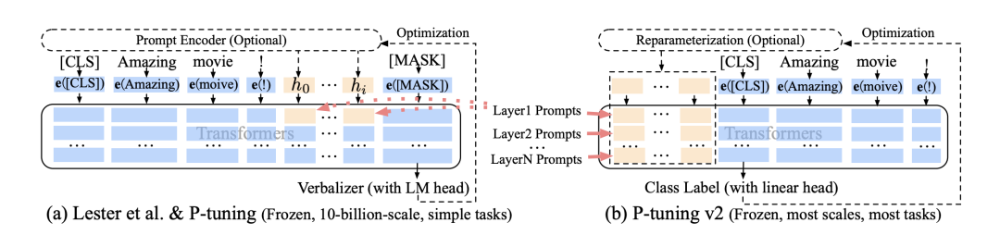
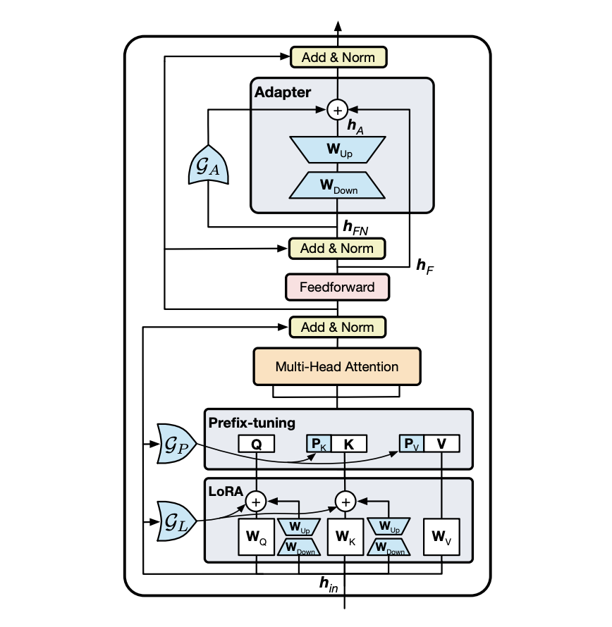

# 4.3 Prompt 的本质是参数有效性学习

根据前文的讲解，我们可以发现，实现 Prompt-Tuning 只需要考虑如何设计模板或指令，而模型和训练目标则都是复用预训练阶段的，即在整个训练过程中，无须添加任何参数（或只需要添加非常少量的与模板有关的参数），而其他参数都是训练好的。基于这个思想，我们再一次将 Prompt 升华到更高的层面—— **Prompt 的本质是参数有效性学习（Parameter-Efficient Learning，PEL）** 。

> **参数有效性学习的背景** ：在一般的计算资源条件下，大规模的模型（例如 GPT-3）很难再进行微调，因为所有的参数都需要计算梯度并进行更新，消耗时间和空间资源。为了解决这个问题，参数有效性学习被提出，其旨在确保模型效果不受太大影响的条件下尽可能地提高训练的时间和空间效率。**参数有效性训练** ：在参数有效性学习过程中，大模型中只需要指定或额外添加少量的可训练参数，而其余的参数全部冻结，这样可以大大提高模型的训练效率的同时，确保指标不会受到太大影响。

常见经典的参数有效性学习有 Adapter-Tuning、Prefix-Tuning、BitFit。下面进行简单的介绍。

## （1）Adapter-Tuning

Adapter-Tuning 在 2019 年提出，其面向预训练语言模型的参数有效性学习。在多层 Transformer 模型中，在微调过程中所有的参数都需要更新，显然并不是有效的。为了提高效率，该方法提出固定 Transformer 的全部参数，然后在 Transformer 的每一个 Block 里嵌入一些新初始化的 Adapter Network。如下图所示：

图1. 

Adapter 位于 Feed-Forward Layer 之后、残差连接之前。Adapter 本质上就是两层 MLP，分别负责将 Transformer 的表征降维和升维（右图）。基于 Adapter 的方法， **只需要添加不到 5% 的可训练参数，即可以几乎达到全参数训练的效果** ，在训练过程中大大节省了训练时间，做到时间有效性。因此在真实场景应用时， **不同的任务我们不需要重新对整个预训练模型进行微调，我们只需要保存 Adapter 即可** ，而预训练模型的其他参数都是原始预训练的，这样就做到了空间的有效性。

## （2）Prefix-Tuning

Prefix-Tuning 也是很经典的参数有效性学习，其是受到 Prompt-Tuning 的启发。我们说 Prompt-Tuning 的本质是参数有效性学习，是因为整个预训练模型参数可以全部固定，只需要对 Template 对应的少量参数（例如连续模板的 Prompt Encoder、伪标记对应的 Embedding 等）进行训练。在 Prefix-Tuning 中，则是除了对输入层添加模板外，还对 Transformer 的每一层添加 “模板”。Prefix-Tuning 与传统 Fine-tuning 的对比图如下所示：

图2. 

可以看到，Transformer 的参数完全固定，而我们只需要对 Prefix 部分进行训练即可，对于不同的任务训练不同的 Prefix，在实际使用时，挑选任务相关的 Prefix 和 Transformer 进行组装，实现可插拔式的应用。

与 Prefix-Tuning 类似的方法还有 P-tuning V2，不同之处在于 Prefix-Tuning 是面向文本生成领域的，P-tuning V2 面向自然语言理解。但本质上完全相同。下图针对 Prefix-tuning（P-tuning V2）与 Prompt-Tuning 对比（黄色部分表示可训练的参数，蓝色表示被冻结的参数）：

图3. 

左图表示的是基于连续提示的 Prompt-Tuning（例如 P-tuning），我们可以发现只有输入层对应模板部分的 Embedding 和 MLP 参数是可训练的，右图部分表示 Prefix-Tuning（P-tuning V2），Transformer 的每一层的前缀部分也是可训练的，可以抽象的认为是在每一层添加了连续的模板。但是实际上，Prefix-Tuning（P-tuning V2）并不是真正的在每一层添加模板，而是通过 HuggingFace 框架内置的 past_key_value 参数控制。其本质上与 Adapter 类似，是在 Transformer 内部对 Key 和 Value 插入可训练的两个 MLP。

有相关工作对 Adapter、Prefix-Tuning、LoRA 等参数有效性学习进行了集成，因为 **这些参数有效性学习方法本质上都是插入少量的新的参数，这些新的参数可以对预训练模型起到提示作用，只不过并不是以人类可读的离散的模板形式体现而已** 。

下图是《UniPELT: A Unified Framework for Parameter-Efficient Language Model Tuning》提出将这些参数有效性方法进行统一，提出 UniPELT 框架：

图4. 

## （3）BitFit

BitFit 的思想更简单，其不需要对预训练模型做任何改动，只需要指定神经网络中的偏向（Bias）为可训练参数即可，BitFit 的参数量只有不到 2%，但是实验效果可以接近全量参数。

介绍了上述的一些参数有效性方法，我们发现，Prompt-Tuning 也符合其主旨。基于参数有效性的思想，也有许多工作致力于 Prompt 与参数有效性的结合，例如《Delta Tuning: A Comprehensive Study of Parameter Efficient Methods for Pre-trained Language Models》、《LiST: Lite Prompted Self-training Makes Parameter-efficient Few-shot Learners》、《Making Parameter-efficient Tuning More Efficient: A Unified Framework for Classification Tasks》、《P-Adapters- Robustly Extracting Factual Information from Language Models with Diverse Prompts》、《Context-Tuning: Learning Contextualized Prompts for Natural Language Generation》，由于相关工作非常多而且更新频繁，这里不一一介绍。
