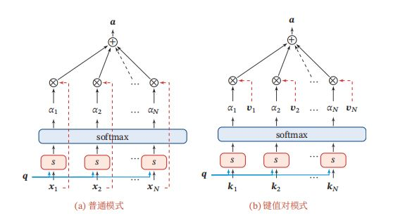
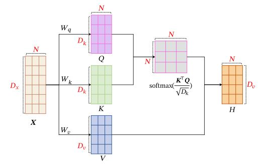
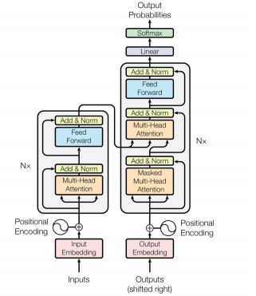
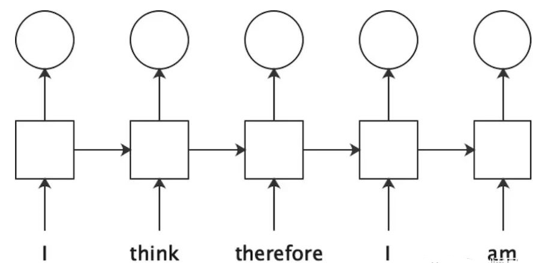
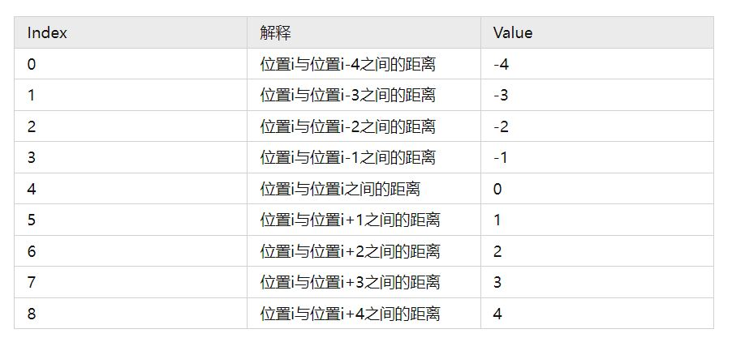
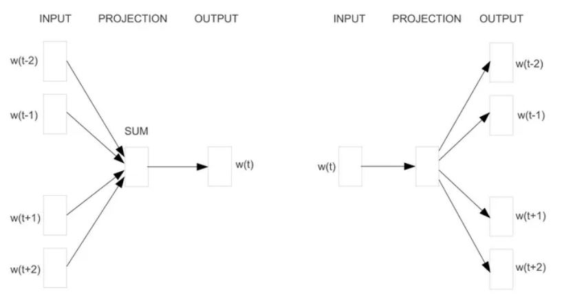
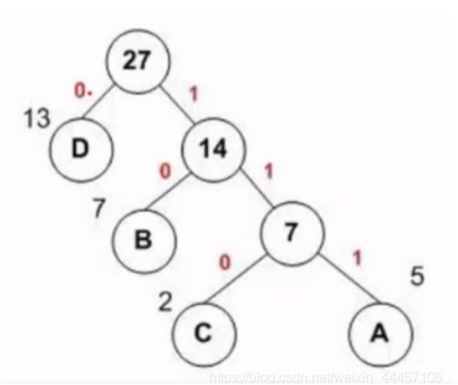
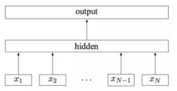
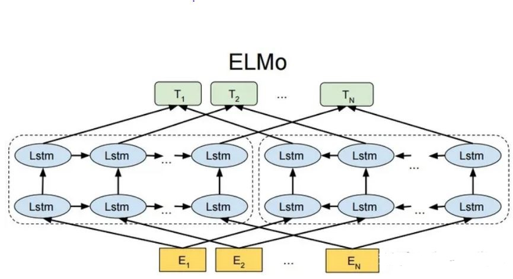

### 5.1 理解注意力

#### 5.1.1 注意力介绍


用 $𝑿 = [𝒙_1, ⋯ , 𝒙_𝑁 ] ∈ ℝ_{𝐷×𝑁}$ 表示 $𝑁$ 组输入信息，其中 $𝐷$ 维向量 $𝒙_𝑛 ∈ℝ_𝐷$ , $𝑛 ∈ [1, 𝑁]$ 表示一组输入信息。为了节省计算资源，不需要将所有信息都输入神经网络，只需要从 $𝑿$ 中选择一些和任务相关的信息。注意力机制的计算可以分为两步：一是在所有输入信息上计算注意力分布，二是根据注意力分布来计算输入信息的加权平均。


为了从 $𝑁$ 个输入向量 $[𝒙_1, ⋯ , 𝒙_𝑁 ]$ 中选择出和某个特定任务相关的信息，需要引入一个和任务相关的表示，称为查询向量，并通过一个打分函数来计算每个输入向量和查询向量之间的相关性。给定一个和任务相关的查询向量 $𝒒$ ， 用注意力变量 $𝑧 ∈ [1, 𝑁]$ 来表示被选择信息的索引位置，即 $𝑧 = 𝑛$表示选择了第 $𝑛$ 个输入向量。为了方便计算，采用一种“软性”的信息选择机制．首先计算在给定 $𝒒$ 和 $𝑿$ 下，选择第 $𝑖$ 个输入向量的概率 $a$ :


$a_𝑛 = 𝑝(𝑧 = 𝑛|𝑿, 𝒒) = softmax (𝑠(𝒙_𝑛, 𝒒))=exp(s(x_n,q))/Σ_{j=1}^N exp(s(x_j,q))$


其中 $a_𝑛$ 称为注意力分布，𝑠(𝒙, 𝒒) 为注意力打分函数，
可以使用以下几种方式来计算：

- 加性模型 $𝑠(𝒙, 𝒒) = 𝒗^Ttanh(𝑾𝒙 + 𝑼𝒒)$
- 点积模型 $𝑠(𝒙, 𝒒) = 𝒙^Tq$
- 缩放点积模型 $𝑠(𝒙, 𝒒) = 𝒙^T𝒒/\sqrt𝐷$
- 双线性模型 $𝑠(𝒙, 𝒒) = 𝒙^T𝑾q$

其中 $𝑾, 𝑼, 𝒗$ 为可学习的参数，$𝐷$ 为输入向量的维度。


理论上，加性模型和点积模型的复杂度差不多，但是点积模型在实现上可以更好地利用矩阵乘积，从而计算效率更高。当输入向量的维度 $𝐷$ 比较高时，点积模型的值通常有比较大的方差，从而导致Softmax函数的梯度会比较小。因此，缩放点积模型可以较好地解决这个问题。双线性模型是一种泛化的点积模型．假设公式中 $𝑾 = 𝑼^T𝑽$，双线性模型可以写为 $𝑠(𝒙, 𝒒) = 𝒙^T𝑼^T𝑽𝒒 = (𝑼𝒙)^T(𝑽𝒒)$ ，即分别对 $𝒙$ 和$𝒒$ 进行线性变换后计算点积．相比点积模型，双线性模型在计算相似度时引入了非对称性。因此，点积缩放模型是目前使用最广泛的一种注意力形式。


注意力分布 $a_𝑛$ 可以解释为在给定任务相关的查询 $𝒒$ 时，第 $𝑛$ 个输入向量受关注的程度。这里采用一种“软性”的信息选择机制对输入信息进行汇总，即：

$attention(𝑿, 𝒒) =Σ_{n=1}^N a_n x_n=E_{z\sim p(z|X,q)}[x_z]$

上式称为软性注意力机制，其选择的信息是所有输入向量在注
意力分布下的期望，下图给出软性注意力机制的示例：

<div align=center>

</div>
<div align=center>图1.软性注意力机制</div>


此外，还有一种注意力是只关注某一个输入向量，称为硬性注意力。硬性注意力有两种实现方式：（1）一种是选取最高概率的一个输入向量，即 $att(𝑿, 𝒒) = 𝒙_{\tilde n}$，其中 ̂$\tilde 𝑛$ 为概率最大的输入向量的下标，即 ̂$\tilde 𝑛 = argmax_{n=1}^N a_n$。（2）另一种硬性注意力可以通过在注意力分布式上随机采样的方式实现。硬性注意力的一个缺点是基于最大采样或随机采样的方式来选择信息，使得最终的损失函数与注意力分布之间的函数关系不可导，无法使用反向传播算法进行训练。因此，硬性注意力通常需要使用强化学习来进行训练。为了使用反向传播算法，一般使用软性注意力来代替硬性注意力。


更一般地，可以用键值对格式来表示输入信息，其中“键”用来计算注意力分布 $a_𝑛$ ，“值”用来计算聚合信息。用 $(𝑲, 𝑽 ) = [(𝒌_1
, 𝒗_1), ⋯ , (𝒌_𝑁 , 𝒗_𝑁 )]$ 表示 $𝑁$ 组输入信息，给定任务相关的查询向量 $𝒒$ 时，注意力函数为 $attention((𝑲, 𝑽 ), 𝒒)=Σ_{n=1}^N a_n v_n=Σ_{n=1}^N(exp(s(k_n,q))/Σ_{j=1}^N exp(s(k_j,q)))v_n$

其中 $𝑠(𝒌_𝑛, 𝒒)$ 为打分函数，当 $𝑲 = 𝑽$ 时，键值对模式就等价于普通的注意力机制。


自注意力模型可以看作在一个线性投影空间中建立 $𝑯$ 中不同向量之间的交互关系。为了提取更多的交互信息，可以使用多头自注意力在多个不同的投影空间中捕捉不同的交互信息．假设在 $𝑀$ 个投影空间中分别应用自注意力模型。多头注意力是2017年《attention is all you need》提出的transformer架构所使用的注意力形式，利用多个查询 $𝑸 = [𝒒_1, ⋯ , 𝒒_𝑀]$ ，来并行地从输入信息中选取多组信息，每个注意力关注输入信息的不同部分：$MultiHead(𝑯) = 𝑾_𝑜[head_1; ⋯ ; head_𝑀]，head_𝑚 = self-att(𝑸_𝑚, 𝑲_𝑚, 𝑽_𝑚)，∀𝑚 ∈ {1, ⋯ , 𝑀},𝑸_m = 𝑾_𝑞𝑿 ∈ ℝ^{𝐷_𝑘×𝑁}$，$𝑲 = 𝑾_𝑘𝑿 ∈ ℝ^{𝐷_𝑘×N}$，$𝑽 = 𝑾_𝑣𝑿 ∈ ℝ^{𝐷_𝑣×N}，𝑾_o ∈ ℝ^{𝐷_h×Md_{v}}$为输出投影矩阵,$𝑾_𝑞^m ∈ ℝ^{𝐷_𝑘×𝐷_h} ,𝑾_𝑘^m ∈ ℝ^{𝐷_𝑘×𝐷_h} ,𝑾_𝑣^m ∈ ℝ^{𝐷_𝑣×𝐷_h}$为投影矩阵，$𝑚 ∈ {(1, ⋯ , 𝑀)}$。


基于卷积或循环网络的序列编码都是一种局部的编码方式，只建模了输入信息的局部依赖关系。虽然循环网络理论上可以建立长距离依赖关系，但是由于信息传递的容量以及梯度消失问题，实际上也只能建立短距离依赖关系。如果要建立输入序列之间的长距离依赖关系，可以使用以下两种方法：一种方法是增加网络的层数，通过一个深层网络来获取远距离的信息交互；另一种方法是使用全连接网络。全连接网络是一种非常直接的建模远距离依赖的模型，但是无法处理变长的输入序列．不同的输入长度，其连接权重的大小也是不同的。这时我们就可以利用注意力机制来“动态”地生成不同连接的权重，这就是自注意力模型。为了提高模型能力，自注意力模型经常采用查询-键-值模式，其计算过程如下图所示，其中红色字母表示矩阵的维度。


<div align=center>

</div>
<div align=center>图2.软性注意力机制</div>


假设输入序列为 $𝑿 = [𝒙_1, ⋯ , 𝒙_𝑁]∈ℝ^{𝐷_𝑥×𝑁}$，输出序列为 $𝑯 = [𝒉_1, ⋯ , 𝒉_𝑁 ] ∈ℝ^{𝐷_𝑣×𝑁}$ ，自注意力模型的具体计算过程如下：

- 对于每个输入 $𝒙_𝑖$ ，首先将其线性映射到三个不同的空间，得到查询向量 $𝒒_𝑖 ∈ ℝ^{𝐷_𝑘}$ 、键向量 $𝒌_𝑖 ∈ ℝ^{𝐷_𝑘}$ 和值向量 $𝒗_𝑖 ∈ ℝ^{𝐷_v}$，对于整个输入序列 $𝑿$，线性映射过程可以简写为 $𝑸 = 𝑾_𝑞𝑿 ∈ ℝ^{𝐷_𝑘×𝑁}$，$𝑲 = 𝑾_𝑘𝑿 ∈ ℝ^{𝐷_𝑘×N}$，$𝑽 = 𝑾_𝑣𝑿 ∈ ℝ^{𝐷_𝑣×N}$。其中 $𝑾_𝑞 ∈ ℝ^{𝐷_𝑘×𝐷_𝑥} ,𝑾_𝑘 ∈ ℝ^{𝐷_𝑘×𝐷_𝑥} ,𝑾_𝑣 ∈ ℝ^{𝐷_𝑣×𝐷_𝑥}$ 分别为线性映射的参数矩阵，$𝑸 = [𝒒_1, ⋯ ,𝒒_𝑁 ], 𝑲 = [𝒌_1, ⋯ , 𝒌_𝑁 ], 𝑽 = [𝒗_1, ⋯ , 𝒗_𝑁]$ 分别是由查询向量、键向量和值向量构成的矩阵。
- 对于每一个查询向量 $𝒒_𝑛$ ∈ 𝑸，利用键值对注意力机制，可以得到输出向量 $𝒉_𝑛$ ，$𝒉_𝑛 = att((𝑲, 𝑽 ), 𝒒_𝑛)=Σ_{j=1}^N a_{nj}v_j=Σ_{j=1}^Nsoftmax(s(k_j,q_n))v_j$，其中 $𝑛, 𝑗 ∈ [1, 𝑁]$ 为输出和输入向量序列的位置，$a_{𝑛𝑗}$ 表示第 $𝑛$ 个输出关注到第 $𝑗$ 个输入的权重。


如果使用缩放点积来作为注意力打分函数，输出向量序列可以简写为：
$𝑯 = 𝑽softmax(𝑲^T𝑸/\sqrt𝐷_𝑘)$。


#### 5.1.2 seq2seq任务和encoder-decoder模型


在序列生成任务中，有一类任务是序列到序列(seq2seq)生成任务，即输入一个序列生成另一个序列。序列到序列是一种条件的序列生成问题，给定一个序列 $𝒙_{1∶𝑆}$ ，生成另一个序列 $𝒚_{1∶𝑇}$ 。输入序列的长度 $𝑆$ 和输出序列的长度 $𝑇$ 可以不同。实现序列到序列的最简单方法是使用两个循环神经网络来分别进行编码和解码，也称为编码器-解码器（Encoder-Decoder）模型。

- 编码器 首先使用一个循环神经网络 $𝑓_{enc}$ 来编码输入序列 $𝒙_{1∶𝑆}$ 得到一个固定维数的向量 $𝒖$，$𝒖$ 一般为编码循环神经网络最后时刻的隐状态。$h_t^{enc}=f_{enc}(h_{t-1}^{enc},e_{x_{t-1}},θ_{enc}), ∀𝑡 ∈ [1 ∶ 𝑆],𝒖 = 𝒉_S^{enc}$ ，其中 $𝑓_{enc}(⋅)$ 为编码循环神经网络，其参数为 $ θ_{enc} $，$𝒆_𝑥$ 为词 $𝑥$
的词向量。
- 解码器 在生成目标序列时，使用另外一个循环神经网络 $𝑓_dec$ 来进行解码．在解码过程的第 $𝑡$ 步时，已生成前缀序列为 $𝒚_{1∶(𝑡−1)}$。令 $𝒉_t^{dec}$ 表示在网络𝑓dec 的隐状态，$𝒐_𝑡 ∈ (0, 1)^{|𝒱|}$ 为词表中所有词的后验概率，则 $𝒉_0^{dec}=u,𝒉_t^{dec}= f_{dec} (h_{t-1}^{dec}, e_{𝑦_{𝑡−1}}, θ_{dec}),𝒐_𝑡=𝑔(𝒉_t^{dec}, θ_𝑜)$。


其中 $𝑓_{dec(⋅)}$ 为解码循环神经网络，$𝑔(⋅)$ 为最后一层为 Softmax 函数的前馈神经网络，$θ_{dec}$ 和 $θ_𝑜$ 为网络参数，$𝒆_𝑦$ 为 $𝑦$ 的词向量，$𝑦_0$ 为一个特殊符号，比如⟨𝐸𝑂𝑆⟩。基于循环神经网络的序列到序列模型的缺点是：
- 编码向量 $𝒖$ 的容量问题，输入序列的信息很难全部保存在一个固定维度的向量中；
- 当序列很长时，由于循环神经网络的长程依赖问题，容易丢失输入序列的信息。


为了获取更丰富的输入序列信息，可以在每一步中通过注意力机制来从输入序列中选取有用的信息。在解码过程的第 $𝑡$ 步时，先用上一步的隐状态 $𝒉^{dec}_{𝑡−1}$ 作为查询向量，利用注意力机制从所有输入序列的隐状态 $𝑯^{enc} = [𝒉^{enc}_1, ⋯ , 𝒉^{enc}_𝑆]$ 中选择相关信息:
$𝒄_𝑡 = att(𝑯^{enc}, 𝒉^{dec}_{𝑡−1}) =Σ_{𝑖=1}^S a_i h_i^{enc}=Σ_{i=1}^S softmax(s(h^{enc}_i,h^{dec}_{t-1}))h_i^{enc}$，其中 $𝑠(⋅)$ 为注意力打分函数。然后，将从输入序列中选择的信息 $𝒄_𝑡$ 也作为解码器 $𝑓_dec(⋅)$ 在第 $𝑡$ 步时的输入，得到第 $𝑡$ 步的隐状态:
$h^{dec}_t=f_{dec}(h^{dec}_{t-1},[e_{y_{t-1}};c_t],θ_{dec})$，最后，将 $𝒉^{dec}_𝑡$ 输入到分类器 $𝑔(⋅)$ 中来预测词表中每个词出现的概率。


#### 5.1.3 transformer


除长程依赖问题外，基于循环神经网络的序列到序列模型的另一个缺点是无法并行计算．为了提高并行计算效率以及捕捉长距离的依赖关系，我们可以使用自注意力模型来建立一个全连接的网络结构。本节介绍一个目前非常成功的基于自注意力的序列到序列模型：Transformer。


对于一个序列 $𝒙_{1∶𝑇}$，可以构建一个含有多层多头自注意力模块的模型来对其进行编码。由于自注意力模型忽略了序列 $𝒙_{1∶𝑇}$ 中每个 $𝒙_𝑡$ 的位置信息，因此需要在初始的输入序列中加入位置编码来进行修正。对于一个输入序列 $𝒙_{1∶𝑇} ∈ ℝ^{𝐷×𝑇}$，令 $𝑯(0) = [𝒆_{𝑥_1} + 𝒑_1, ⋯ , 𝒆_{𝑥_𝑇}+𝒑_𝑇]$，其中 $𝒆_{𝑥_𝑡}∈ ℝ^𝐷$ 为词 $𝑥_𝑡$ 的嵌入向量表示，$𝒑_𝑡 ∈ ℝ^𝐷$ 为位置 $𝑡$ 的向量表示，即位置编码。$𝒑_𝑡$ 可以作为可学习的参数,也可以通过下面方式进行预定义: $𝒑_{𝑡,2𝑖} = sin(𝑡/10000^{2𝑖/𝐷})，𝒑_{𝑡,2𝑖+1} = cos(𝑡/10000^{2𝑖/𝐷})$，其中 $𝒑_{𝑡,2𝑖}$ 表示第 $𝑡$个位置的编码向量的第 $2𝑖$ 维，$𝐷$ 是编码向量的维度。给定第 $𝑙−1$ 层的隐状态 $𝑯^(𝑙−1)$，第 $𝑙$ 层的隐状态 $𝑯^(𝑙)$ 可以通过一个多头自注意力模块和一个非线性的前馈网络得到．每次计算都需要残差连接以及层归一化操作。具体计算为：
$𝒁^{(𝑙)} =norm(𝑯^{(𝑙−1)} + MultiHead(𝑯^{(𝑙−1)}))，𝑯(𝑙) =norm(𝒁^{(𝑙)} + FFN(𝒁^{(𝑙)}))$


其中 $norm(⋅)$ 表示层归一化，$FFN(⋅)$ 表示逐位置的前馈神经网络，是一个简单的两层网络．对于输入序列中每个位置上向量 $𝒛 ∈ 𝒁^{(𝑙)}$，$FFN(𝒛) = 𝑾_2ReLu(𝑾_1𝒛 + 𝒃_1) + 𝒃_2，其中 $𝑾1,𝑾2,𝒃1,𝒃2$ 为网络参数。基于自注意力模型的序列编码可以看作一个全连接的前馈神经网络，第 $𝑙$ 层的每个位置都接受第 $𝑙−1$ 层的所有位置的输出．不同的是，其连接权重是通过注意力机制动态计算得到。


Transformer模型是一个基于多头自注意力的序列到序列模型，其整个网络结构可以分为两部分：
- 编码器只包含多层的多头自注意力模块，每一层都接受前一层的输出作为输入。编码器的输入为序列 $𝒙_{1∶𝑆}$，输出为一个向量序列 $𝑯^{enc} = [𝒉^{enc}_
1, ⋯ , 𝒉^{enc}_𝑆]$。然后，用两个矩阵将 $𝑯^{enc}$ 映射到 $𝑲^{enc}$ 和 $𝑽^{enc}$ 作为键值对供解码器使用，即 $𝑲^{enc} = 𝑾_𝑘^′𝑯^{enc}，V^{enc} = 𝑾_v^′𝑯^{enc}$。其中 $𝑾𝑘′$ 和 $𝑾𝑣′$ 为线性映射的参数矩阵。
- 解码器是通过自回归的方式来生成目标序列。和编码器不同，解码器由以下三个模块构成：(1)掩蔽自注意力模块：第 $𝑡$ 步时，先使用自注意力模型对已生成的前缀序列 $𝒚_{0∶(𝑡−1)}$ 进行编码得到 $𝑯^{dec} = [𝒉^{dec}_1, ⋯ , 𝒉^{dec}_𝑡]$；(2)解码器到编码器的交叉注意力模块：将 $𝒉^{dec}_𝑡$ 进行线性映射得到 $𝒒^{dec}_𝑡$。将 $𝒒^{dec}_𝑡$ 作为查询向量，通过键值对注意力机制来从输入 $(𝑲^{enc}, 𝑽^{enc})$ 中选取有用的信息；(3)逐位置的前馈神经网络：使用一个前馈神经网络来综合得到所有信息。


将上述三个步骤重复多次，最后通过一个全连接前馈神经网络来计算输出概率．下图给出了Transformer的网络结构示例，其中 $𝑁×$ 表示重复 $𝑁$ 次，“Add
& Norm” 表示残差连接和层归一化。在训练时，为了提高效率，通常将右移的目标序列 $𝒚_{0∶(𝑇−1)}$ 作为解码器的输入，即在第 $𝑡$ 个位置的输入为 $𝑦_{𝑡−1}$。在这种情况下，可以通过一个掩码来阻止每个位置选择其后面的输入信息。这种方式称为掩蔽自注意力。


<div align=center>

</div>
<div align=center>图3.transformer</div>


#### 5.1.4 transformer代码解读


```python
if __name__ == '__main__':
    #1.数据集导入
    ## 句子的输入部分，
    sentences = ['ich mochte ein bier P', 'S i want a beer', 'i want a beer E']
    #上方的列表是一个样本而不是三个样本，其中P（padding）,S（start）,E（end）分别代表编码端输入，解码端输入，解码端输入的真实标签（即正确答案）
    # E用来计算与解码端输出结果（训练预测答案）的损失，从而判断模型效果
    #P用来对输入矩阵进行填充，当batch-size大于1时，各样本的句子长度不一定相等，因此通过padding对矩阵的大小进行规范处理
    ## 构建词表，将字符与数字对应，更加方便计算机识别
    #编码端词表：
    src_vocab = {'P': 0, 'ich': 1, 'mochte': 2, 'ein': 3, 'bier': 4}
    src_vocab_size = len(src_vocab)
    
    #解码端词表：
    tgt_vocab = {'P': 0, 'i': 1, 'want': 2, 'a': 3, 'beer': 4, 'S': 5, 'E': 6}
    tgt_vocab_size = len(tgt_vocab)
    
    #规定编码端和解码端的输入句子长度，也就是输入矩阵的“列”
    src_len = 5 # length of source
    tgt_len = 5 # length of target
    ## 模型参数设置
    d_model = 512  # Embedding Size，字符转换为词向量的维度
    d_ff = 2048  # FeedForward dimension，前馈神经网络中线性层linear映射到的维度
    d_k = d_v = 64  # dimension of K(=Q), V
    n_layers = 6  # number of Encoder of Decoder Layer，6个Encoder和Decoder
    n_heads = 8  # number of heads in Multi-Head Attention，考虑多头注意力机制时，有8个头
## 1. 从整体网路结构来看，分为三个部分：编码层，解码层，输出层
class Transformer(nn.Module):
    def __init__(self):
        super(Transformer, self).__init__()
        self.encoder = Encoder()  ## 编码层
        self.decoder = Decoder()  ## 解码层
        self.projection = nn.Linear(d_model, tgt_vocab_size, bias=False) ## 输出层 ，d_model 是我们解码层每个token（预测结果）输出的维度大小，
        #之后会做一个 tgt_vocab_size 大小的softmax
        #把预测结果映射进解码端词表里，表现为各个词的概率大小
        
    ## forward接收输入 
    def forward(self, enc_inputs, dec_inputs):
        ## 这里有两个数据进行输入，一个是enc_inputs 形状为[batch_size, src_len]，主要是作为编码段的输入，一个dec_inputs，形状为[batch_size, tgt_len]，主要是作为解码端的输入
        
        #编码端的输出：
        ## enc_inputs作为输入 形状为[batch_size, src_len]。
        ## 输出格式由自己的函数内部指定，想要什么指定输出什么，可以是全部tokens的输出，可以是特定每一层的输出；也可以是中间某些参数的输出；
        ## enc_outputs就是主要的输出，enc_self_attns这里没记错的是QK转置相乘之后softmax之后的矩阵值，代表的是每个单词和其他单词相关性；
        enc_outputs, enc_self_attns = self.encoder(enc_inputs)
 
        # 解码端的输出：
        ## dec_outputs 是decoder主要输出，用于后续的linear映射； dec_self_attns类比于enc_self_attns 是查看每个单词对decoder中输入的其余单词的相关性；
        ## dec_enc_attns是decoder中每个单词对encoder中每个单词的相关性；
        dec_outputs, dec_self_attns, dec_enc_attns = self.decoder(dec_inputs, enc_inputs, enc_outputs)
 
        ## 解码端输出结果到词表的映射
        ## dec_outputs做映射到词表大小
        dec_logits = self.projection(dec_outputs) # dec_logits : [batch_size x src_vocab_size x tgt_vocab_size]
        return dec_logits.view(-1, dec_logits.size(-1)), enc_self_attns, dec_self_attns, dec_enc_attns
class Encoder(nn.Module):
    def __init__(self):
        super(Encoder, self).__init__()
        self.src_emb = nn.Embedding(src_vocab_size, d_model)  ## 词向量层，这个其实就是去定义生成一个矩阵，大小是 src_vocab_size * d_model
        self.pos_emb = PositionalEncoding(d_model) ## 位置编码层，这部分自己实现，表示位置编码情况，这里是固定的正余弦函数，
        # 也可以使用类似词向量的nn.Embedding获得一个可以更新学习的位置编码
        self.layers = nn.ModuleList([EncoderLayer() for _ in range(n_layers)]) ## 注意力机制和前馈神经网络，
        # 使用ModuleList对多个encoder进行堆叠，因为后续的encoder并没有使用词向量和位置编码，所以抽离出来；
 
    ## forward接收编码端输入
    def forward(self, enc_inputs):
        ## 这里我们的 enc_inputs（1个输入） 形状是： [batch_size x source_len]
 
        ## 下面这个代码通过src_emb，根据字符对应的数字进行索引定位，将数字对应的词向量提取出来，构成一个矩阵，enc_outputs输出形状是[batch_size, src_len, d_model]
        ## 总体思路是把输入词语由字符转换为数字，再由数字索引找到对应的词向量
        enc_outputs = self.src_emb(enc_inputs)
 
        ## 这里就是位置编码，把两者相加放入到了这个函数里面，从这里可以去看一下位置编码函数的实现；3.
        enc_outputs = self.pos_emb(enc_outputs.transpose(0, 1)).transpose(0, 1)
 
        ## get_attn_pad_mask是为了得到句子中pad的位置信息，并得到一个相同大小的01矩阵，0表示词语，1表示填充的pad；
        ## 之所以要这样，是为了在计算自注意力和交互注意力的时候去掉pad符号的影响，否则会把pad视作句子中的词语研究；去看一下这个函数 4.
        ## 此处是编码端的自注意力机制，因此两个输入都是enc_inputs，在编码端和解码端之间的交互注意力机制中，两个输入不相同
        enc_self_attn_mask = get_attn_pad_mask(enc_inputs, enc_inputs)
        enc_self_attns = []
        
        ## 多个Encoder和Decoder，因此采用for循环进行
        for layer in self.layers:
            ## 去看EncoderLayer 层函数 5.
            ## 这里的输入分别是上一轮的输出结果，标识句子中pad位置的符号矩阵
            enc_outputs, enc_self_attn = layer(enc_outputs, enc_self_attn_mask)
            enc_self_attns.append(enc_self_attn)
        return enc_outputs, enc_self_attns
## 3. PositionalEncoding 代码实现，这部分的实现过程基本固定
class PositionalEncoding(nn.Module):
    ## max_len是句子的最大长度，结合padding对输入矩阵进行规范
    def __init__(self, d_model, dropout=0.1, max_len=5000):
        super(PositionalEncoding, self).__init__()
 
        ## 位置编码的实现其实很简单，直接对照着公式去敲代码就可以，下面这个代码只是其中一种实现方式；
        ## 从理解来讲，需要注意的就是偶数和奇数在公式上有一个共同部分，我们使用log函数把次方拿下来，方便计算；
        ## pos代表的是单词在句子中的索引，这点需要注意；比如max_len是128个，那么索引就是从0，1，2，...,127
        ##假设我的d_model是512，2i那个符号中i从0取到了255，那么2i对应取值就是0,2,4...510
        self.dropout = nn.Dropout(p=dropout)
 
        pe = torch.zeros(max_len, d_model)
        position = torch.arange(0, max_len, dtype=torch.float).unsqueeze(1)
        div_term = torch.exp(torch.arange(0, d_model, 2).float() * (-math.log(10000.0) / d_model))## 表示公式中共有的部分，此处是将原公式进行了变化，利用了对数的运算，无误
        pe[:, 0::2] = torch.sin(position * div_term)## 公式中PE的求取；这里需要注意的是pe[:, 0::2]这个用法，就是从0开始到最后面，补长为2，其实代表的就是偶数位置
        pe[:, 1::2] = torch.cos(position * div_term)## 公式中PE的求取；这里需要注意的是pe[:, 1::2]这个用法，就是从1开始到最后面，补长为2，其实代表的就是奇数位置
        ## 上面代码获取之后得到的pe:[max_len*d_model]
 
        ## 下面这个代码之后，我们得到的pe形状是：[max_len*1*d_model]
        pe = pe.unsqueeze(0).transpose(0, 1)## transpose实现矩阵的转置，unsqueeze（0）是增加矩阵的维度，此处变为三维矩阵
        '''transpose（X，Y）函数和矩阵的转置是一个意思，相当于行为X轴，列为Y轴，X轴和Y轴调换了位置；
　　        X轴用0表示，Y轴用1表示；
　        　例如：如果transpose（1，0）表示行与列调换了位置；
            此处交换了x与y轴，否则pe的形状会是[1*max_len*d_model]'''
        
        '''一、先看torch.squeeze() 这个函数主要对数据的维度进行压缩，去掉维数为1的的维度，比如是一行或者一列这种，一个一行三列（1,3）的数去掉第一个维数为一的维度之后就变成（3）行。
            1.squeeze(a)就是将a中所有为1的维度删掉。不为1的维度没有影响。
            2.a.squeeze(N) 就是去掉a中指定的维数为一的维度。
              还有一种形式就是b=torch.squeeze(a，N) a中去掉指定的维数N为一的维度。
            二、再看torch.unsqueeze()这个函数主要是对数据维度进行扩充。
            给指定位置加上维数为一的维度，比如原本有个三行的数据（3），在0的位置加了一维就变成一行三列（1,3）。a.unsqueeze(N) 就是在a中指定位置N加上一个维数为1的维度。
            还有一种形式就是b=torch.unsqueeze(a，N) a就是在a中指定位置N加上一个维数为1的维度'''
 
        self.register_buffer('pe', pe)  ## 定一个缓冲区，其实简单理解为这个参数不更新就可以
## 6. MultiHeadAttention
class MultiHeadAttention(nn.Module):
    def __init__(self):
        super(MultiHeadAttention, self).__init__()
        ## 输入进来的QKV是相等的，我们会使用映射linear做一个映射得到参数矩阵Wq, Wk,Wv
        self.W_Q = nn.Linear(d_model, d_k * n_heads)
        self.W_K = nn.Linear(d_model, d_k * n_heads)
        self.W_V = nn.Linear(d_model, d_v * n_heads)
        self.linear = nn.Linear(n_heads * d_v, d_model)
        self.layer_norm = nn.LayerNorm(d_model)
 
    def forward(self, Q, K, V, attn_mask):
 
        ## 这个多头分为这几个步骤，首先映射分头，然后计算atten_scores，然后计算atten_value;
        ##输入进来的数据形状： Q: [batch_size x len_q x d_model], K: [batch_size x len_k x d_model], V: [batch_size x len_k x d_model]
        residual, batch_size = Q, Q.size(0)
        # (B, S, D) -proj-> (B, S, D) -split-> (B, S, H, W) -trans-> (B, H, S, W)
 
        ##下面这个就是先映射，后分头；一定要注意的是q和k分头之后维度是一致额，所以一看这里都是dk
        q_s = self.W_Q(Q).view(batch_size, -1, n_heads, d_k).transpose(1,2)  # q_s: [batch_size x n_heads x len_q x d_k]
        k_s = self.W_K(K).view(batch_size, -1, n_heads, d_k).transpose(1,2)  # k_s: [batch_size x n_heads x len_k x d_k]
        v_s = self.W_V(V).view(batch_size, -1, n_heads, d_v).transpose(1,2)  # v_s: [batch_size x n_heads x len_k x d_v]
 
        ## 输入进行的attn_mask形状是 batch_size x len_q x len_k，然后经过下面这个代码得到 新的attn_mask : [batch_size x n_heads x len_q x len_k]，就是把pad信息重复了n个头上
        attn_mask = attn_mask.unsqueeze(1).repeat(1, n_heads, 1, 1)
 
 
        ##然后我们计算 ScaledDotProductAttention 这个函数，去7.看一下
        ## 得到的结果有两个：context: [batch_size x n_heads x len_q x d_v], attn: [batch_size x n_heads x len_q x len_k]
        context, attn = ScaledDotProductAttention()(q_s, k_s, v_s, attn_mask)
        context = context.transpose(1, 2).contiguous().view(batch_size, -1, n_heads * d_v) # context: [batch_size x len_q x n_heads * d_v]
        output = self.linear(context)
        return self.layer_norm(output + residual), attn # output: [batch_size x len_q x d_model]
## 8. PoswiseFeedForwardNet
class PoswiseFeedForwardNet(nn.Module):
    def __init__(self):
        super(PoswiseFeedForwardNet, self).__init__()
        self.conv1 = nn.Conv1d(in_channels=d_model, out_channels=d_ff, kernel_size=1)
        self.conv2 = nn.Conv1d(in_channels=d_ff, out_channels=d_model, kernel_size=1)
        self.layer_norm = nn.LayerNorm(d_model)
 
    def forward(self, inputs):
        residual = inputs # inputs : [batch_size, len_q, d_model]
        output = nn.ReLU()(self.conv1(inputs.transpose(1, 2)))
        output = self.conv2(output).transpose(1, 2)
        return self.layer_norm(output + residual)
```

#### 5.1.5 transformer-xl


序列模型捕获数据长期依赖的能力在任何NLP任务中都是至关重要的，LSTM通过引进门机制将RNN的长期依赖的捕获能力提升到200个左右，Transformer的提出则进一步提升了获长期依赖的能力。Transformer-XL（extra long）则是为了进一步提升Transformer建模长期依赖的能力。它的核心算法包含两部分：片段递归机制和相对位置编码机制。Transformer-XL带来的提升包括：
- 捕获长期依赖的能力；
- 解决了上下文碎片问题；
- 提升模型的预测速度和准确率。


##### 5.1.5.1 相对位置编码


最先介绍相对位置编码的是论文《self-attention with relative positional representation》(后面简称RPR)。对比RNN系列的模型，Transformer的一个缺点是没有从网络结构上对位置信息进行处理，而只是把位置编码加入到了输入层。RPR的动机就是解决Transformer的这个天然缺陷，它的做法是把相对位置编码加入到了self-attention的内部。如下图，输入序列为“I think therefore I am”，对RNN来说两个‘I’接收到的信息是不同的，第一个'I'接收的隐层状态是初始化的值，第二个'I'接收的隐层状态是经过'I think therefore'编码之后的。

<div align=center>

</div>
<div align=center>图4.相对位置编码示例1</div>


RPR提出的模型的原理是在计算第 $i$ 个元素与第 $j$ 个元素之间的attention的值和权值的时候加入 $i$ 与 $j$ 之间的距离编码，因为加入的是 $i$ 与 $j$ 之间的相对位置关系，因此叫做相对位置编码。例如对一个长度为5的序列，它共有9个相对位置编码信息（当前位置编码，当前位置的前4个，当前位置的后四个），如下表所示：

<div align=center>

</div>
<div align=center>图5.相对位置编码示例2</div>


通过加入上面的相对位置编码信息，再对比一下“I think therefore I am”中两个‘I’的输入有什么不同，如下图所示。下图左边是第一个‘I’的相对位置编码信息，右边是第二个‘I’的相对位置编码信息。RPR并没有根据输入序列的长度来确定需要考虑的相对位置之间的距离，而是用了一个固定的常数 $k$ ，也就是说需要学习的相对位置编码的序列长度为 $2k+1$ 。

<div align=center>

</div>
<div align=center>图6.相对位置编码示例3</div>


RPR需要为学习两个相对位置向量，一个是计算第 $i$ 个词特征 $z_i$ ，另一个用于计算第 $i$ 个词到第 $j$ 个词之间的权值系数 $e_{ij}$ ，不同于投影矩阵，这两个嵌入在注意力头之间是共享的。RPR在self-attention中添加了两个可学习的变量 $a_{ij}^V$ 和 $a_{ij}^K$ 。$z_i$(即之前所述的注意力)的计算公式改为 $z_i=Σ_{j=1}^n a_{nj}(W_v x_j+a_{ij}^V)$。前述的注意力打分函数则可改为：$s(x_i,x_j)=(W_q x_i)(W_k x_j+a_{ij}^k)$。$a_{ij}^V$ 和 $a_{ij}^K$的计算方式相同，即在 $[-k,k]$ 的范围之内计算相对距离，超出范围的用 $0$ 或者 $k$ 进行截断：$a_{ij}^K=w_{clip(j-i,k)}^K,a_{ij}^V=w_{clip(j-i,k)}^V,clip(x,k)=max[-k,min(k,x)]$。


Transformer-XL的相对位置编码参考了RPR中把相对位置编码加入到self-attention中的思想，Transfomer-XL在transformer的注意力计算公式的基础上做了若干变化，得到了下面的计算方法：

<div align=center>

</div>
<div align=center>图7.transformer-xl的注意力</div>


- 第一个变化出现在了(a)，(b)，(c)，(d)中： $W_k$ 被拆分成 $W_{k,E}$ 和 $W_{k,R}$，也就是说输入序列和位置编码不再共享权值。
- 第二个变化是(b)和(d)中将绝对位置编码 $p_j$ 换成了相对位置编码 $R_{i-j}$，其中 $R$ 是Transformer中采用的不需要学习的编码矩阵。
- 第三个变化是(c)，(d)中引入了两个新的可学习的参数 $u∈R^d$ 和 $v∈R^d$ 来替换Transformer中的query向量 $p_i^T W_q^T$ 。表明对于所有的query位置对应的query(位置)向量是相同的。 即无论query位置如何，对不同词的注意偏差都保持一致。

改进之后上式中的四个部分也有了各自的含义：

- (a) 没有考虑位置编码的原始分数，只是基于内容的寻址；
- (b) 相对于当前内容的位置偏差；
- (c) 从内容层面衡量键的重要性，表示全局的内容偏置；
- (d) 从相对位置层面衡量键的重要性，表示全局的位置偏置。


##### 5.1.5.2 片段递归机制


和Transformer一样，Transformer-XL在训练的时候也是以固定长度的片段的形式进行输入的，不同的是Transformer-XL的上一个片段的状态会被缓存下来然后在计算当前段的时候再重复使用上个时间片的隐层状态。因为上个片段的特征在当前片段进行了重复使用，这也就赋予了Transformer-XL建模更长期的依赖的能力。


长度为 $L$ 的连续两个片段表示为 $s_r=[x_{r,1},...,x_{r,l}]$ 和 $s_{r+1}=[x_{r+1,1},...,x_{r+1,l}]$。$s_r$ 的隐层节点的状态表示为 $h_r^n∈R^{L×d}$ ，其中 $d$ 是隐层节点的维度。 $s_{r+1}$ 的隐层节点的状态 $h_{r+1}^n$ 的计算过程为：$\hat h_{r+1}^{n-1}=[SG(h_{r}^{n-1}) \bigodot h_{r+1}^{n-1}],q_{r+1}^n,k_{r+1}^n,v_{r+1}^n=h_{r+1}^{n-1}W_q^T,\hat h_{r+1}^{n-1}W_k^T,\hat h_{r+1}^{n-1}W_v^T，h_{r+1}^n=transformer-layer(q_{r+1}^n,k_{r+1}^n,v_{r+1}^n)$。其中SG表示stop-gradient，表示不参与BP计算。$[h_u \bigodot h_v]$ 表示两个隐层节点在长度维度进行拼接，$W$ 是模型需要学习的参数。$k_{r+1}^n,v_{r+1}^n$ 使用的是扩展了上个片段的隐层状态的 $\hat h_{r+1}^{n-1}$。片段递归可以带来的推理速度的提升，对比Transformer的自回归架构每次只能前进一个时间片，Transfomer-XL的推理过程通过直接复用上一个片段的表示而不是从头计算，将推理过程提升到以片段为单位进行推理。


### 5.2 词嵌入


无论是基于深度学习的自然语言处理模型还是传统的自然语言处理方式都需要将自然语言转换成计算机可以识别的特征向量，词嵌入就是对文本的数字表示。本章将介绍经典的词嵌入算法。


#### 5.2.1 Word2Vec


Word2Vec是Google在2013年推出的一个NLP工具，特点是将所有的词向量化，这样词与词之间就可以定量地度量它们之间的关系，挖掘词之间的联系。它的思路是通过训练将每个词都映射到一个较短的词向量上来，所有词向量就构成了向量空间，进而可以用普通的统计学方法研究词与词之间的联系。Word2Vec具体的训练方法主要有两部分：CBOW模型和Skip-Gram模型。
- CBOW(Continuous Bag-Of-Word，连续词袋)模型是一个三层神经网络。如下左图所示，该模型的特点是输入已知的上下文，输出对当前单词的预测。例如根据一定窗口大小内的上下文 $C_t$ (若取窗口大小为5，$C_t={w_{t-2},w_{t-1},w_{t+1},w_{t+2}$ )对 $t$ 时刻的词 $w_t$ 进行预测。之所以取名为词袋模型也是因为CBOW模型并不考虑上下文中单词位置或顺序，模型输入实际上是一个“词袋”而非序列。
- Skip-Gram模型与CBOW模型相反，由当前词预测上下文词，建立的是词与词之间的共现关系，如下右图所示。


<div align=center>

</div>
<div align=center>图8.word2vec</div>


##### 5.2.1.1 CBOW


CBOW是通过上下文来预测中心词，具体步骤如下：设窗口大小为 $m$ ，则上下文单词的个数为 $2m$ ，词向量维度为 $D$ ，词库中单词个数为 $|V|$：
- 输入层：输入层为 $2m$ 个词的one-hot编码表示的结果，即输入为 $2m*|V|$。
- 隐藏层：这里隐藏层主要是通过输入层的one-hot结果，来查找对应词的词向量，通过one-hot乘以词嵌入矩阵 $W_1^{|V|*D}$ ，$2m$ 个词对应的词向量的个数为
$2m$ 个，将这 $2m$ 个词向量的结果相加求平均，得到的输出为 $1*|D|$。
- 输出层：由隐藏层输出的 $1*|D|$ 乘于输出权重矩阵 $W_2^{|D|*|V|}$ ，得到输出 $1*|V|$。
- 输出结果：得到的 $1*|V|$ 经过softmax转换成中心词取每个单词的概率 $1*|V|$。
- Loss：将预测取每个单词的概率作为pred，真实结果为true，以交叉熵为损失函数计算损失。
- 反向传播：以Loss为标准，不断反向传播更新 $W_1$ 和 $W_2$ ，其中 $W_1$ 就是需要的词向量的表示。


##### 5.2.1.2 Skip-Gram


Skip-gram用中心词去预测周边词，具体步骤如下：设词向量维度为 $D$ ，词库中单词个数为 $|V|$：
- 输入层：输入为中心词的one-hot向量 $1*|V|$。
- 隐藏层：输入的中心词one-hot向量乘于隐层的词嵌入矩阵 $W_1^{|V|*D}$ ，得到隐层的输出 $1*D$（也即为中心词对应的词向量）。
- 输出层：由隐藏层输出的 $1*|D|$ 乘于输出权重矩阵 $W_2^{|D|*|V|}$ ，得到输出 $1*|V|$。
- 输出结果：得到的 $1*|V|$ 经过softmax转换成中心词取每个单词的概率 $1*|V|$。
- Loss：将预测取每个单词的概率作为pred，真实结果为true，以交叉熵为损失函数计算损失。
- 反向传播：以Loss为标准，不断反向传播更新 $W_1$ 和 $W_2$ ，其中 $W_1$ 就是需要的词向量的表示。


##### 5.2.1.3 优化


###### 5.2.1.3.1 Hierarchical Softmax


利用softmax函数输出概率，消耗非常大，如果词汇表大小为 $|V|$，softmax会计算这 $|V|$ 个词的概率，并且时间复杂度为 $O(V)$。但是实际上，交叉熵作为损失函数时，只需要知道正确标签的模型预测概率即可。比如，正确的输出为单词‘We’，那么只需要知道模型预测中心词/周围词为‘We’的概率，并不需知道模型预测为其它词的概率。因此，word2vec的作者提出Hierarchical softmax代替softmax，其时间复杂度从 $O(V)$ 降为 $O(\sqrt V)$。Hierarchical Softmax的思想是利用哈夫曼树，在Hierarchical Softmax中，将word以词频作为哈夫曼树的权值来构建哈夫曼树，这样经常出现的单词路径就会更短。哈夫曼树是一种二叉树，实际上就是在不断的做二分类。


以下图为例，当需要查找到单词C时，从根节点开始做二分类，判断往左还是往右，得到往右的概率为 $p_1=1-1/(1+exp(w_1x+b_1))$，到达节点14，继续判断往右的概率为 $p_2=1-1/(1+exp(w_2x+b_2))$，到达节点7，判断往左的概率为 $p_3=1-1/(1+exp(w_3x+b_3))$。这时可以求得整体的累计概率为：$p=p_1*p_2*p_3$。


<div align=center>

</div>
<div align=center>图9.hierarchical softmax</div>


###### 5.2.1.3.2 高频词抽样


针对频繁出现的词，例如‘The’，往往是不具备区分度的，因此训练价值也不高。高频词抽样的思想就是，针对每个词，都有一定概率被删除，频率越高则删除的概率越大。其被抽样的概率如下式：

$P(w_i)=\sqrt{t/z(w_i)}+t/z(w_i)$

其中，$z(w_i)$ 是词在语料中出现的频率。$t$ 是设定的阈值，正比关系，$t$ 越大，不同频率单词的采样概率差异越大。


###### 5.2.1.3.3 负采样


目前介绍的词嵌入模型可以被归纳为对目标词的预测任务，但当词表规模较大且计算资源有限时，这类模型的训练过程会受到输出层概率归一化计算效率的影响。负采样方法则提供了一种新的任务视角：给定当前词以及上下文，最大化两者共现的概率。每次迭代过程中都有大量的向量需要更新，因此负采样的思想是针对正样本的单词向量进行更新，对于负样本，采样出一部分进行更新。其采样概率和单词出现的频率有关，单词出现的越频繁，则被采样为负样本的概率越高。这样，问题就简化为对于 $(w,c)$ 的二元分类问题(共现或非共现)，从而规避了大词表上的归一化计算。令 $P(D=1|w,c)=σ(v_w*v_c^{'})$ 表示 $c$ 与 $w$ 共现的概率，那么两者不共现 $P(D=0|w,c)=1-P(D=1|w,c)=σ(-v_w*v_c^{'})$。(σ指代sigmoid函数)


负采样算法适用于不同的 $(w,c)$ 定义形式。例如，在Skip-gram模型中，$w=w_t,c=w_{t+j}$。若使用负采样方法估计，$(w_t,w_{t+j})$ 则为满足共现条件的一对正样本，对应的类别D=1。与此同时，对c进行若干次负采样，得到K个不出现在 $w_t$ 上下文窗口内的词语，记为 $\hat w_i(i=1...K)$。对于 $(w_t,\hat w_i)$ ，其类别D=0。


基于负采样方法的Skip-gram模型损失函数为 $L(θ)=-Σ_{t=1}^T Σ_{-k<=j<=k,j=0}logσ(v_{w_t}*v_{w_{t+j}}^{'})+Σ_{i=1}^K logσ(-v_{w_t}*v_{\hat w_i}^{'})$，其中{$\hat w_i|i=1,...,K$} 根据分布 $P_n(w)$ 采样得到，即 $\hat w_i~P_n(w)$。假设 $P_1^(w)$ 表示从训练语料中统计得到的Unigram分布，目前被证明具有较好实际效果的一种负采样分布为 $P_n(w) \propto P_1(w)^{3/4}$如下式：

$P(w_i)=f(w_i)^{3/4}/Σ_{j=0}^n f(w_j)^{3/4}$

其中，$f(w_i)$ 是词频，四分之三则是通过经验得到的参数。


##### 5.2.1.4 Word2Vec部分代码解读


```python
from gensim.models import word2vec#导入gensim包
model=word2vec.Word2Vec(sentences=old_text,size=64,min_count=0,window=5)
#Word2Vec的参数如下：workers是并行运行线程数，sentences是输入数据，size是词向量维数，min_count是最小词频，window是上下文窗口大小，sample是对频繁词汇下采样设置，iter是循环次数
model_name="genshin.bin"#模型存储名
model.save(model_name)#存储训练好的模型
text="yuanshen qidong"#需要转换的文本
text=tools.text_clear(text)#对文本进行清理
'''
随着要训练的文档增加，使用gensim持续训练模型
'''
model=word2vec.Word2Vec.load('./genshin.bin')#载入存储的模型
model.train(new_text,epochs=model.epochs,total_examples=model.corpus_count)#继续模型训练，old_text是初始训练文档，new_text是后续训练部分
```

#### 5.2.2 FastText


相较于传统的Word2Vec算法，FastText是一种更新更快速的计算词嵌入的算法。其优点主要有以下几个方面：
- fastText在保持高精度的情况下加快了训练速度和测试速度。
- fastText不需要预训练好的词向量，fastText会自己训练词向量。
- fastText两个重要的优化：Hierarchical Softmax、N-gram。


fastText模型架构和word2vec中的CBOW很相似， 不同之处是fastText预测标签而CBOW预测的是中间词，即模型架构类似但是模型的任务不同。fastText模型架构如下图所示，其中 $x_1,x_2,…,x_{N−1},x_N$ 表示一个文本中的n-gram向量，每个特征是词向量的平均值。这和前文中提到的cbow相似，cbow用上下文去预测中心词，而此处用全部的n-gram去预测指定类别。


<div align=center>

</div>
<div align=center>图10.m-gram</div>


n-gram是基于语言模型的算法，基本思想是将文本内容按照字节顺序进行大小为N的窗口滑动操作，最终形成窗口为N的字节片段序列。常用的n-gram架构有三种：1-gram、2-gram、3-gram，分别对应一元、二元和三元。以“最爱原石啦”为例，进行分词处理，得到下面的数组：[“最”，“爱”，“原”，“石”，“啦”]。这就是1-gram，分词时对应一个滑动窗口，窗口大小为1，所以每次只取一个值。同理，使用2-gram，得到[“最爱”，“爱原”，“原石”，“石啦”]。n-gram模型认为词与词之间有关系的距离为N，如果超过N，则认为它们之间没有联系，因此不会出现“最原”、“爱石”之类的词。


#### 5.2.3 GloVe


基于Word2vec的词向量预训练方法本质上是利用文本中词与词在局部上下文的共现信息作为自监督学习信号。除此之外，另一类常用于估计词向量的方法是基于矩阵分解的方法，首先对语料进行统计分析，并获得含有全局统计信息的“词-上下文”共现矩阵，然后利用奇异值分解对该矩阵进行降维，进而得到词的低维表示。然而，传统的矩阵分解方法得到的词向量不具备良好的几何性质。GloVe模型(Global Vectors for Word Representation)即是解决这个问题而产生，其基本思想是利用词向量对“词-上下文”共现矩阵进行预测，从而实现隐式的矩阵分解。首先，构建共现矩阵 $M$ ,其中 $M_{w,c}$ 表示词 $w$ 与上下文 $c$ 在受限窗口大小内的共现次数。GloVe模型在构建 $M$ 的过程中进一步考虑了 $w$ 和 $c$ 的距离，认为距离较远的 $(w,c)$ 对于全局共现次数的贡献较小，因此采用以下基于共现距离进行加权的计算方式：$M_{w,c}=Σ_i 1/{d_i(w,c)}$，$d_i(w,c)$ 表示在第 $i$ 次共现发生时,$w$ 与 $c$ 之间的距离。


在获得矩阵 $M$ 之后，利用词与上下文向量表示对 $M$ 中的元素取对数进行回归计算，具体形式为：$v_w^Tv_c^{'}+b_w+b_c'=logM_{w,c}$，$v_w、v_c'$分别表示 $w$ 与 $c$ 的向量表示；$b_w$ 与 $b_c'$ 分别表示相应的偏置项。对该回归问题进行求解，即可获得词与上下文的向量表示。令 $E$ 为所有词向量构成的矩阵，$θ$={$E,E',b,b'$}表示GloVe模型中所有可学习的参数，$D$ 表示训练语料中所有共现的 $(w,c)$ 样本集合。GloVe模型通过优化以下加权回归损失函数进行学习：$L(θ,M)=Σ_{(w,c)∈D}f(M_{w,c})(v_w^Tv_c^{'}+b_w+b_c'=logM_{w,c})^2$，式中，$f(M_{w,c})$ 表示每一个 $(w,c)$ 样本的权重。样本的权重与其共现次数有关，共现次数很少的样本通常含有较大噪声，所蕴含的有用信息相对于频繁共现的样本也更少，因此希望给予较低的权重；对于高频共现的样本，也需要避免给予过高的权重。因此，GloVe采用了以下分段函数进行加权：

$$
f(M_{w,c})=\left\{
\begin{array}{rcl}
(M_{w,c}/m^{max})^a  &  &{M_{w,c}<=m^{max}} \\
1&                      &{M_{w,c}>m^{max}}
\end{array} \right.
$$


当 $M_{w,c}$ 不超过阈值 $m^{max}$ 时，$f(M_{w,c})$ 的值随 $M_{w,c}$ 递减且小于等于1，增长速率由 $a$ 控制，而当 $M_{w,c}>m^{max}$ 时，$f(M_{w,c})$ 恒为1。


#### 5.2.4 ELMo


词向量的学习也就是词嵌入主要利用了语料库中词与词之间的共现信息。以上介绍的基于局部上下文预测的Word2vec算法和基于显式全局共现信息的GloVe算法，都属于静态词嵌入算法，本质都是将一个词在整个语料库中的共现上下文信息聚合至该词的向量表示中。因此，在一个给定的语料库上训练得到的词向量可以认为是“静态”的，即：对于任意一个词，其向量表示是恒定的，不随其上下文的变化而变化。然而，一词多义是自然语言中普遍存在的现象，在静态词向量表示中，由于词的所有上下文信息都被压缩、聚合至单个向量表示内，因此难以刻画一个词在不同上下文或不同语境下的不同词义信息。为了解决这一问题，研究人员提出了上下文相关的词向量，在这种表示方法中，一个词的向量将由其当前所在的上下文计算而得，因此是随上下文动态变化的，又称动态词向量。动态词向量的代表模型是ELMo(Embedding from Language Model)。ELMo的核心要点为：
- 使用大规模的无标签语料库训练双向LSTM语言模型。
- 将ELMo得到的特征向量送到下游任务中，得到任务相关的预测结果。


##### 5.2.4.1 双向语言模型（Bi-LSTM）部分


ELMo的基本结构如下图所示，其中 $E$ 表示模型输入的嵌入向量，$T$ 表示第 $i$ 个时间片的预测结果。它的核心结构是一个双向的LSTM，目标函数就是最大化正反两个方向的语言模型的最大似然。首先介绍一下双向LSTM。双向LSTM（Bi-directional LSTM）简称Bi-LSTM，LSTM模型可以解决序列输入问题，可以利用输入序列的上文信息进行当前词的预测，双向LSTM就是增加将序列反向输入，即正向的输入序列可以得到上文信息，反向输入的序列可以得到下文信息，所以在预测当前词输出时，做到了利用整体上下文的信息进行预测，使得到的结果更加准确。


<div align=center>

</div>
<div align=center>图11.ELMo</div>


对于一个给定的句子 $(t_1,...,t_N)$，前向语言模型会根据给定的前 $k-1$ 个单词来预测第 $k$ 个单词，表示为 $p(t_1,...,t_N)=\prod_{k=1}^N P(t_k|t_1,...,t_{k-1})$。对于一个 $L$ 层的LSTM，其输入是 $x_k^{LM}$ (使用Word2Vec或其他方式得到的词嵌入)，多层LSTM的每一层都会输出一个内容相关的表示 $\vec{h}_{k,j}^{LM},j=1,...,L$ ，那么它最顶层的输出则表示为 $\vec{h}_{k,L}^{LM}$，在语言模型中，$\vec{h}_{k,L}^{LM}$ 被用于预测第 $k$ 个时间片的输出结果。后向语言模型则根据后面的 $(t_{k+1},...,t_N)$ 单词预测第 $k$ 个单词，表示为 $p(t_1,...,t_N)=\prod_{k=1}^N P(t_k|t_{k+1},...,t_N)$，对于一个 $L$ 层的反向LSTM，其输入为 $x_k^{LM}$，每一层都会输出一个 $\overleftarrow{h}_{k,j}^{LM}$，最后一层输出为 $\overleftarrow{h}_{k,L}^{LM}$。双向语言模型则是上面两个LSTM的结合，通过最大化对数似然估计来完成模型的训练，如式所示：$Σ_{k=1}^N [log P(t_k|t_1,...,t_{k-1};θ_x,\vec θ_{LSTM},θ_s)+log P(t_k|t_{k+1},...,t_{N};θ_x,\overleftarrow θ_{LSTM},θ_s)]$，其中 $θ_x$ 是词嵌入，$θ_s$ 是输出层的参数。


##### 5.2.4.2 ELMo词嵌入部分


在双向语言模型预训练完成后，模型的编码部分(包括输入表示层以及多层堆叠LSTM)便可以用来计算任意文本的动态词向量表示。ELMo采取对不同层次的向量表示进行加权平均的机制，为不同的下游任务提供更多组合的自由度。令 $R_t$ 表示 $w_t$ 的所有中间层状态向量表示构成的集合，则：$R_t$={$x_t,h_{t,j}|j=1,...,L$} 。式中，$h_{t,j}=[\overleftarrow h_{t,j};\vec h_{t,j}]$ 表示两个多层堆叠LSTM中每一层的前向、后向隐含层输出拼接后得到的向量。令 $h_{t,0}=x_t$ ,则ELMo词向量可表示为：$ELMo_t=f(R_t,\Psi)=γ^{task}Σ^L_{j=0}s^{task}_jh_{t,j}$。式中，$\Psi$={$s^{task},γ^{task}$} 为计算ELMo向量所需的额外参数；$s^{task}$ 表示每个向量的权重，反映每一层向量对于目标任务的重要性，可由一组参数根据Softmax函数归一化计算得到，该权重向量可在下游任务的训练中学习；$γ^{task}$ 系数同样与下游任务有关，当ELMo向量与其他向量共同作用时，可以适当地缩放ELMo向量；将ELMo向量作为词特征用于下游任务时，编码器的参数将被冻结不参与更新。


### 5.3 Bert


Bert(Bidirectional Encoder Representation from Transformer,Transformer的双向编码表示)模型是2018年10月由google AI研究院提出的一种预训练模型。其使用了transformer的编码器层级和构造方法，通过注意力模型将任意位置的两个单词的距离转换成1。Bert实际上是一种替代了传统的词嵌入算法的一种新型文字编码方案，是目前计算文字在不同文本中的语境而“动态编码”的最优方法。


