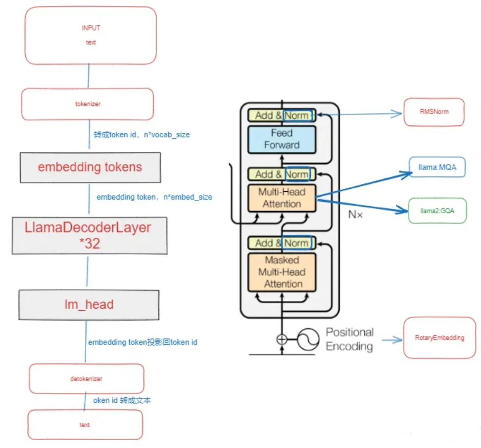
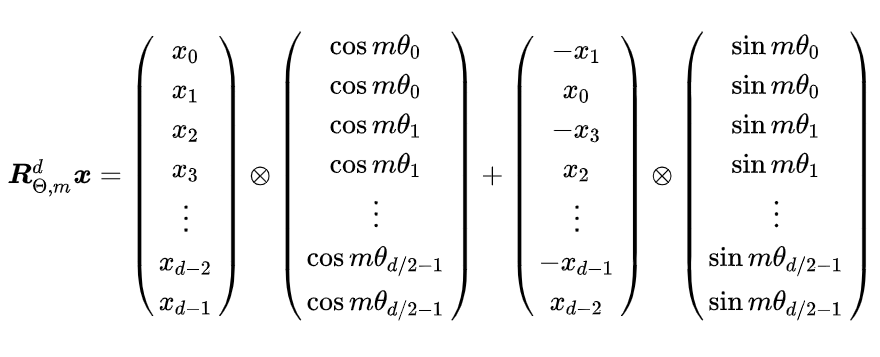

# 5.1 llama2结构


与transformer不同，llama2采用了前置层归一化（pre-normalization）并使用RMSNorm归一化函数、激活函数更换为SwiGLU，使用了旋转位置编码，transformer结构与GPT-2相似，如下图：


<div align=center>

</div>
<div align=center>图1.llama2结构 </div>


接下来，分别介绍RMSNorm归一化函数、SwiGLU激活函数和RoPE的具体内容和实现。


## 5.1.1 RMSNorm归一化函数


为了使模型训练过程更加稳定，GPT-2相较于GPT引入了前置层归一化方法，将第一个层归一化移动到多头自注意力之前，将第二个层归一化移动到全连接层之前。同时，残差连接的位置调整到多头自注意力层与全连接层之后。层归一化中也采用了RMSNorm归一化函数。针对输入向量 $a$ ，RMSNorm函数计算公式如下：$ RMS(a)=\sqrt{Σ_{i=1}^n a_i^2/n} ，\overline{a_i}=a_i/RMS(a) $ 。此外，RMSNorm还可以引入可学习的缩放因子 $g_i$ 和偏移参数 $b_i$，从而得到 $\overline{a_i}=a_i*g_i/RMS(a)+b_i$。


下面是HuggingFace的transformers库中RMSNorm的代码实现：


```python
class LlamaRMSNorm(nn.Module):
    def __init__(self,hidden_size,eps=1e-6):
        super().__init__()
        self.weight=nn.Parameter(torch.ones(hidden_size))
        self.variance_epsilon=eps#防止取倒数分母为0
    def forward(self,hidden_states):
        input_dtype=hidden_states.dtype
        variance=hidden_states.to(torch.float32).pow(2).mean(-1,keepdim=True)
        hidden_states=hidden_states*torch.rsqrt(variance+self.variance_epsilon)
        return (self.weight*hidden_states).to(input_dtype)
```

## 5.1.2 SwiGLU激活函数


在llama2中，全连接层使用带有SwiGLU激活函数的FFN的计算公式如下：$ FFN_{SwiGLU}(x,W,V,W_2)=SwiGLU(x,W,V)W_2,SwiGLU(x,W,V)=Swish_β(xW) \otimes xV,Swish_β(x)=xσ(βx)$ 。Swish激活函数中取β=1即是SiLU函数，部分llama2模型实现例如transformers库中，Swish激活函数被SiLU激活函数代替。


## 5.1.3 旋转位置编码(RoPE,Rotary Position Embedding)


旋转位置编码（Rotary Position Embedding，RoPE）是论文Roformer: Enhanced Transformer With Rotray Position Embedding 提出的一种能够将相对位置信息依赖集成到 self-attention 中并提升 transformer 架构性能的位置编码方式。LLaMA2、GLM 模型也是采用该位置编码方式。和相对位置编码相比，RoPE 具有更好的外推性(外推性是指大模型在训练时和预测时的输入长度不一致，导致模型的泛化能力下降的问题)。目前是大模型相对位置编码中应用最广的方式之一。


首先定义一个长度为 $N$ 的输入序列为： $S_N={w_i}^N_{i=1}$ ，其中 $w_i$ 是输入序列中第 $i$ 个token，而输入序列 $S_N$ 对应的 embedding 表示为： $E_N={x_i}^N_{i=1}$ ，其中 $x_i$ 表示第 $i$ 个token $w_i$ 对应的 $d$ 维嵌入向量。接着在做 self-attention 之前，会用词嵌入向量计算 $\bm{q,k,v}$ 向量同时加入位置信息，函数公式表达如下:  $q_m=f_q(x_m,m),k_n=f_k(x_n,n),v_n=f_v(x_n,n)$ ，其中 $q_m$ 表示第 $m$ 个token对应的词向量 $\bm{x}_m$ 集成位置信息 $m$ 之后的query向量。而 $\bm{k}_n$ 和 $\bm{v}_n$ 则表示第 $n$ 个token对应的词向量 $\bm{x}_n$ 集成位置信息 $n$ 之后的key和value向量。而基于 transformer 的位置编码方法都是着重于构造一个合适的 $f\left( \bm{q},\bm{k},\bm{v} \right)$ 函数形式。


为了能利用上token之间的相对位置信息，假定query向量 $\bm{q}_m$ 和key向量 $\bm{k}_n$ 之间的内积操作可以被一个函数 $g$ 表示，该函数 $g$ 的输入是词嵌入向量 $\bm{x}_m, \bm{x}_n$ 和它们之间的相对位置 $m-n$ ：$<f_q(x_m,m),f_k(x_n,n)>=g(x_m,x_n,x-n)$ ，接下来的目标就是找到一个等价的位置编码方式，从而使得上述关系成立。假定现在词嵌入向量的维度是2维 (d=2) ，这样就可以利用上2维平面上的向量的几何性质。llama2论文中提出了一个满足上述关系的 $f$ 和 $g$ 的形式如下： $f_q(x_m,m)=(W_qx_m)e^{imθ}，f_k(x_n,n)=(W_kx_n)e^{inθ} ，g(x_m,x_n,m-n)=Re[(W_qx_m)(W_kx_n)^{*}e^{i(m-n)θ}]$ ，这里面 $Re$ 表示复数的实部，*表示共轭复数。


进一步地， $f_q$ 可以表示成下面的式子：


$$ f_q(x_m,m)= \left[
 \begin{matrix}
   cosmθ & -sinmθ \\
   sinmθ & cosmθ \\
  \end{matrix}
  \right] \left[
 \begin{matrix}
   W_q^{(1,1)} &  W_q^{(1,2)}\\
   W_q^{(2,1)} &  W_q^{(2,2)}\\
  \end{matrix}
  \right] \left[
 \begin{matrix}
   x_m^{(1)}\\
   x_m^{(2)}\\
  \end{matrix}
  \right] = \left[
 \begin{matrix}
   cosmθ & -sinmθ \\
   sinmθ & cosmθ \\
  \end{matrix}
  \right] \left[
  \begin{matrix}
   q_m^{(1)}\\
   q_m^{(2)}\\
  \end{matrix}
  \right]
$$


这里就是query向量乘以了一个旋转矩阵，因此称为旋转位置编码。同理，$f_k$ 可以表示成下面的式子：


$$ f_k(x_n,n)= \left[
 \begin{matrix}
   cosnθ & -sinnθ \\
   sinnθ & cosnθ \\
  \end{matrix}
  \right] \left[
 \begin{matrix}
   W_k^{(1,1)} &  W_k^{(1,2)}\\
   W_k^{(2,1)} &  W_k^{(2,2)}\\
  \end{matrix}
  \right] \left[
 \begin{matrix}
   x_n^{(1)}\\
   x_n^{(2)}\\
  \end{matrix}
  \right] = \left[
 \begin{matrix}
   cosnθ & -sinnθ \\
   sinnθ & cosnθ \\
  \end{matrix}
  \right] \left[
  \begin{matrix}
   k_n^{(1)}\\
   k_n^{(2)}\\
  \end{matrix}
  \right]
$$


最终 $g(\bm{x}_m,\bm{x}_n,m-n)$ 可以表示如下：


$$ g(\bm{x}_m,\bm{x}_n,m-n)= \left[
  \begin{matrix}
   q_m^{(1)} & q_m^{(2)} \\
  \end{matrix}
  \right] \left[
  \begin{matrix}
   cos((m-n)θ) & -sin((m-n)θ) \\
   sin((m-n)θ) & cos((m-n)θ) \\
  \end{matrix}
  \right] \left[
  \begin{matrix}
  k_n^{(1)}\\
  k_n^{(2)}\\
  \end{matrix}
  \right]
$$


以上公式推导仅需要欧拉公式和三角函数和角公式即可自行推导，具体过程详见知乎《一文看懂 LLaMA 中的旋转式位置编码》一文。将2维推广到任意维度，可以表示如下：$f_{q,k}(x_m,m)=R^d_{θ,m}W_{q,k}x_m$。内积满足线性叠加性，因此任意偶数维的RoPE都可以表示为二维情形的拼接，即：


<div align=center>

</div>
<div align=center>图2.多维RoPE </div>


将 RoPE 应用到自注意力计算，可以得到包含相对位置信息的自注意力： $q_m^Tk_n=(R^d_{θ,m}W_qx_m)^T(R^d_{θ,n}W_kx_n)=x_m^TW_qR^d_{θ,n-m}W_kx_n$ ，其中， $R^d_{θ,n-m}=(R^d_{θ,m})^TR^d_{θ,n}$ 。由于 $\bm{R}^d_{\Theta}$ 是一个正交矩阵，它不会改变向量的模长，因此不会改变原模型的稳定性。


由于 $\bm{R}^d_{\Theta,m}$ 的稀疏性，所以直接用矩阵乘法来实现会很浪费算力，通常逐元素相乘操作 $\otimes$ 来实现 RoPE：


<div align=center>

</div>
<div align=center>图3.高效计算RoPE </div>


总结来说，RoPE的自注意力操作的流程是：对于token序列中的每个词嵌入向量，首先计算其对应的query和key向量，然后对每个token位置都计算对应的旋转位置编码，接着对每个token位置的 query和key向量的元素按照两两一组应用旋转变换，最后再计算query和key之间的内积得到自注意力的计算结果。下图展示了旋转变换的过程：


<div align=center>

</div>
<div align=center>图4.旋转变换过程 </div>


RoPE具有很好的外推性，因为RoPE可以通过旋转矩阵来实现位置编码的外推，即可以通过旋转矩阵来生成超过预期训练长度的位置编码。这样可以提高模型的泛化能力和鲁棒性。回顾一下RoPE的工作原理：假设有一个 $d$ 维的绝对位置编码 $P_i$ ，其中 $i$ 是位置索引，将 $P_i$ 看成一个 $d$ 维空间中的一个点，定义一个 $d$ 维空间中的一个旋转矩阵 $\bm{R}$ ，它可以将任意一个点沿着某个轴旋转一定的角度。用 $\bm{R}$ 来变换 $P_i$ ，得到一个新的点 $Q_i=\bm{R}*P_i$ 。可以发现， $Q_i$ 和 $P_i$ 的距离是相等的，即 $\left|\left| Q_i-P_i \right|\right| = 0$ 。这意味着 $Q_i$ 和 $P_i$ 的相对关系没有改变。但是， $Q_i$ 和 $P_j$ 的距离可能发生改变，即 $\left|\left| Q_i-P_j \right|\right| \ne \left|\left| P_i-P_j \right|\right|$ 。这意味着 $Q_i$ 和 $P_j$ 的相对关系有所改变。因此，我们可以用 $\bm{R}$ 来调整不同位置之间的相对关系。


如果想要生成超过预训练长度的位置编码，只需要用 $\bm{R}$ 来重复变换最后一个预训练位置编码 $P_n$ ，得到新的位置编码 $Q_{n+1} = \bm{R} * P_n ，Q_{n+2} = \bm{R} * Q_{n+1} ， Q_{n+3} = \bm{R} * Q_{n+2}$ ，依此类推。这样就可以得到任意长度的位置编码序列 $Q_1, Q_2, …, Q_m$ ，其中 $m$ 可以大于 $n$ 。由于 $\bm{R}$ 是一个正交矩阵，它保证了 $Q_i$ 和  $Q_j$  的距离不会无限增大或缩小，而是在一个有限范围内波动。这样就可以避免数值溢出或下溢的问题。同时，由于 $\bm{R}$ 是一个可逆矩阵，它保证了 $Q_i$ 和 $Q_j$ 的距离可以通过 $\bm{R}$ 的逆矩阵 $\bm{R}^{-1}$ 还原到 $P_i$ 和 $P_j$ 的距离，即 $||\bm{R}^{-1} * Q_i - \bm{R}^{-1} * Q_j|| = ||P_i - P_j||$ 。这样就可以保证位置编码的可逆性和可解释性。


RoPE代码实现如下所示：


```python
# 生成旋转矩阵
def precompute_freqs_cis(dim: int, seq_len: int, theta: float = 10000.0):
    # 计算词向量元素两两分组之后，每组元素对应的旋转角度\theta_i
    freqs = 1.0 / (theta ** (torch.arange(0, dim, 2)[: (dim // 2)].float() / dim))
    # 生成 token 序列索引 t = [0, 1,..., seq_len-1]
    t = torch.arange(seq_len, device=freqs.device)
    # freqs.shape = [seq_len, dim // 2] 
    freqs = torch.outer(t, freqs).float()  # 计算m * \theta

    # 计算结果是个复数向量
    # 假设 freqs = [x, y]
    # 则 freqs_cis = [cos(x) + sin(x)i, cos(y) + sin(y)i]
    freqs_cis = torch.polar(torch.ones_like(freqs), freqs) 
    return freqs_cis

# 旋转位置编码计算
def apply_rotary_emb(
    xq: torch.Tensor,
    xk: torch.Tensor,
    freqs_cis: torch.Tensor,
) -> Tuple[torch.Tensor, torch.Tensor]:
    # xq.shape = [batch_size, seq_len, dim]
    # xq_.shape = [batch_size, seq_len, dim // 2, 2]
    xq_ = xq.float().reshape(*xq.shape[:-1], -1, 2)
    xk_ = xk.float().reshape(*xk.shape[:-1], -1, 2)
    
    # 转为复数域
    xq_ = torch.view_as_complex(xq_)
    xk_ = torch.view_as_complex(xk_)
    
    # 应用旋转操作，然后将结果转回实数域
    # xq_out.shape = [batch_size, seq_len, dim]
    xq_out = torch.view_as_real(xq_ * freqs_cis).flatten(2)
    xk_out = torch.view_as_real(xk_ * freqs_cis).flatten(2)
    return xq_out.type_as(xq), xk_out.type_as(xk)

class Attention(nn.Module):
    def __init__(self, args: ModelArgs):
        super().__init__()

        self.wq = Linear(...)
        self.wk = Linear(...)
        self.wv = Linear(...)
        
        self.freqs_cis = precompute_freqs_cis(dim, max_seq_len * 2)

    def forward(self, x: torch.Tensor):
        bsz, seqlen, _ = x.shape
        xq, xk, xv = self.wq(x), self.wk(x), self.wv(x)

        xq = xq.view(batch_size, seq_len, dim)
        xk = xk.view(batch_size, seq_len, dim)
        xv = xv.view(batch_size, seq_len, dim)

        # attention 操作之前，应用旋转位置编码
        xq, xk = apply_rotary_emb(xq, xk, freqs_cis=freqs_cis)
        
        # scores.shape = (bs, seqlen, seqlen)
        scores = torch.matmul(xq, xk.transpose(1, 2)) / math.sqrt(dim)
        scores = F.softmax(scores.float(), dim=-1)
        output = torch.matmul(scores, xv)  # (batch_size, seq_len, dim)
  # ......
```

##