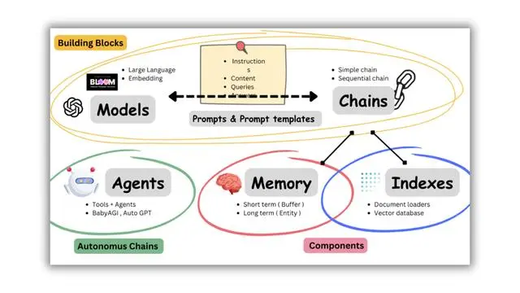

# 6.1 langchain模块介绍


langchain的两个关键概念分别是“组件”和“链”。“组件”包括LLM模型包装器、聊天模型包装器及与数据连接相关的一系列工具和接口。这些组件就是langchain的核心，每个组件都有特定功能，例如处理数据的输入输出、转化数据格式等。链是将各种组件连接在一起的纽带，能够确保组件之间的无缝集成和在程序运行环境中的高效调用，例如LLMChain，可以整合LLM模型包装器和记忆组件，让聊天机器人拥有“记忆”。langchain正在重新定义LLM应用的开发方式，尤其是在问答系统、数据处理与管理、自动问答与客服机器人这三个场景下。针对LLM应用开发者的需求，langchain提供了以下6大核心模块，如下图所示，这些模块覆盖了从模型I/O到数据连接，从链到记忆，以及从Agent到回调处理器的全方位功能。借助这些模块中的包装器和组件，开发者能够更为方便地搭建LLM应用。


<div align=center>

</div>
<div align=center>图1.langchain模块(注：图中未显示回调模块) </div>


- 模型输入/输出(model I/O)：langchain提供了与任何大语言模型均适配的模型包装器(模型I/O的功能)，分为LLM和聊天模型包装器。模型包装器的提示词模板功能使得开发者可以模板化、动态选择和管理模型输入。langchain自身并不提供大语言模型，而是提供统一的模型接口。模型包装器这种包装方式允许开发者与不同模型平台底层的api进行交互，从而简化了大语言模型的调用，降低了开发者的学习成本。此外，其输出解析器也能帮助开发者从模型输出中提取所需的信息。

- 索引(indexes)(在之前的langchain版本又称为数据连接(data connection)):langchain提供了加载、转换、存储和查询数据的构建块。开发者可以利用文档加载器从多个来源加载文档，通过文档转换器进行文档切割、转换等操作。向量存储和数据检索工具则提供了对嵌入数据的存储和查询功能。

- 链(chain):面对复杂的应用，往往需要将多个LLM模型包装器或其他组件进行链式连接。langchain为此类“链式”应用提供了接口。

- 记忆(memory):大部分的LLM应用都有一个对话式的界面，能够引用之前对话中的信息是至关重要的。langchain提供了多种工具，帮助开发者为系统添加记忆功能。记忆功能可以独立使用，也可以无缝集成到链中。记忆模块需要支持两个基本操作，即读取和写入。在每次运行中，链首先从记忆模块中读取数据，然后在执行核心逻辑后将当前运行的输入和输出写入记忆模块，以供未来引用。

- 代理(agent):利用LLM选择操作序列。在链中，操作序列是硬编码的，而在Agent代理中，大语言模型被用作推理引擎，确定执行哪些操作以及执行顺序。

- 回调(callback):用于记录和流式传输任何链式组装的中间步骤。langchain提供了一个回调系统，允许开发者在LLM应用的各个阶段对状态进行干预。这对于日志记录、监视、流处理非常有用。通过api提供的callbacks参数，开发者可以订阅这些事件。


## 6.1.1 模型输入/输出


langchain中的模型输入/输出模块是与各种大语言模型进行交互的基本组件，是大语言模型应用的核心元素。该模块的基本流程如下图所示，主要包含模型包装器(language models)、提示词(prompts)和输出解析器(output parsers)三个部分，下面将对这三部分一一介绍。


### 6.1.1.1 模型包装器


langchain的模型包装器组件是基于各个模型平台的api协议进行开发的，主要提供了两种类型的包装器。一种是通用的LLM模型包装器，接收文本字符串作为输入并返回文本字符串；另一种是专门针对chat类型api的chat model(聊天模型包装器)，由大语言模型支持，但接收聊天消息列表作为输入并返回聊天消息。在langchain中，LLM指纯文本补全模型，接收字符串提示词作为输入，并输出字符串，openai的GPT-3是LLM实现的一个实例。chat model专为会话交互设计，与传统的纯文本补全模型相比，这一模型的api采用了不同的接口方式：它需要一个标有说话者身份的聊天消息列表作为输入。作为输出，chat model会返回一个标为“AI”的聊天消息。


使用LLM模型包装器最简单的方法是，输入一个字符串，输出一个字符串：
```python
from langchain.llms import OpenAI
llm=OpenAI()
llm("xxx")
```


为了使用聊天模型包装器，这里导入3个数据模式(schema):一个由AI生成的消息数据模式(AIMessage)、一个人类用户输入的消息数据模式(HumanMessage)、一个系统消息数据模式(SystemMessage)。这些数据模式通常用于设置聊天环境或提供上下文信息。然后导入聊天模型包装器ChatOpenAI，这个模型包装器封装了OpenAI平台Chat类型的API，无需关注OpenAI平台的接口如何调用，只需要关注向这个ChatOpenAI中输入的内容：
```python
from langchain.schema import (
    AIMessage,
    HumanMessage,
    SystemMessage
)
from langchain.chat_models import ChatOpenAI
```


向ChatOpenAI聊天模型包装器输入的内容必须是一个消息列表。消息列表的数据模式需要符合AIMessage、HumanMessage和SystemMessage这3种数据模式的要求。这样设计的目的是提供一种标准和一致的方式来表示和序列化输入消息，序列化是将数据结构转换为可以存储或传输的数据模式的过程。在ChatOpenAI中，序列化是指将消息对象转换为可以通过API发送的数据。在下面的示例中，SystemMessage是指在使用大语言模型时用于配置系统的系统消息，HumanMessage是指用户信息。下面将SystemMessage和HumanMessage组合成一个聊天消息列表，输入模型。这里使用的模型是GPT-3.5-turbo，turbo表示性能提升的版本。
```python
chat=ChatOpenAI(model_name="gpt-3.5-turbo",temperature=0.3)
messages=[SystemMessage(content="你是个原神玩家，你擅长原神启动"),
HumanMessage(content="帮我抽个可莉")]
response=chat(messages)
print(response.content,end='\n')
```


创建一个消息列表messages，这个列表包含了一系列SystemMessage和HumanMessage对象。每个消息对象都有一个content属性，用于存储实际的消息内容。当调用chat(messages)时，ChatOpenAI对象会接收这个消息列表，然后按照AIMessage、HumanMessage、SystemMessage这3种数据模式将其序列化并发送到OpenAI平台的服务器上。服务器会处理这些消息，生成AI的回应，然后将这个回应发送回ChatOpenAI聊天模型包装器。聊天模型包装器接收回应，回应是一个AIMessage对象，可以通过response.content方法获取它的内容。


### 6.1.1.2 提示词


在Langchain框架中，提示词不是简单的字符串，而是一个更复杂的结构“提示词工程”。这个结构中包含一个或多个提示词模板(PromptTemplate类的实例)，每个提示词模板可以接收一些输入变量，并根据这些变量生成对应的提示词，这样就可以根据具体的需求和情境动态地创建各种各样的提示词。提示词可以被视为向大语言模型提出的请求，是由提示词模板这个包装器对象生成的。提示词模板的功能就是根据大语言模型平台的API类型，包装并生成适合的提示词。为了满足不同类型模型平台底层API的需求，提示词模板提供了format方法和format_prompt方法。


同模型包装器的分类一样，提示词模板包装器也分为PromptTemplate包装器和ChatPromptTemplate包装器两类。PromptTemplate包装器可以输出一个字符串类型的提示词。这个字符串可能包含一些特定的任务描述、用户问题，或者其他的上下文信息，它们都被整合在一起，构成了一个完整的、用于引导模型生成预期输出的提示词。ChatPromptTemplate包装器可以生成一个消息列表格式的提示词。模型平台的Chat类型API通常需要一个消息列表作为输入，在这种情况下，这种包装器将构造出一个包含多个消息对象的提示词。每个消息对象都代表一条消息，它可能是一个用户问题、一个AI回答或者一条系统指令。这些消息被组织在一起，形成了一个清晰的对话流程，用于引导模型完成复杂的对话任务。


PromptTemplate是Langchain提示词组件中最核心的一个类，构造提示词的步骤本质上是实例化这个类的过程。在实例化PromptTemplate类时，两个关键参数是template和input_variables。只需要准备好这两个参数就可以实例化一个基础的PromptTemplate类，生成结果就是一个PromptTemplate对象，即一个PromptTemplate包装器。
```python
from langchain import PromptTemplate
template="""原神启动"""
prompt=PromptTemplate(template=template,input_variables=["concept"])
```


PromptTemplate包装器接收内部数据(内部数据指已经被langchain框架封装好的数据，以及开发者写的示例和需求描述文本。这里是实例化时定义的template和input_variables)和外部数据(外部数据指开发者自由添加的数据，这里是运行链时传递的数据)，在使用链组件调用时，外部数据(用户输入)是通过链组件传递的，而不是直接传递给提示词模板包装器。如果不需要通过链进行调用，PromptTemplate包装器还提供了一些其他方法，例如，format方法可以将PromptTemplate包装器的用户输入和模板字符串的变量进行绑定，形成一个完整的提示词，方便查看完整提示词内容。示例如下：
```python
from langchain import PromptTemplate
template="""原神启{concept}"""
prompt=PromptTemplate.from_template(template)
final_prompt=prompt.format(concept="动")
```


input_variables属性指定提示词模板期望的输入变量，这些输入变量生成提示词需要的数据，例如以上示例的输入变量就是concept。如果不想显式指定输入变量，可以使用from_template方法实例化模板，接收与预期的input_variables对应的关键字参数，format方法接收concept="动"作为输入，并返回格式化的提示词。


ChatPromptTemplate包装器与PromptTemplate包装器不同，ChatPromptTemplate包装器构造的提示词是消息列表，支持输出Message对象。Langchain提供了内置的聊天提示词模板(ChatPromptTemplate)和角色消息提示词模板。角色消息提示词模板包括AIMessagePromptTemplate、SystemMessagePromptTemplate和HumanMessagePromptTemplate这3种。下面是使用ChatPromptTemplate包装器构造提示词的示例，先导入内置的聊天提示词模板和角色消息提示词模板：
```python
from langchain.prompts import (
    ChatPrtomptTemplate,
    PromptTemplate,
    SystemMessagePromptTemplate,
    AIMessagePromptTemplate,
    HumanMessagePromptTemplate
)
```

先使用from_template方法将SystemMessagePromptTemplate类和HumanMessagePromptTemplate类实例化为包装器，传入定义的template模板字符串，得到人类消息模板和系统消息模板对象：
```python
from langchain import PromptTemplate
template="""原神启动"""
system_message_prompt=SystemMessagePromptTemplate.from_template(template)
human_template="星穹铁道{concept}"
human_message_prompt=HumanMessagePromptTemplate.from_template(human_template)
```


将上述两个模板对象作为参数传入from_messages方法，转化为ChatPromptTemplate包装器：
```python
chat_prompt=ChatPromptTemplate.from_messages([system_message_prompt,human_message_prompt])
```


最后使用format_prompt方法将用户输入传入包装器内，组合为完整的提示词：
```python
chat_prompt.format_prompt(content="启动")
```


如果调用format_prompt方法，获得的是ChatPromptValue对象。ChatPromptValue对象中有to_string方法将提示词转化为一个字符串，to_messages则转化为一个消息列表。
```python
chat_prompt.format_prompt(content="启动").to_messages()
```


### 6.1.1.3 输出解析器


在使用大语言模型时，需要langchain的输出解析器(OutputParsers)将模型生成的输出格式转化为可以在代码中直接使用的格式。输出解析器具有两大功能:添加提示词模板的输出指令和解析输出格式。输出解析器是通过改变提示词模板，即增加输出指令，来指导模型按照特定格式输出内容的。除了预设大量的输出指令，输出解析器的parse方法还支持将模型的输出解析为对应的数据格式。


Langchain提供了一系列预设的输出解析器，这些输出解析器能够针对不同的数据类型给出合适的输出指令，并将输出解析为不同的数据格式。这些输出解析器包括：
- BooleanOutPutParser：用于解析布尔值类型的输出。
- CommaSeparatedListOutputParser：用于解析以逗号分隔的列表类型的输出。
- DatetimeOutputParser：用于解析日期时间类型的输出。
- EnumOutputParser：用于解析枚举类型的输出。
- ListOutputParser：用于解析列表类型的输出。
- PydanticOutputParser：用于解析符合Pydantic大语言模型需求的输出。
- StructuredOutputParser：用于解析具有特定结构的输出。


输出解析器的使用主要依靠提示词模板对象的partial方法注入输出指令的字符串，主要的实现方式是利用PromptTemplate对象的Partial方法或在实例化PromptTemplate对象时传递partial_variables参数。具体操作是，首先使用output_parser.get_fromat_instructions()获取预设的输出指令，然后在实例化PromptTemplate类时将format_instructions作为partial_variables的一部分传入，如此便在原有的提示词模板中追加了format_instructions变量，这个变量是输出指令字符串。示例如下：
```python
format_instructions=output_parser.get_format_instructions()
prompt=PromptTemplate(
    template="List five {subject} .\n{format_instructions}",
    input_variables=["subject"],
    partial_variables={"format_instructions":format_instructions}
)
```


在这段代码中，PromptTemplate的模板字符串template中包含两个占位符变量{subject}和{format_instructions}。在实例化PromptTemplate对象时，除了要传入input_variables=["subject"]参数，还要通过partial_variables={"format_instructions":format_instructions}参数预先填充{format_instructions}变量，这样就成功为提示词模板添加了输出解析器所提供的输出指令。下面通过示例完成输出解析器的两大功能：添加输出指令和解析输出格式，同时展示如何将输出解析器运用到链组件上。


首先，采用CommaSeparatedListOutputParser输出解析器：
```python
from langchain.output_parsers import CommaSeparatedListOutputParser
from langchain.prompts import PromptTemplate
from langchain.llms import OpenAI
output_parser=CommaSeparatedListOutputParser()
```


然后使用output_parser.get_format_instructions()方法获取预设的格式化输出指令。这个字符串输出指令会指导模型如何将输出格式化为逗号分隔的消息列表。接下来，创建一个PromptTemplate提示词模板对象：
```python
format_instructions=output_parser.get_format_instructions()
prompt=PromptTemplate(
    template="List five {subject} .\n{format_instructions}",
    input_variables=["subject"],
    partial_variables={"format_instructions":format_instructions}
)
```


这个提示词模板中定义了一个字符串模板，其中包含两个占位符变量{subject}和{format_instructions}。{subject}是希望模型产生的列表主题，而{format_instructions}是从输出解析器中获取的预设的输出指令。这里引入OpenAI的LLM模型包装器。
```python
from langchain.chains import LLMchain
chain=LLMchain(
    llm=OpenAI(
        openai_api_key="填入密钥"
    ),
    prompt=prompt
)


将subject的值设为ice cream flavors，然后调用prompt.format(subject="ice cream flavors")方法，返回一个完整的提示词字符串，包含指导模型产生5种冰淇淋口味的指令。导入LLMChain链组件，将PromptTemplate类实例化后的对象传入LLMChain链：output=chain("ice cream flavors")。运行这个链得到的是一个JSON对象，output['text']是模型回答的字符串，然后调用输出解析器的parse()方法将这个字符串解析为一个列表。


## 6.1.2 数据连接


由于GPT4的数据集只训练到2023年4月份，这个时间之后的数据并没有被模型学习和理解。这是因为模型在训练数据集之外的知识领域中，其预测能力是有限的。连接外部数据不仅可以填补大模型语言的知识缺失，而且还能让开发的应用程序更加可靠。大语言模型不仅需要连接外部的数据，填补缺失知识，同时还受到提示词的限制。构建好的提示词模板需要依靠外部数据，然而提示词的字符数量是有限的，这就是max token概念。为了解决大语言模型的这些限制问题，langchain设计了数据连接模块，目的是检索与用户输入的问题相关的外部数据，包括筛选相关问题和文档。然后这些相关数据会形成提示词模板，提交给LLM或Chat Model类型的模型包装器。数据连接模块还提供了一系列内置的文档转换器，这些文档转换器可以对文档进行切割、组合、过滤等操作。


### 6.1.2.1 LEDVR工作流


数据连接模块是一个多功能的数据增强集成工具，可称作LEDVR。其中，L代表加载器(Loader)、E代表嵌入模型包装器(Text Embedding Model)、D代表文档转换器(Document Transformers)、V代表向量存储库(VectorStore)、R代表检索器(Retriever)。加载器负责从各种来源加载数据作为文档，其中文档是由文本和相关元数据组成的。嵌入模型包装器是一个专为与各种文本嵌入模型交互而设计的类。文档转换器主要用来对文档进行切割、组合、过滤等各种转换，目的是将加载的文档转换为可被嵌入模型包装器操作的文档数据格式。向量存储库是用于存储和检索嵌入向量的工具，处理的数据是通过模型平台的文本嵌入模型转换的向量数据。向量存储库负责存储嵌入数据并执行向量检索。在检索时，可以嵌入非结构化查询，以检索与嵌入数据“最相似”的嵌入向量。检索器是一个接口，返回非结构化查询的文档。下面通过示例解析langchain数据处理流程的各个步骤：


首先使用加载器，创建一个WebBaseLoader实例，用于从网络加载数据，文档加载器读取该网址的内容并转换为一份文档数据。
```python
from langchain.document_loader import WebBaseLoader
loader=WebBaseLoader("http://xxx.html")
data=loader.load()
```


随后使用嵌入模型包装器，将这些切割后的文本数据转换为向量数据。创建一个OpenAIEmbeddings实例，用于将文本转换为向量。
```python
from langchain.embeddings.openai import OpenAIEmbeddings
embedding=OpenAIEmbeddings(openai_api_key="填入密钥")
```


接下来，使用文档转换器，将数据切割成小块，然后转换为文档格式的数据，这是为了让数据更好地适应数据连接模块的工作流程。创建一个RecursiveCharacterTextSplitter实例作为切割工具，并指定每个片段500个字符将数据切割成多个片段。
```python
from langchain.text_splitter import RecursiveCharacterTextSplitter
text_splitter=RecursiveCharacterTextSplitter(chunk_size=500,chunk_overlap=0)
splits=text_splitter.split_document(data)
```


然后，进入工作流的向量存储库环节，创建一个向量存储库：FAISS实例，用于存储这些向量数据。
```python
from langchain.vectorstores import FAISS
vectordb=FAISS.from_documents(document=splits,embedding=embedding)
```


最后实例化一个检索器，在这些数据中进行检索。创建一个ChatOpenAI实例和一个MultiQueryRetriever实例，用于执行检索问答。下例使用相似度查询方法get_relevant_documents进行检索。
```python
from langchain.chat_models import ChatOpenAI
from langchain.retrievers.multi_query import MultiQueryRetriever
question="1+1"
llm=ChatOpenAI(openai_api_key="密钥")
retriever_from_llm=MultiQueryRetriever.from_llm(retriever=vectordb.as_retriever(),llm=llm)
docs=retriever_from_llm.get_relevant_documents(question)
```


## 6.1.3 链


### 6.1.3.1 基础链


链是连接组件、管理组件数据流的包装器。基础链的类型有四种：LLM链(LLMChain)、路由器链(RouterChain)、顺序链(Sequential Chain)和转换链(Transformation Chain)：
- LLM链由提示词模板和模型包装器组成。它使用提供的输入键值格式化提示词模板，然后将格式化的字符串传递给LLM模型包装器，并返回LLM模型包装器的输出。
- 路由器链是一种使用路由器创建的链，它可以动态地选择给定输入的下一条链。路由器链由两部分组成：路由器链本身(负责选择要调用的下一条链)和目标链(路由器链可以路由到的链)。
- 顺序链在调用语言模型后的下一步使用，适合将一次调用的输出作为另一次调用的输入的场景。顺序链有两种类型：SimpleSequentialChain(每一步都有一个单一的输入/输出，一个步骤的输出是下一个步骤的输入)和SequentialChain(允许多个输入/输出)。
- 转换链是一个用于数据转换的链，开发者可以自定义transform函数来执行任何数据转换逻辑。这个函数接受一个字典(其键由input_variables指定)作为参数并返回另一个字典(其键由output_variables指定)。


以下分别是LLM链、路由器链和顺序链的示例代码：
```python
from langchain.chains import LLMchain
chat=ChatOpenAI(temperature=0)#temperature位于0和1之间，越大则输出越有多样性
prompt_template="a {adjective} joke"
llm_chain=LLMChain(llm=chat,prompt=PromptTemplate.from_template(prompt_template))
llm_chain(inputs={"adjective":"corny"})
```


```python
from langchain.chains.router.llm_router import LLMRouterChain
router_chain=LLMRouterChain.from_llm(llm,router_prompt)
```


```python
from langchain.chains import SimpleSequentialChain,SequentialChain
full_chain=SimpleSequentialChain(chains=[fact_extraction_chain,invest_update_chain],verbose=True)
response=full_chain.run(article)
```


### 6.1.3.2 工具链


在Langchain中，链是由一系列工具链构成的，每一个工具都可以视为整个链中的一个环节。在工具链中，一个链的输出将成为下一个链的输入，形成了一个输入/输出的范式流程。下面是几个常见的工具链：
- APIChain使得大语言模型可以与API进行交互，以获取相关的信息。
- ConversationalRetrievalQA链在问答链的基础上提供了一个聊天历史组件。它首先将聊天历史(明确传入或从提供的内存中检索)和问题合并成一个独立的问题，然后从检索器中查找相关的文档，最后将这些文档和问题传递给一个问答链用以返回响应。
- 对于需要将多个文档进行合并的任务，可以使用文档合并链，如MapReduceDocumentsChain或StuffDocumentsChain等。
- 专门设计用来满足特定需求的链，如ConstitutionalChain，这是一个保证大语言模型输出遵循一定规则的链，通过设定特定的原则和指导方针，使得大语言模型生成的内容符合这些原则，从而提供更受控、符合伦理和上下文的回应内容。

其中，处理文档的链又包括四种：
- Stuff链接收一组文档并将它们全部插入一个提示中，然后将该提示传递给LLM链。
- Refine链通过遍历输入文档并迭代更新其答案来构建响应。对于每个文档，它将所有非文档输入、当前文档和最新的中间答案传递给LLM链。
- MapReduce链首先将LLM链单独应用于每个文档(map步骤)，然后将所有新文档传递给一个单独的文档链以获得单一输出(reduce步骤)。
- 重排链(MapRerank)与MapReduce链一样，对每一个文档运行一个初始提示的指令微调。这个初始提示不仅试图完成一个特定任务(比如回答一个问题)，也为其答案提供了一个置信度评分。然后这个得分被用来重新排序所有文档或条目。最终得分最高的响应被返回。


工具链的使用方法通常是先使用类方法实例化，然后通过run方法调用，输出结果是一个字符串，然后将这个字符串传递给下一个链。类方法常见的有from_llm()和from_chain_type()。from_llm()方法的名称意味着实例化时，传递的LLM模型包装器在内部已被包装为LLMChain。而只有设置combine_documents_chain属性的子类时才使用from_chain_type()方法构造链，目前只有文档问答链使用这个类方法，比如load_qa_with_source_chain和load_qa_chain。下面以SQLDatabaseChain为例介绍如何使用工具链。
```python
from langchain import OpenAI,SQLDatabase,SQLDatabaseChain
db=SQLDatabase.from_uri("sqlite:///../xxx.db")
llm=OpenAI(temperature=0,verbose=True)
db_chain=SQLDatabaseChain_from_llm(llm,db,verbose=True)
db_chain.run("how many people are there")
```