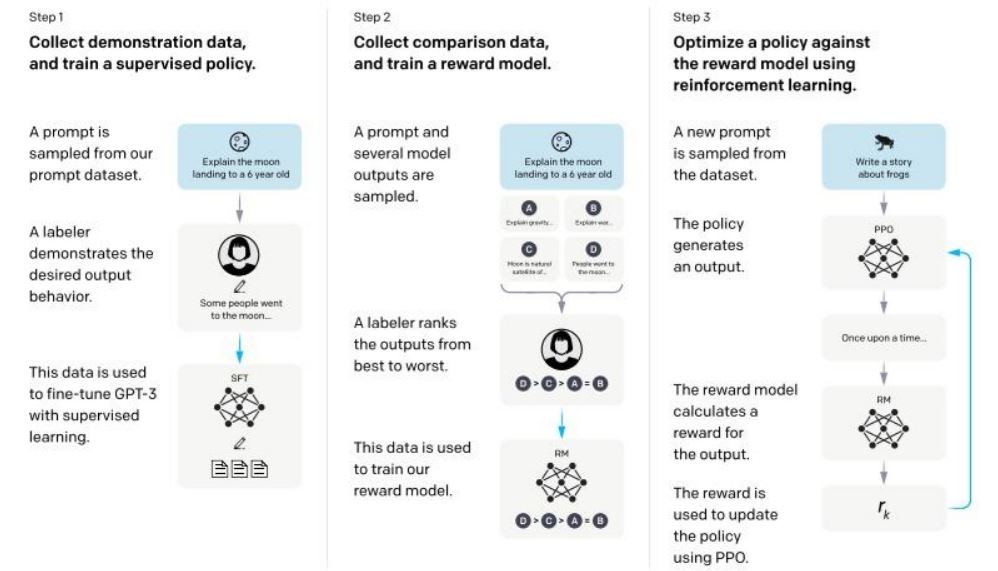
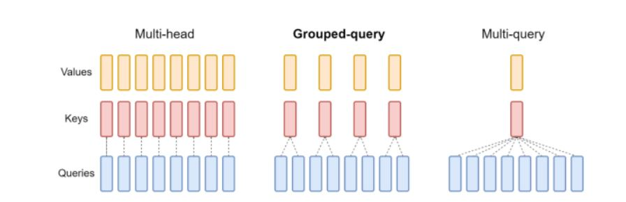
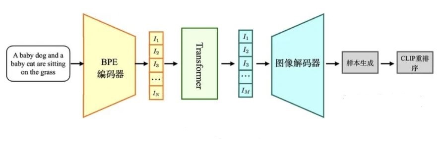
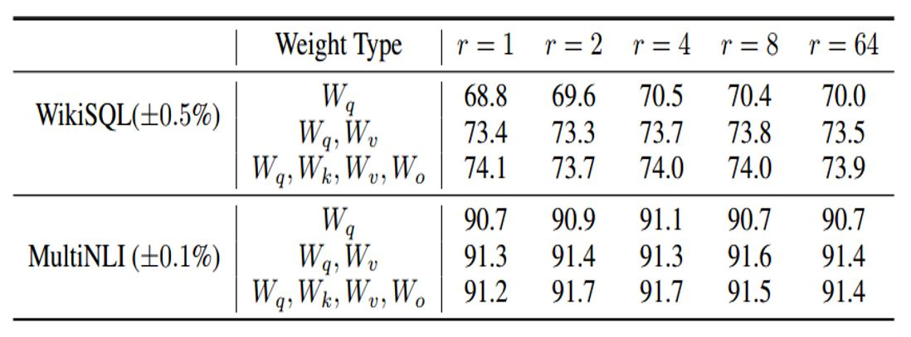
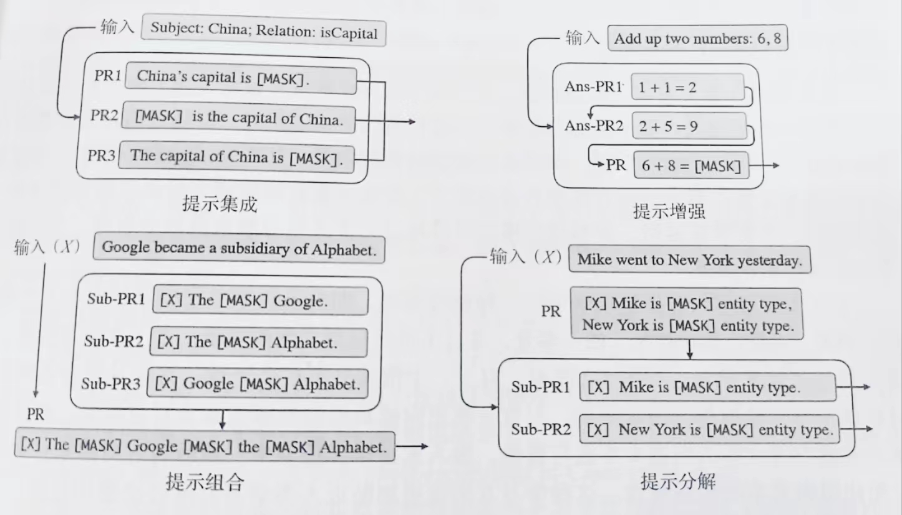
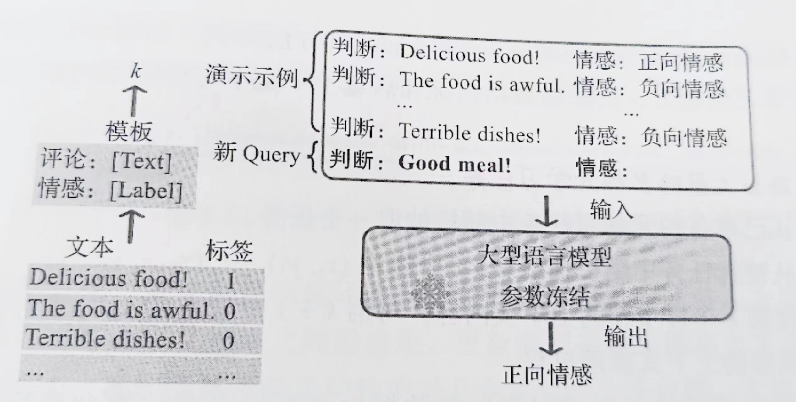
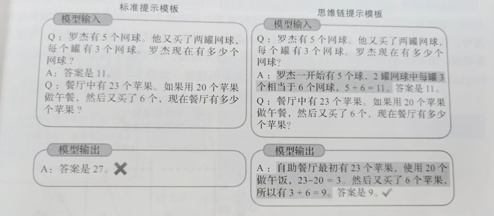
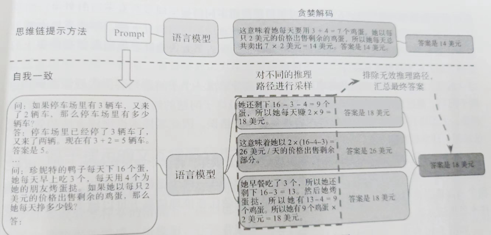
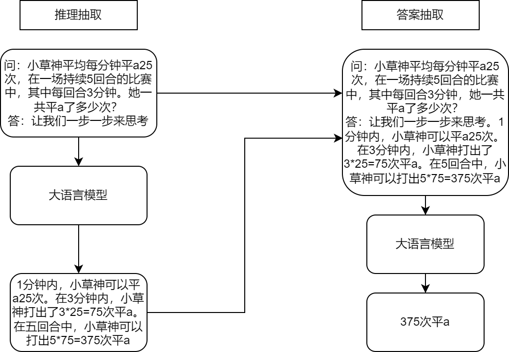

# 1.1 大模型

随着2023年chatgpt的爆火，大模型的研究热度也在与日俱增，在自动驾驶领域里也出现了自动驾驶和大模型结合的工作。在介绍这方面的工作之前，有必要先讲解一下大模型发展的来龙去脉。

## 1.1.1 gpt系列模型

### 1.1.1.1 gpt1

gpt1起源于《Improving Language Understanding by Generative Pre-Training》，是2018年由OpenAI的研究团队发布的一篇论文。它介绍了一种名为“生成式预训练”（Generative Pre-Training，简称gpt）的新型语言模型，该模型通过在大规模语料库上进行训练，能够学习自然语言的模式和规律，从而实现更好的语言理解。

gpt1模型是一种基于神经网络的自回归语言模型。该模型使用了前述1.3NLP自然语言处理一节已经介绍过的Transformer的架构，这是一种新型的序列到序列模型，能够在处理长序列数据时避免传统的循环神经网络中存在的梯度消失问题。Transformer架构中的关键组件包括多头注意力机制和残差连接等，gpt1使用了Transformer的解码器部分。为了预训练GPT模型，研究团队使用了两个大规模的语料库：BooksCorpus和英文维基百科。

以下是GPT1的主要技术特点：

基于Transformer架构：GPT1采用了Transformer架构，其中包括多头自注意力机制和前向神经网络。这使得GPT1可以在处理自然语言时捕捉长距离依赖性，并且具有高效的并行性。

图1. gpt1 

预训练技术：GPT-1使用了一种称为“生成式预训练”的技术。预训练分为两个阶段：预训练和微调（fine-tuning）。在预训练阶段，GPT-1使用了大量的无标注文本数据集，例如维基百科和网页文本等。通过最大化预训练数据集上的对数似然函数来训练模型参数。在微调阶段，GPT-1将预训练模型的参数用于特定的自然语言处理任务，如文本分类和问答系统等。

多层模型：GPT-1模型由多个堆叠的Transformer编码器组成，每个编码器包含多个注意力头和前向神经网络。这使得模型可以从多个抽象层次对文本进行建模，从而更好地捕捉文本的语义信息。

### 1.1.1.2 gpt2

《Language Models are Unsupervised Multitask Learners》是一篇介绍GPT-2模型的论文，它是2019年由OpenAI发表的。GPT-2主要解决的问题是如何利用大规模未标注的自然语言文本来预训练一个通用的语言模型，从而提高自然语言处理的能力。与GPT-1模型不同之处在于，GPT-2模型使用了更大的模型规模和更多的数据进行预训练，同时增加了许多新的预训练任务。

以下是GPT-2的主要技术特点：

- 大规模预训练：GPT-2使用了一种无监督学习的方法，在大规模文本语料库上进行预训练。在这个阶段，模型从语料库中学习文本序列的统计规律和语义信息。
- 非监督多任务学习：GPT-2具有多任务学习的能力，通过训练模型来执行多个不同的自然语言处理任务，从而提高模型的鲁棒性和泛化能力。
- Transformer架构：GPT-2使用Transformer架构作为模型的基础，使得模型可以自适应地处理长距离依赖关系，从而更好地理解文本的语义。
- 无需人工标注数据：GPT-2在训练过程中不需要人工标注数据，可以自动从大规模文本语料库中学习自然语言的规律。
- 零样本学习：GPT-2具有小样本学习的能力，能够在只看到少量样本的情况下学习和执行新任务。

### 1.1.1.3 gpt3

《Language Models are Few-Shot Learners》是一篇介绍GPT-3模型的论文，是2020年由OpenAI发表的。GPT-3主要解决的问题是如何使一个预训练的语言模型具有迁移学习的能力，即在只有少量标注数据的情况下，能够快速适应到新的任务中。

GPT-3模型采用了基于Transformer的架构，与前一代GPT-2类似，但是在模型规模、预训练数据量和使用的预训练任务上都有所增加。GPT-3的模型规模为1750亿个参数，是前一代GPT-2的100倍以上。GPT-3还具有零样本学习的能力，即能够在没有任何样本数据的情况下进行学习和预测。例如，当给定一个新的任务和一些文字描述时，GPT-3能够基于文字描述自动推理出该任务的执行过程。

### 1.1.1.4 instructGPT

由于gpt3.5、chatgpt和gpt4均没有公开的论文技术细节和开源代码，这里就介绍一下instructGPT的内容。《InstructGPT: Training language models to follow instructions with human feedback》是一篇由OpenAI团队发表的论文，于2021年在ICML上发布。

InstructGPT模型在GPT-3基础上进一步强化。InstructGPT使用来自人类反馈的强化学习方案RLHF(reinforcement learning from human feedback)，通过对大语言模型进行微调，从而能够在参数减少的情况下，实现优于GPT-3的功能。

图2. RLHF 

OpenAI在GPT-3基础上根据人类反馈的强化学习方案RHLF，训练出奖励模型去训练学习模型。

具体来说，该方法包括以下步骤：

定义指令：首先，定义指令集合，即人类需要模型生成的语言指令。这些指令通常是任务相关的，例如完成一项任务或回答某个问题。

生成指令：通过 InstructGPT 生成一个或多个备选指令，每个指令都对应一个相应的生成概率。这些备选指令会显示在屏幕上供人类评估。

人类反馈：人类对生成的备选指令进行评估，并提供一个奖励信号，表示该指令与预期指令的匹配程度。奖励信号可以表示为基于 BLEU、ROUGE 等指标的分数。

强化学习训练：根据人类反馈，训练模型以优化生成指令的质量。具体来说，使用强化学习算法，将生成的指令和人类反馈作为训练数据，迭代训练模型，以最大化生成指令的奖励信号。

该方法的优点是可以让语言模型更加有针对性地生成文本，以适应特定任务或场景，并且可以根据人类反馈进行动态调整，提高生成文本的质量和多样性。

### 1.1.2 Llama系列模型

除了gpt系列，Llama模型也是著名的大模型之一，由于其开源情况和效果都不错，它也是自动驾驶和大模型结合的工作中所用的基础大模型之一，所以有必要在此介绍一下。Llama (Large Language Model Meta AI)是Meta公司发布的大型语言模型系列，Llama1于2023年2月25日推出，Llama2于2023年7月19日推出。Llama 是一系列从 7 B到 65B 参数的基础语言模型。Meta 训练这些模型使用了数万亿个 token，并且证明了完全可以只使用公开可得的数据集来训练最先进的模型，而无需使用专有和不可获取的数据集。特别是，Llama-13B 在大多数基准测试中表现优于GPT-3（175B）。

#### 1.1.2.1 Llama1

##### 1.1.2.1.1 RMSNorm

Llama 的网络基于 Transformer 架构。为了提高训练稳定性，LLaMa 对每个 Transformer 子层的输入进行归一化，而不是对输出进行归一化。LLaMa 使用了 RMSNorm 归一化函数。在之前的Vision Transformer等论文中，Transformer中的Normalization层一般都是采用LayerNorm来对Tensor进行归一化，LayerNorm的公式如下：
$y= (x-E(x)) /\sqrt{Var(x)+ε}*γ+β$
$E(x)=Σ_{i=1}^N x_i/N$
$Var(x)=Σ_{i=1}^N (x_i-E(x))^2$
而RMSNorm就是LayerNorm的变体，RMSNorm省去了求均值的过程,也没有了偏置 $β$ ,即
$y=x/\sqrt{Mean(x^2)+ε}*γ$
$Mean(x^2)=Σ_{i=1}^N {x_i}^2/N$
其中 $γ$ 和 $β$ 为可学习的参数。

##### 1.1.2.1.2 SWiGLU

LLaMa 使用 SwiGLU 激活函数替换 ReLU 以提高性能，SwiGLU 是2019年提出的新的激活函数，它结合了 SWISH 和 GLU 两种者的特点。SwiGLU 主要是为了提升Transformer 中的 FFN(feed-forward network) 层的实现。
$SwiGLU(x,W,V,b,c,β)=Swish_β(xW+b)\circ(xV+c)$,其中\circ是阿达玛积符号。

##### 1.1.2.1.3 旋转位置编码

LLaMa 没有使用之前的绝对位置编码，而是使用了旋转位置编码（RoPE），可以提升模型的外推性。在RoPE中，可以通过绝对位置编码的方式实现相对位置编码，如下图所示, 序列两两一对利用复数坐标嵌入位置信息，最后编码矩阵则与旋转矩阵形式等价，这也是旋转位置编码的得名由来。有关旋转位置编码的数学推导过程比较复杂，可以参考论文《ROFORMER: ENHANCED TRANSFORMER WITH ROTARY POSITION EMBEDDING》。

图3. 旋转位置编码 

#### 1.1.2.2 Llama2

Llama2在Llama1的基础上对内存优化做了一些改进：

##### 1.1.2.2.1 KV Cache & GQA

大模型推理性能优化的一个常用技术是KV Cache，首先这里的K和V值得分别是Attention计算时的KV，这里的K V Cache就是将Attention 中的KV缓存下来，通过空间换时间的方式来加速计算Attention。通过将每次计算的K和V缓存下来，之后新的序列进来时只需要从KV Cache中读取之前的KV值即可，就不需要再去重复计算之前的KV了。此外，对于Q也不用将序列对应的所有 $Q_i$ 都计算出来，只需要计算最新的 $Q_newtoken$ , (即此时句子长度为1), K V同理。

GQA就如下图所示，多头注意力机制(MHA)就是多个头各自拥有自己的Q、K、V来算各自的Self-Attention，而MQA(Multi Query Attention)就是Q依然保持多头，但是K、V只有一个，所有多头的Q共享一个K、V ,这样做虽然能最大程度减少KV Cache所需的缓存空间，但是可想而知参数的减少意味着精度的下降，所以为了在精度和计算之间做一个trade-off，GQA (Group Query Attention)孕育而生，即Q依然是多头，但是分组共享K、V，即减少了K、V缓存所需的缓存空间。

图4. GQA 

##### 1.1.2.2.2 SiLU激活函数

与标准的Transformer一样，经过Attention层之后就进行FeedForward层的处理，但LLama2的FeedForward与LLama1的SWiGLU激活函数不一样，采用了SiLU激活函数：
$SiLU(x)=x*sigmoid(x)=x/(1+e^{-x})$

### 1.1.3 Dall-e系列

#### 1.1.3.1 Dall-e1

OpenAI创造的Dall-e图像生成器，能够直接通过文本描述生成图像。Dall-e主要包括dVAE、稀疏Transformer和CLIP三个模型架构，三个模型都是不同阶段独立训练的。下面讲一下dVAE、稀疏transformer和CLIP三个部分。

##### 1.1.3.1.1 阶段1：dVAE(离散变分自编码器,Discrete Variance Auto-Encoder)

在深度学习中，变分自编码器（VAE）是比较常见的生成模型。提到VAE，则又不得不提自编码器（Auto-Encoder，AE），AE是一个常见的降维算法，它由编码器和解码器组成，编码器用于将输入x压缩成信号y，表示为y=f(x)。解码器用于将信号y重构成内容r ，表示为r=h(y)。自编码器的误差定义为输入x和重构内容r的差值，它可以表示为式e=x-r=x-h(f(x))。

AE的一种特殊情况，它通过引入正则化来避免模型过拟合，并且保证隐层空间有较好的进行数据生成的能力。不同于AE的是，VAE的预测不再是一个值，而是一个分布，通过在分布上的随机采样便可以解码成不同的生成内容。给定一个输入 x ，VAE的编码器的输出应该是特征 z 的后验分布 p(z|x) 。但是这个分布是非常难计算的，一个替代方案是使用另外一个可伸缩的概率分布函数 q(z|x) 来替代 p(z|x) 。然后通过网络学习 q(z|x) 的参数，让其分布逼近 p(z|x) 。在计算分布的相似度时，一个常见的指标是KL散度（KL-Divergence），所以VAE的目标可以表示为最小化 p(z|x)和 q(z|x) 的KL散度。因为 q(z|x) 是一个概率分布函数，因此我们有$Σ_xq(z|x)=1$。

根据上面的介绍，可以给出VAE的证据下界（Evidence Lower Bound，ELB）的推导过程。下面证明不等式是利用了琴生不等式。这里的证据指数据或可观测变量的概率密度。

图5.证据下界 

上式是普通的变分自编码器的证明过程。在DALL-E1的阶段1中，这个证据下界可以写为下式。我们可以通过最大化下式来进行阶段1的优化。
$L=E_{q_{Φ}(z|x)}(log p_{θ}(x|z)-βD_{kL}(q_{Φ}(z|x),p_{ψ}(z))$

在DALL-E中， x是输入图像， z是图像编码的特征向量。$q_{Φ}$ 是输入图像编码后得到的大小为 32×32，通道数为 8,192的token的分布，$p_{θ}$ 是解码器根据token生成的RGB图像的分布。$p_{ψ}$ 是位于codebook(在NLP里，codebook就可以理解为一个小词典，里面装了最常用的单词，我们每一个长句子都能用这些词表示，这样就能达到一个压缩的效果)向量之上初始化的一个均匀分布，并不参与stage1的训练。

因为我们得到的 $q_{Φ}$ 是一个one-hot编码，计算one-hot编码时一般使用argmax取特征向量的最大值，但是这个argmax是不可导的，因此无法用来更新模型。DALL-E解决这个问题的策略是引入了Gumbel-Softmax的操作。

Gumbel-Softmax在DALL-E中可以理解为通过向softmax中引入超参数 $τ$ 来使argmax可导。超参数 $τ$ 在深度学习中有一个专业术语叫做温度，它可以通过调整softmax曲线的平滑程度来实现不同的功能。加入超参 $τ$ 的softmax可以表示为下式：
$σ_{τ}(p_{j})=exp(p_{j}/τ)/Σ_{i=1}^N (p_{i}/τ)$

当 $τ$ 的值大于1时，我们可以得到的更加平滑的softmax曲线，这种方式可以得到更加平滑的置信度分布。当 $τ$ 的值小于1时，得到的softmax曲线更加陡峭，当 $τ$ 的值趋近0时，可以得到近似argmax的效果，但是这时softmax还是可导的。在DALL-E中，$τ$ 的值被设置为了1/16以解决 $q_{Φ}$ 的不可导的问题。

在构建生成图像时，图像的像素是有值域范围的，而VAE中通过拉普拉斯分布或者高斯分布得到的值域是整个实数集，这就造成了模型目标和实际生成内容的不匹配问题。为了解决这个问题，DALL-E提出了拉普拉斯分布的变体：log-拉普拉斯分布。它的核心思想是将sigmoid作用到拉普拉斯分布的随机变量上，从而得到一个值域是(0,1)的随机变量，如下式：
$f(x|μ,b)=exp(-|logit(x)-μ|/b)/2bx(1-x)$

DALL-E的离散VAE的编码器和解码器都是基于残差网络构建的，DALL-E1保持了残差网络的基础结构，但也有其针对性的调整，它的核心修改如下：

- 编码器的输入层的卷积核的大小是7*7；
- 编码器的最后一个卷积的卷积核的大小是1*1，用于产生大小是 32 *32 *8192的Feature Map；
- 使用最大池化而非原来的平均池化进行降采样；
- 解码器的的第一个卷积核最后一个卷积的卷积核的大小均为 1*1；
- 解码器使用了最近邻的方式进行上采样;
- 为了提升训练速度，VAE使用了混合精度训练。

图像像素的范围是0到255，在DALL-E1中，输入像素的范围首先被映射到了(ε，1-ε)的范围，计算方式如下式：
$φ：x \rightarrow (1-2ε)*x/255+ε$
其中x为图像的像素值，ε是一个超参，原文设为0.1。
在解码器中，通过log-拉普拉斯分布得到的预测结果的范围是(0,1)，这里可以通过φ的逆运算便可以得到解码器的生成内容，表示为下式：
$\hat{x}=φ^{-1}(sigmoid(x))$

##### 1.1.3.1.2 阶段2：稀疏transformer先验分布学习

图6.先验分布学习 

在阶段2中，固定上式的 $ϕ$ 和 $θ$ ，只通过最大化证据下界来优化参数 $ψ$ ，这里 $p_{ψ}$ 是一个由120亿参数的稀疏Transformer构成的模型。如上图所示，首先使用BPE(Byte Pair Encoding，字节对编码)方法将文本编码成长度为 256，特征数为 16,384 的特征向量。然后将其与阶段1得到的图像特征进行拼接，最后使用稀疏Transformer自回归的训练这个图像和文本的拼接结果。

稀疏Transformer的特点是只关注Top-k个贡献最大的特征的状态，因此比普通的Transformer更能关注重要的特征。DALL-E1的Transformer有64个自注意力层，每个层的头数是62，每个注意力头的维度是64。

DALL-E共使用了3个不同形式的稀疏自注意力编码，如下图所示。给定注意力层的索引 $i$ ，(i∈[1,63])，如果(i-2)mod4=0，我们使用下图第三部分的列注意力。否则我们使用下图第一部分的行注意力。另外对于最后一层稀疏Transformer，我们使用下图第四部分的卷积稀疏自注意力。

图7.三种稀疏自注意力机制 

##### 1.1.3.1.3 图像生成CLIP

CLIP（Contrastive Language–Image Pre-training）是OpenAI的第一篇多模态预训练的算法，它延续了GPT系列“大力出奇迹”的传统。模型是一个基于图像和文本并行的多模态模型，然后通过两个分支的特征向量的相似度计算来构建训练目标。CLIP的核心思想是将图像和文本映射到同一个特征空间。这个特征空间是一个抽象的概念，例如当看到一条狗的图片的时候，我们心中想的是狗，当我们读到狗的时候我们想的也是狗，那么我们心中想象的狗，便是“特征空间”。

所以CLIP也是由两个编码器组成，如下图所示：

- 图像编码器：用于将图像映射到特征空间；
- 文本编码器：用于将文本映射到相同的特征空间。
  

图8.clip 

在模型训练过程中，我们取到的每个batch由 $N$ 个图像-文本对组成。这 $N$ 个图像送入到图像编码器中会得到N个图像特征向量$(I_{1},……,I_{N})$，同理将这 $N$ 个文本送入到文本编码器中我们可以得到 $N$ 个文本特征向量$(T_{1},……,T_{N})$。因为只有在对角线上的图像和文本是一对，所以CLIP的训练目标是让是一个图像-文本对的特征向量相似度尽可能高，而不是一对的相似度尽可能低，这里相似度的计算使用的是向量内积。通过这个方式，CLIP构建了一个由 $N$ 个正样本和 $N^2-N$ 个负样本组成的损失函数。另外，因为不同编码器的输出的特征向量长度不一样，CLIP使用了一个线性映射将两个编码器生成的特征向量映射到统一长度。

Dall-e1图像生成过程如下图所示，它首先将输入文本编码成特征向量，然将特征向量送入到自回归的Transformer中生成图像的token，再后将图像的token送入到dVAE的解码器中得到生成图像，最后通过CLIP对生成样本进行评估，得到最终的生成结果。

图9.图像生成过程 

#### 1.1.3.2 Dall-e2

Dall-e2主要包括三个部分：CLIP，先验模块prior和img decoder。Dall-e2将其三个部分分开训练，最后将这些训练好的子模块拼接在一起，最后实现由文本生成图像的功能。首先训练CLIP，使其能够编码文本和对应图像，这一步和上面介绍的CLIP流程一样。下面详细介绍训练先验模块prior和img decoder的流程。

##### 1.1.3.2.1 训练prior，使文本编码可以转换为图像编码

将CLIP中训练好的text encoder拿出来，输入文本 $y$ ，得到文本编码 $z_{t}$。同样的，将CLIP中训练好的img encoder拿出来，输入图像 $x$ 得到图像编码 $z_i$。我们希望prior能从 $z_t$ 获取相对应的 $z_i$。假设 $z_t$ 经过prior输出的特征为 $z^{'}_{i}$，那么我们自然希望 $z_i$ 与 $z^{'}_{i}$ 越接近越好，这样来更新我们的prior模块。最终训练好的prior，将与CLIP的text encoder串联起来，它们可以根据我们的输入文本 $y$ 生成对应的图像编码特征 $z_i$了。使用了主成分分析法PCA来提升训练prior的稳定性。

图10.prior训练过程 

在DALL·E2模型中，作者团队尝试了两种先验模型：自回归式Autoregressive (AR) prior 和扩散模型Diffusion prior。实验效果上发现两种模型的性能相似，而因为扩散模型效率较高，因此最终选择了扩散模型作为prior模块。

原文所用的扩散模型为DDPM(Denoising Diffusion Probabilistic Models，去噪扩散概率模型)。给定一个图像 $x_0$ ，每一次加一点点高斯噪声，变成 $x_t$ 直到加到 $x_T$ 变成一个完全是高斯噪声的图像，然后训练一个模型让模型根据 $x_t$ 图像，预测 $x_{t-1}$ 图像的情况(实际上，是预测残差图 $ϵ$ ，也就是预测在哪些位置加了噪声)，模型因为输入输出是一样的尺寸，所以一般使用 U-Net 进行生成，原来用 $T$ 步生成图片，就用 $T$ 步循环 forward 这个 U-Net 网络来进行图片的还原，这样就可以做到从高斯模型还原回一副真实的图片，训练的时候，用$(x_{t-1},x_{t})$ 构建数据集 ground truth，进行训练，生成的时候，让模型从高斯噪声图片一步步还原（生成）图片。此外，还通过某种方式往这个 U-Net 中加入当前的时间信息（目前预测到 $t$ 步），来提醒模型当前是需要增加低频（轮廓，色彩）信息还是高频（细节）信息。

##### 1.1.3.2.2 训练decoder生成最终的图像

训练decoder模块，从图像特征 $z_i$ 还原出真实的图像 $x$ ，如下图左边所示。这个过程与自编码器类似，从中间特征层还原出输入图像，但又不完全一样。我们需要生成出的图像，只需要保持原始图像的显著特征就可以了，这样以便于多样化生成，例如下图右边的示例。

图11.prior训练过程 

#### 1.1.3.3 Dall-e3

Dall-e3在2023年10月发布，由于目前只给出了技术报告而并未披露更详尽的技术细节和开源代码，这里仅就其技术报告作一概略介绍。从DALL-E3的技术架构来看，主要分为图像描述生成和图像生成两大模块。图像描述生成模块使用了CLIP图像编码器和GPT语言模型(GPT-4)，可为每张图像生成细致的文字描述。图像生成模块先用VAE将高分辨率图像压缩为低维向量，降低学习难度。然后，使用T5Transformer将文本编码为向量，并通过GroupNorm层将其注入latent diffusion模型，指导图像生成方向。latent diffusion是图像生成的核心技术,将图像生成问题分解为多次对噪声向量的小规模扰动,逐步邻近目标图像。研究人员发现,在压缩image latent空间上再训练一个Diffusion模型,可以进一步提升细节生成质量。

### 1.1.4 微调

微调大模型非常吃资源，以刚刚达到涌现能力边界的7B模型为例，微调7B模型需要3×28G的显存，至少需要2张A100的显卡才能满足要求。因此，如何降低微调大模型所需的机器资源，是初学者最为关心的问题。

目前主流对大模型进行微调方法有三种：
- Freeze
- P-Tuning
- Lora

以语言模型为例，在微调过程中模型加载预训练参数 $Φ_0$ 进行初始化,并通过最大化条件语言模型概率进行参数更新 $Φ_0+∆Φ$，即：
$max_ΦΣ_{((x,y)∈Z)}Σ_{t=1}^{|y|}log(P_Φ(y_t|x,y<t))$
这种微调方式主要的缺点是我们学习到的参数增量 $∆Φ$ 的维度和预训练参数 $Φ_0$ 是一致的，这种微调方式所需的资源很多，一般被称为full fine-tuning。

研究者认为能用更少的参数表示上述要学习的参数增量 $∆Φ =∆Φ(Θ)$ ，其中 $|Θ|≪|Φ_0|$ ，原先寻找 $∆Φ$ 的优化目标变为寻找 $Θ$ ：
$max_{Φ}Σ_{((x,y)∈Z)}Σ_{t=1}^{|y|}log(P_{Φ_0}+∆Φ(Θ)(y_t|x,y<t))$
这种仅微调一部分参数的方法称为高效微调。针对高效微调，研究者有很多的实现方式(如Freeze、prefix-tuning和Lora等):

- Freeze方法：该方法的主要思想是在微调过程中"冻结"（即保持不变）预训练模型的一部分权重，只对特定层或参数进行更新，以便更好地适应新的任务或领域。

- P-Tuning方法： P-Tuning（Parameter Tuning）是一种用于语言模型微调的方法，旨在通过调整参数以适应特定任务或领域。相比于传统的微调方法，P-Tuning不仅微调模型的权重，还微调模型的超参数。
  
- Lora方法：旨在使用一个低秩矩阵来编码 $∆Φ$ ，相比于其他方法，LORA不会增加推理耗时且更便于优化。

下面详细介绍Lora方法。首先，在《intrinsic dimentionality explains the effectiveness of language model fine-tuning》一文中，作者表明了预训练模型拥有极小的内在维度(intrinsic dimension)，即存在一个极低维度的参数，微调它和在全参数空间中微调能起到相同的效果，同时在预训练后，越大的模型有越小的内在维度，这也解释了为何大模型都拥有很好的few-shot能力。

受intrinsic dimension工作的启发，Lora作者认为参数更新过程中也存在一个‘内在秩’。对于预训练权重矩阵 $W_0∈ℝ^{d×k}$ ，我们可以用一个低秩分解来表示参数更新 $△W$ ，即：
$W_0+△W= W_0+BA$
$B∈ℝ^{d×r},A∈ℝ^{r×k} and r≪min(d,k)$
训练过程中冻结参数 $W_0$ ，仅训练A和B中的参数。如上图所示，对于$ℎ= W_0x$ ，前向传播过程变为：
$ℎ= W_0x+△Wx=W_0x+BAx$

通过大量的对比实验，作者证明了LORA的有效性，但是作者希望进一步解释这种从下游任务中学到的低秩适应(low-rank adaptation)的特性。为此，作者提出了三个问题：
1. LORA应该作用于Transformer的哪个参数矩阵？
2. LORA最优的秩r是多少？
3. 参数增量 $△W$ 和 $W$ 的关系？

对于第一个问题从下图我们可以看到：
1. 将所有微调参数都放到attention的某一个参数矩阵的效果并不好，将可微调参数平均分配到W_q和W_k的效果最好
2. 秩仅取4也能获得足够的信息

图12.Lora微调结果1 

因此在实际操作中，应当将可微调参数分配到多种类型权重矩阵中，而不应该用更大的秩单独微调某种类型的权重矩阵。

对于第二个问题从下图我们可以看到：
在秩小到1或者2的时候，LORA的仍有不错的效果。这证明了更新参数矩阵 $△W$ 存在极小的‘内在秩’。

图13.Lora微调结果2 

从下图的对比结果，作者发现三个现象：
- 相比于随机矩阵，$△W$ 和 $W$ 有强关联。
- $△W$ 仅放大了 $W$ 中任务相关的特征，并未放大头部特征。
- $r$ 等于4时，$△W$ 的放大系数已经很大了。

因此我们可以得到结论：在训练过程中，低秩的适应矩阵 $△W$ 仅仅放大了对下游任务有用的特征，而不是预训练模型中的主要特征。

图14.Lora微调结果3 

如下图所示，LoRA在所有三个数据集上都匹配或超过微调基线。
并且经过实测，在Aquila-7B模型的Lora 微调中，设置r=8的情况下，训练参数从73亿降到了420万，仅为之前的0.057%。
在英伟达A100*80G4卡且batch_size=1的配置下，相比于全量SFT训练，LoRA所占用的显存降低了67.5%，训练速度增加了25.0%。而且可以独立保存，使得保存权重和转移权重更加方便。

图15.Lora微调结果4 

LoRA 的优势有以下三点：

- 可以针对不同的下游任务构建小型 LoRA 模块，从而在共享预训练模型参数基础上有效地切换下游任务。
- LoRA 使用自适应优化器（Adaptive Optimizer），不需要计算梯度或维护大多数参数的优化器状态，训练更有效、硬件门槛更低。
- LoRA 使用简单的线性设计，在部署时将可训练矩阵与冻结权重合并，不存在推理延迟。

但LoRA缺点也很明显，参与训练的模型参数量不多，也就百万到千万级别的参数量，所以效果比全量微调差很多。

### 1.1.5 提示学习

在大语言模型时代，提示学习已经成为新的训练范式，通过缩短预训练模型与下游任务之间的差距，可以深度挖掘原有模型的能力，并在下游任务取得更大的优势。本节主要介绍提示学习的概念、如何在下游任务中使用提示学习，以及如何提升提示学习的效果。

#### 1.1.5.1 什么是提示学习

自bert等预训练语言模型出现以来，预训练+微调的范式在自然语言处理任务上取得了很大进展。但是，预训练+微调的范式主要是让预训练语言模型去适配下游任务，通过引入下游任务的损失，让模型在具体任务上继续训练，以便在下游任务中取得较好效果。但是，在微调过程中，语言模型会遗忘预训练过程中学到的知识，造成模型泛化性和鲁棒性的丢失，仅能保留某个任务或者某个数据的信息。随着语言模型逐渐变大，模型本身已经存储了大量的知识，因具体的下游任务微调导致原本模型能力丧失是大模型应用的一个障碍难点。

因此，预训练+提示+预测的范式成为大型语言模型的主流使用模板。该范式让下游任务去适配预训练语言模型，通过对下游任务的重构，让下游任务符合模型预训练过程，消除预训练任务与下游任务之间的差异，使得下游任务在小样本甚至零样本上取得更好结果，提高泛化性和鲁棒性。

提示学习是在原始文本输入上附加额外提示信息作为新的输入，将下游的预测任务转化为语言模型任务，并将语言模型的预测结果转化为原本下游任务的预测结果。提示学习在进行下游任务时的步骤如下：
第一步：根据不同下游任务选择合适预训练语言模型。
第二步：根据不同下游任务对输入文本选择合适的提示模板。
第三步：由于语言模型输出的是词表中的字词，与下游任务中的真实标签不匹配，需要根据不同下游任务指定不同关系映射，又称答案空间映射。
第四步：根据不同下游任务选择不同训练策略，例如增加额外参数训练、全量参数训练等。

#### 1.1.5.2 提示模板设计

提示模板包括完形填空型提示和前缀续写型提示两种格式。一般来说，选择哪一种格式的提示模板取决于要解决的下游任务。以情感分析为例，原始任务是根据给定的输入文本“原神，启动”判断该段文本的情感极性，采用完型填空型提示模板更为适合。提示学习在原始输入文本“原神，启动”上增加额外的提示模板，例如：“这句话的情感为{mask}。”然后利用语言模型的掩码语言模型任务针对{mask}标记进行预测，再将其预测出的token映射到情感极性标签上实现情感极性预测。

对于提示模板来说，最简单和最直接的方式就是人工编写，根据不同任务和模板格式编写不同的提示模板。但人工编写的方法依赖人的经验和背景知识，并且需要很多实验来验证提示模板的效果，由此自动构建提示模板便应运而生。目前自动构建提示模板的方法包括离散型提示模板的自动构建和连续型提示模板的自动构建。

离散型提示模板的自动构建是指自动搜索离散空间中描述的模板，一般由自然语言组成，主要方法如下：
- 提示挖掘：在给定训练数据的前提下，根据数据中的输入和输出从大型文本语料库中自动发现提示模板。具体来说，就是找到输入和输出中频繁出现的中间词或依赖路径，将这些中间词和依赖路径作为最终提示模板。
- 提示释义：首先将已有的提示模板(人工构建或挖掘的提示模板)释义成一组候选提示模板，然后选择在下游任务中精度最高的提示模板。释义的方法主要包括将提示翻译成其他语言再翻译回来、用同义词或同义短语替换、模型重写等。
- 梯度下降搜索：在词表中选择多个词语组成提示模板，对提示中的每个词进行替换，通过梯度下降的方式搜索并找到每个位置均对模型影响较大的词语组成提示模板。
- 提示生成：将提示模板的构建视作标准自然语言生成任务，通过模型生成提示模板内容。
- 提示打分：对于手工构造的一组提示模板，填充输入和输出内容，再通过单向语言模型对这些填充过的提示模板进行评分，选择语言模型概率最高的一个作为模板内容。将每个单独的输入生成自定义的提示模板的内容。

连续型提示模板的自动构建是让提示模板不再拘泥于人类可解释的自然语言，只要机器可以直接理解的对语言模型执行下游任务有益即可。因此连续型提示模板放宽了提示模板的词嵌入是自然语言词嵌入的约束，模板可以具有自己独立的参数，根据下游任务的训练数据来自动调整，主要方法如下：
- 前缀调优：在输入内容前增加一串连续的向量，也可以理解为在原始文本进行词嵌入之后，在前面拼接上一个前缀矩阵，或将前缀矩阵拼在模型每一层的输入前，在保持原有模型参数不变的情况下，仅对前缀矩阵的参数进行训练，以获得适合特定下游任务的前缀提示。
- 离散提示初始化调优：将离散型提示内容对连续型提示内容的虚拟化标记进行初始化，可以为连续型提示内容的训练提供一个较好的初始化起点，提高模型收敛效率以及连续型提示模板的效果。
- 软硬提示混合调优：将一些可调的词嵌入内容插入的人工提示模板中增强生成模板的能力。

#### 1.1.5.3 答案空间映射设计

在提示学习中，提示模板的内容进入模型后输出的答案格式可以是字词型、短语型和句子型。字词型的答案为语言模型词表中的一个标记，短语型的答案为一个连续的文本片段，句子型的答案为句子内容或者文档内容。由于生成的答案内容可能与原始标签内容不匹配，为了使模型可以预测出真实的标签内容，需要将模型输出的答案选择空间与真实输出空间进行映射，获取最终输出结果。答案空间映射最简单的方法是人工构建。对于文本生成任务来说，一般生成的答案空间与原始结果的空间是一致的，因此无需进行答案空间映射，或者说无约束空间。而对于标签有限的任务来说，就需要对模型输出结果进行空间约束了。

与人工编写提示模板一样，人工编写答案空间映射也会导致模型最终效果达不到最优且依赖于人的经验和背景知识，因此自动创建答案空间映射同样也应运而生。自动创建答案空间映射包含离散型和连续型，其中离散型答案空间映射自动构建方法如下：
- 答案释义：将原始答案空间映射中的答案词语进行释义，对原始答案空间映射进行扩充，扩大其覆盖范围。
- 裁剪后搜索：对一个随机构建的答案空间进行不断裁剪和模型搜索比较，获取最终答案空间。
- 标签分解：将标签词内容进行分解，拆解成多个字词，将其作为模型预测的答案空间。例如，将关系分类中的“玩-原神-玩的”标签分解成{“玩”、“原神”、“玩的”}答案空间。

连续型的答案空间映射自动构建方法主要是将类别标签初始化为可学习向量与模型输出拼接从而得到预测结果，例如WARP(词级别对抗重编程)方法。

以情感分析为例，可以将一些正向情感的词语映射为正向标签，一些负向情感的词语映射为负向标签。当对文本“{mask}满意，你也玩原神"进行情感分析时，假设模型预测{mask}位置的单词为“很”的概率为80%，“好”的概率为70%，“不”的概率为20%，则认为该输入的模型预测标签为“很”，通过答案空间映射获取该文本的情感极性为“正向”。

#### 1.1.5.4 多提示学习方法

在提示学习中，不同的提示模板内容会导致模型在预测阶段存在波动。在解决复杂任务时，无法很好构建单个提示模板。因此，可以通过多个提示进一步提高提示学习方法的效果，包括提示集成、提示增强、提示组合和提示分解，如下图所示：

<<<<<<< HEAD

=======

>>>>>>> 9daed71ac28b7b8ceeba240f9d7369ed579fd330

图16.多提示学习 

- 提示集成是在模型推理时，使用多个不同的提示模板作为输入。这样可以利用不同提示内容达到互补作用。同时在提示集成过程中，无需选择最优模板，从而减轻人工构建最优提示模板的成本。此外，还提高了下游任务的稳定性。集成方法包括一致性平均法，对来自不同提示内容的答案概率求均值；加权平均法，对来自不同提示内容的答案概率加权平均；投票法，对答案标签投票，选择票数多的答案。
- 提示增强是在提示模板中增加演示示例，使得模型可以根据已有演示样例进行学习。
- 提示组合是将多个简单的提示模板融合成一个复杂的提示模板。主要应用在关系抽取任务中将实体识别和关系抽取两个子任务进行融合。
- 提示分解是将一个复杂的提示模板分解成多个简单的子提示模板。主要应用在实体关系抽取任务，将原始文本拆分，构建多个提示内容进行实体类别预测。

### 1.1.6 上下文学习

大模型参数量巨大导致微调困难，上下文学习则通过几个演示示例，在不进行微调的情况下提高模型效果。本节将介绍上下文学习的概念、如何在训练阶段提示上下文学习能力，以及如何在推理优化上下文学习的效果。

#### 1.1.6.1 什么是上下文学习

上下文学习可以看作提示学习的一种特殊情况，即演示示例看作提示学习中人工编写提示模板(离散型提示模板)的一部分，并且不进行参数更新。上下文学习的核心思想是通过类比来学习。如图所示，对于一个情感分类任务来说，首先从已存在的情感分析样本库中抽取部分演示示例，包含一些正向或负向的情感文本及对应标签；然后将其演示示例与待分析的情感文本进行拼接，送入大语言模型中；最后通过对演示示例的学习类比得出文本的情感极性。

<<<<<<< HEAD

=======

>>>>>>> 9daed71ac28b7b8ceeba240f9d7369ed579fd330

图17.上下文学习 

大语言模型的上下文能力主要依赖两个阶段：模型在预训练阶段对上下文能力的培育和模型在推理阶段对指定任务演示的预测。下面将重点介绍这两个阶段。

#### 1.1.6.2 预训练阶段提升上下文能力

在模型预训练之后和模型推理之前，可以增加额外的训练过程，在训练过程中将上下文学习作为训练目标，以获取更好的上下文学习能力，又称模型预热。与微调不同，模型预热的目的不是通过训练大语言模型解决特定下游子任务，而是增强模型的整体上下文学习能力。模型预热分为有监督上下文训练和自监督上下文训练。

有监督上下文训练可以通过将有监督数据转化为上下文学习格式的数据进行模型训练。以MetaICL(Meta-training for In-Context Learning)方法为例，通过多任务的元学习来增加模型上下文学习的能力，消除模型预训练和后续上下文学习使用之间的差距。主要流程如下：
第一步：准备大量的多种元学习任务。
第二步：从已准备的元学习任务中随机抽取一个任务。
第三步：从被选任务中随机抽取 $k+1$ 个样本 $(x_1,y_1),...,(x_{k+1},y_{k+1})$。
第四步：将前 $k$ 个样本作为上下文内容，与第 $k+1$ 个样本的 $x_{k+1}$ 进行拼接，预测 $y_{k+1}$ 的内容，模拟模型上下文推理过程。

有监督上下文训练也可以通过有监督数据构建更加丰富的指令进行微调。以FLAN(Finetuned LAnguage Net)方法为例，在多种任务中的监督数据上增加明显的指令内容，再进行模型微调，提高语言模型零样本学习能力，激发模型理解能力，同时也提高了模型上下文学习的能力。

自监督上下文训练是通过将无监督数据自动转换为ICL格式数据后进行模型训练。无监督数据可以通过下一句生成(Next Sentence Generation,NSG)任务、掩码词预测(Masked Word Prediction,MWP)任务、最后短语预测(Last Phrase Prediction,LPP)任务和分类(CLassification,CL)任务来构建自监督学习数据。对于NSG任务，模型在给定前面的句子作为上下文内容的情况下，生成下一个句子内容。对于MWP任务，用特殊符号随机替换原始文本中的词语，模型预测输入中特殊符号位置被掩蔽的真实内容。对于LPP任务，可以将原始文本最后的短语作为模型待生成的内容，前面所有内容作为上下文；也可以在文本最后一句内容的开始前增加“问题”标记，最后的短语内容前增加“答案”标记，可以对原始短语内容进行替换或保持原状，然后判断最后短语的内容是否为真实内容。对于CL任务，将原始文本的最后一句话进行替换或保持不变，模型判断最后一句话的内容与原文保持一致。

自监督上下文的训练过程需要构建多个连续自监督数据样本，将内容进行拼接，并输入到模型中进行训练微调。对于输入偏后的样本，可以将其前面的样本视为上下文内容。这种方法可以在无标注数据的情况下提高模型的上下文学习能力。

#### 1.1.6.3 推理阶段优化上下文学习的效果

模型的上下文学习能力依赖于演示示例的设计和结果获取的打分函数，本节对其详细介绍。

演示的设计策略可以分为演示的组织方式和演示的格式。其中，演示的组织方式主要是从样本库中选取最优的演示样例，也就是选取模型进行上下文推理时的样例，以及对选取的演示样例进行排序，也就是选择演示样例的最优排序组合进而构成上下文内容。

最优演示样例的选择可以从无监督和有监督两个方面入手。无监督方法可以通过预先定义的指标来选择与所预测内容相似的演示样例，指标包括欧式距离、余弦相似度和困惑度等。考虑到演示样例的多样性以提高模型的泛化能力，还可以从不同的演示库中选择演示样例。当不存在样本库时，可以通过大语言模型生成一些与预测内容相似的演示样例。有监督方法可以通过训练监督模型来进行演示样例的筛选，先通过无监督检索器筛选出与训练集样本相似的样例，构建候选集合，再用每个候选演示样例与预测文本构建提示模板，通过模型获取输出概率，根据概率值标记候选集合中每个样例的正负标签，最后根据有标签数据训练一个密集检索器，用于推理阶段筛选演示样本。也可以利用强化学习的思想，将演示样例的选择看作序列决策任务，行为是选择一个演示样例，奖励是验证集准确率，训练一个强化学习模型选择最优演示样例。

最优演示样例的排序一般采用无监督训练的方法来进行排序，例如根据与预测文本的相对距离来进行演示样例来进行排序，越相似的演示样例距离预测文本越近。根据演示样例与预测文本组合后的信息熵来决定演示样例的排序，选择熵值最大的排序。

演示的格式主要是将演示样例与预测文本更好地串联起来，常见的演示格式包括简单拼接，指令格式和推理步骤格式。简单拼接仅适用于不复杂的情况。指令格式主要通过准确描述任务的自然语言指令将演示样例与预测文本进行组合，使模型可以精准获取用户意图信息，提高上下文推理能力。推理步骤格式主要解决更复杂的推理任务，在输入输出间增加显示的推理步骤(例如思维链)构造演示示例，从而激发模型推理能力，在输出结果返回推理答案和推理依据及步骤。推理步骤内容可以利用大语言模型本身的能力，增加“一步步考虑”等指令自动生成，也可以将复杂问题拆分成多个子问题进行逐个解答。

评分函数用于估计将大语言模型的预测转换为特定答案的可能性，分为直接评估法、困惑度评估法和通道评估法。直接评估法是直接根据候选答案的条件概率值从语言模型的词表获取答案。困惑度评估法是通过计算输入文本与候选答案之间的困惑度指标来选择答案内容。通道评估法是利用通道模型逆向计算条件概率值选择答案内容。

### 1.1.7 思维链

随着模型参数增加，例如情感分析、主题分类等系统-1任务(人类可以快速直观地完成任务)，即使在小样本和零样本的条件也可以达到较好效果。但对于系统-2任务(人类需要缓慢且深思熟虑的思考才能完成的任务)，例如数学推理等任务，即使模型参数增加到数千亿效果也不理想，简单增加模型参数量不能给性能带来实质性提升。

Google在2022年提出了思维链的概念，用于提高大语言模型执行各种推理任务的能力。思维链本质上是一种离散式的提示模板，旨在通过提示模板使大语言模型可以模仿人类思考的过程，给出逐步推理依据，并推导出最终答案，而每一步推理依据组成的句子集合就是思维链的内容。思维链是帮助大语言模型将一个多步问题分解为多个可以被单独解答的中间步骤，而不是在一次向前传递中解决整个多跳问题。

如图所示，思维链提示模板与标准提示模板的区别就是在上下文学习时，给出的演示样例不仅包括问题和答案，还包括推理依据，并且在大语言模型预测过程中，并非直接给出答案结果，而是先给出问题对应的解题步骤，再推导出答案内容。思维链类似于一个解决方案，捕捉模型推理的一步步思考逻辑以找到答案。

<<<<<<< HEAD

=======

>>>>>>> 9daed71ac28b7b8ceeba240f9d7369ed579fd330

图18.标准提示模板与思维链提示模板 

由于在模型推理过程中，会将部分演示示例作为模型推理的参考依据，因此这种方法也称为小样本思维链方法。一个复杂推理问题可以有多种不同推理思路，如果问题需要更深入地思考分析，得到的答案推理路径会更多。但在小样本思维链方法中，语言模型解码生成思维链时仅采用贪婪解码生成单一思维链，导致模型鲁棒性不足。为了增强模型鲁棒性，采用自我一致思维链方法在模型推理过程中采样生成不同的思维链，从而获取多个答案结果，通过投票机制选取最终结果，如图所示：

<<<<<<< HEAD

=======

>>>>>>> 9daed71ac28b7b8ceeba240f9d7369ed579fd330

图19.自我一致思维链方法 

由于每条推理路径都可能导致不同答案，如果多种不同的思维链均生成了相同答案，那么该答案的准确性大幅提升。自我一致思维链方法避免了贪婪解码的重复性和局部最优性，同时减轻单个采样生成的随机性。

在大语言模型上下文推理时，需要人工构建思维链演示样例，极大增加了人工成本。零样本思维链方法可以在无思维链演示样例情况下采用思维链方式获取最终答案。如图所示，将推理过程分为思维链提取和答案提取两个阶段。在思维链提取阶段，将问题与“让我们一步一步来思考”模板内容拼接，通过大语言模型自动生成思维链内容。在答案提取阶段，将问题、“让我们一步一步来思考”模板、生成的思维链内容和“因此答案为”模板组成新的提示内容，通过大语言模型获取问题答案。

<<<<<<< HEAD

=======

>>>>>>> 9daed71ac28b7b8ceeba240f9d7369ed579fd330

图20.零样本思维链方法 

自动思维链方法通过对测试集样本生成思维链及采样，将多个演示样例加入提示模板，减轻思维链的错误级联效应。即使多个演示样例中存在一两个错误的思维链，也不影响整个语言模型推理过程。如图所示，首先对测试集中所有的问题进行聚类操作，得出的每个簇代表一类问题。其次，选取簇中心的问题作为簇代表，对问题进行思维链内容生成。与零样本思维链方法一致，通过“让我们一步一步来思考”模板自动生成思维链。然后，将所选取的问题及思维链内容作为演示样例构建提示模板。最后，通过大语言模型获取真实结果，包括实际问题的思维链和答案内容。生成思维链时可能出现逻辑错误，选择问题聚类后各个簇中心的问题，可以增加样例的多样性，防止选取的演示样例均为模型不擅长的问题，减轻零样本思维链方法中的思维链错误带来的影响。

